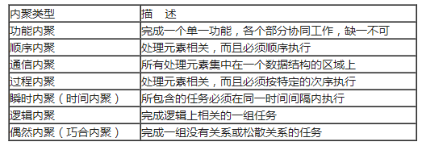

数据耦合是通过参数表传递简单信息

公共耦合是多个模块访问同一个公共数据环境

外部耦合是一组模块访问同一个全局简单变量而没有通过参数表传递

内容耦合是一个模块直接访问另一个模块的内部数据；一个模块不通过正常入口转到另一个模块的内部；两个模块有一部分程序代码重叠；一个模块有多个入口

- <https://blog.51cto.com/u_15902978/5965142>

- <https://blog.csdn.net/scau_lth/article/details/83474492>

- <https://blog.csdn.net/weixin_42562514/article/details/114938013>