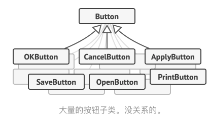
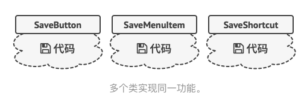

## 引入

### 问题举例

假如你正在开发一款新的文字编辑器， 当前的任务是创建一个包含多个按钮的工具栏， 并让每个按钮对应编辑器的不同操作。 你创建了一个非常简洁的 `按钮`类， 它不仅可用于生成工具栏上的按钮， 还可用于生成各种对话框的通用按钮

尽管所有按钮看上去都很相似， 但它们可以完成不同的操作 （打开、 保存、 打印和应用等）。 你会在哪里放置这些按钮的点击处理代码呢？ 最简单的解决方案是在使用按钮的每个地方都创建大量的子类。 这些子类中包含按钮点击后必须执行的代码

你很快就意识到这种方式有严重缺陷。 首先， 你创建了大量的子类， 当每次修改基类 `按钮`时， 你都有可能需要修改所有子类的代码。 简单来说， GUI 代码以一种拙劣的方式依赖于业务逻辑中的不稳定代码

还有一个部分最难办。 复制/粘贴文字等操作可能会在多个地方被调用。 例如用户可以点击工具栏上小小的 “复制” 按钮， 或者通过上下文菜单复制一些内容， 又或者直接使用键盘上的 `Ctrl+C` 

我们的程序最初只有工具栏， 因此可以使用按钮子类来实现各种不同操作。 换句话来说，  `复制按钮`Copy­Button子类包含复制文字的代码是可行的。 在实现了上下文菜单、 快捷方式和其他功能后， 你要么需要将操作代码复制进许多个类中， 要么需要让菜单依赖于按钮， 而后者是更糟糕的选择

### 解决方案

优秀的软件设计通常会将关注点进行分离， 而这往往会导致软件的分层。 最常见的例子： 一层负责用户图像界面； 另一层负责业务逻辑。 GUI 层负责在屏幕上渲染美观的图形， 捕获所有输入并显示用户和程序工作的结果。 当需要完成一些重要内容时 （比如计算月球轨道或撰写年度报告）， GUI 层则会将工作委派给业务逻辑底层

这在代码中看上去就像这样： 一个 GUI 对象传递一些参数来调用一个业务逻辑对象。 这个过程通常被描述为一个对象发送*请求*给另一个对象

命令模式建议 GUI 对象不直接提交这些请求。 你应该将请求的所有细节 （例如调用的对象、 方法名称和参数列表） 抽取出来组成命令类， 该类中仅包含一个用于触发请求的方法

命令对象负责连接不同的 GUI 和业务逻辑对象。 此后， GUI 对象无需了解业务逻辑对象是否获得了请求， 也无需了解其对请求进行处理的方式。 GUI 对象触发命令即可， 命令对象会自行处理所有细节工作

下一步是让所有命令实现相同的接口。 该接口通常只有一个没有任何参数的执行方法， 让你能在不和具体命令类耦合的情况下使用同一请求发送者执行不同命令。 此外还有额外的好处， 现在你能在运行时切换连接至发送者的命令对象， 以此改变发送者的行为

你可能会注意到遗漏的一块拼图——请求的参数。 GUI 对象可以给业务层对象提供一些参数。 但执行命令方法没有任何参数， 所以我们如何将请求的详情发送给接收者呢？ 答案是： 使用数据对命令进行预先配置， 或者让其能够自行获取数据

让我们回到文本编辑器。 应用命令模式后， 我们不再需要任何按钮子类来实现点击行为。 我们只需在 按钮Button基类中添加一个成员变量来存储对于命令对象的引用， 并在点击后执行该命令即可。

你需要为每个可能的操作实现一系列命令类， 并且根据按钮所需行为将命令和按钮连接起来。

其他菜单、 快捷方式或整个对话框等 GUI 元素都可以通过相同方式来实现。 当用户与 GUI 元素交互时， 与其连接的命令将会被执行。 现在你很可能已经猜到了， 与相同操作相关的元素将会被连接到相同的命令， 从而避免了重复代码。

最后， 命令成为了减少 GUI 和业务逻辑层之间耦合的中间层

## 模式

命令模式（Command Pattern）：将一个请求封装为一个对象，从而使你可用不同的请求对客户进行参数化，对请求排队或记录请求日志，以及支持可取消的操作

### 意图

命令模式是一种行为设计模式， 它可将请求转换为一个包含与请求相关的所有信息的独立对象。 该转换让你能根据不同的请求将方法参数化、 延迟请求执行或将其放入队列中， 且能实现可撤销操作

### 别名

### 适用性

### 结构

### 参与者

### 协作

## 代码实现