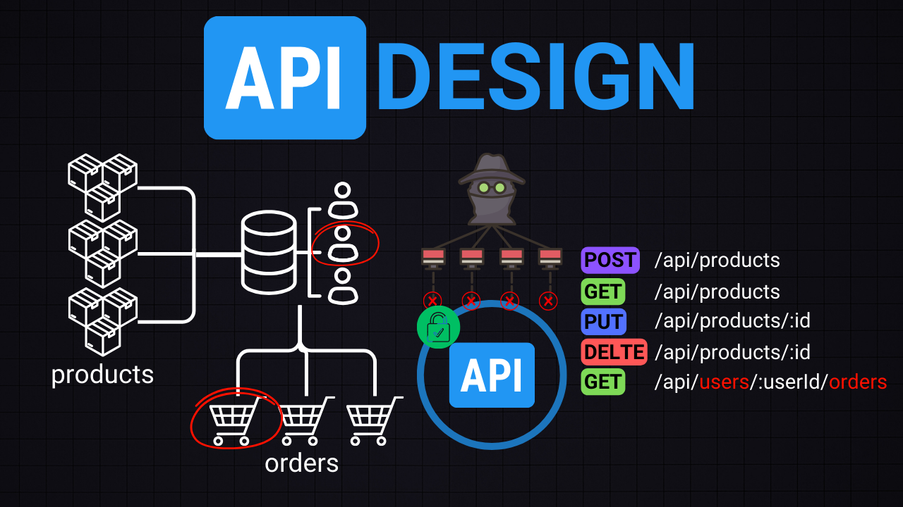
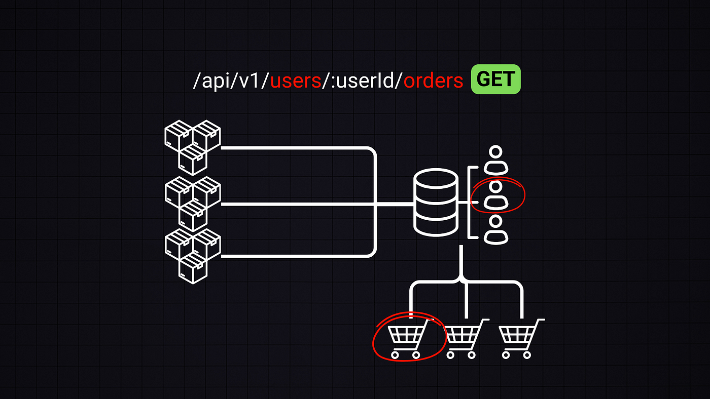

## API 设计

电子商务示例

考虑一个类似 Shopify （它是一个著名的电子商务平台，允许企业建立在线商店）这样的电子商务平台的 API

在 API 设计中，关注定义 API 的输入（比如新产品的产品详情）和输出（比如当某人查询产品时返回的信息）

这意味着关注的是接口而不是低级实现

## CRUD

因此，焦点主要是定义 CRUD 操作如何向使用电子商务 API 的用户或系统公开

CRUD 代表 Create、Read、Update、Delete，这些是任何数据驱动应用程序的基本操作

例如：

- 要添加新产品（创建），将通过 POST 请求发送到`/api/products`，其中产品详情包含在请求体中

- 要检索产品（读取），需要使用 GET 请求从`/products`获取数据

- 要更新产品信息（更新），使用 PUT 或 PATCH 请求到`/products/:id`，其中 id 是需要更新的产品的 id

- 删除类似于更新；通过 DELETE 请求到`/products/:id`，其中 id 是需要移除的产品

另一部分是决定要使用通信协议，比如 HTTP、WebSockets 等，以及数据传输机制：JSON、XML 或 Protocol Buffers

这适用于 RESTful API，但我们还有 GraphQL 或 gRPC 范例

## API 范例

API 有不同的范例，每个范例都有其自己的一套协议和标准

### REST（表述性状态转移）

**优势：** 无状态：客户端到服务器的每个请求都必须包含理解和完成请求所需的所有信息。使用标准的 HTTP 方法（GET、POST、PUT、DELETE）。易于被不同客户端（浏览器、移动应用）消费

**缺点：** 这可能导致数据的过多或过少获取-因为可能需要更多的端点来访问特定的数据

**特性：** 支持分页、过滤（`limit`、`offset`）和排序。使用 JSON进 行数据交换

### GraphQL

**优势：** 允许客户端请求确切需要的内容，避免过多或过少获取。基于强类型模式的查询

**缺点：** 复杂的查询可能会影响服务器性能。所有请求都以 POST 请求发送

**特性：** 通常以 HTTP 200 状态码回应，即使在错误的情况下也是如此，并在响应体中提供错误详细信息

### gRPC（Google远程过程调用）

**优势：** 构建在 HTTP/2 之上，提供了高级功能，如多路复用和服务器推送。使用 Protocol Buffers，一种语言中立、平台中立、可扩展的序列化结构化数据的方式。在带宽和资源方面效率高，特别适用于微服务

**缺点：** 与 JSON 相比，可读性较差。需要支持 HTTP/2

**特性：** 支持数据流和双向通信。适用于服务器间通信

## API 设计中的关系

例如在电子商务环境中，可能会有诸如用户到订单、订单到产品等的关系

设计端点以反映这些关系是重要的。例如，在这种情况下，`GET /users/{userId}/orders`应该为特定用户获取订单

## GET 请求的查询、限制和幂等性

常见的查询还包括用于分页的`limit`和`offset`，或者用于在某个日期范围内过滤产品的`startDate`和`endDate`。这允许用户检索特定集合的数据，而不会一次性向系统或用户提供太多信息

设计良好的 GET 请求是幂等的，这意味着多次调用它不会改变结果

GET 请求永远不应该改变数据。它们只用于检索

## 向后兼容性和版本控制

在修改端点时，保持向后兼容性非常重要。这意味着确保更改不会破坏现有客户端

**版本控制：** 引入版本（比如`/v2/products`）是处理重大更改的常见做法

