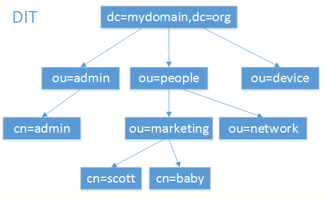

OpenLDAP

参考文档：<https://notes.lzwang.ltd/DevOps/Docker/DeployService/docker_deploy_ldap/#_3>

LDAP 简介

- DC：domain component一般为公司名，例如：dc=163,dc=com
- OU：organization unit为组织单元，最多可以有四级，每级最长32个字符，可以为中文
- CN：common name为用户名或者服务器名，最长可以到80个字符，可以为中文
- DN：distinguished name为一条LDAP记录项的名字，有唯一性(类似绝对路径)，例如：dc： cn=admin,ou=developer,dc=163,dc=com"
- SN：suer name（真实名称）
- O：organization（组织-公司）
- C：countryName（国家）



```bash
# 工具
ldapsearch
```

## 参考文档

- <https://wiki.eryajf.net/pages/ea10fa/>