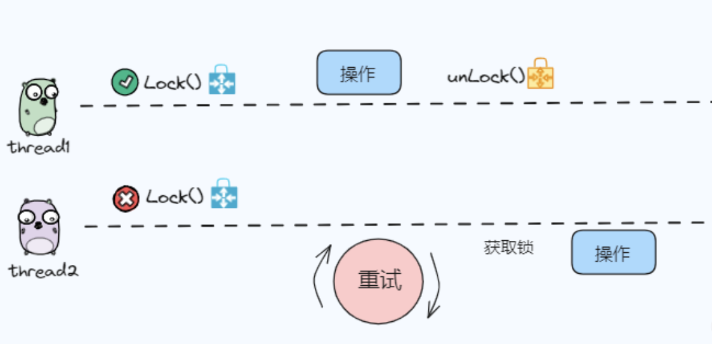
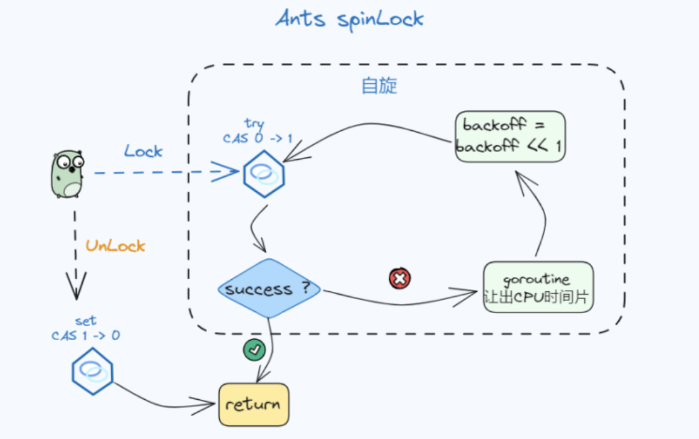
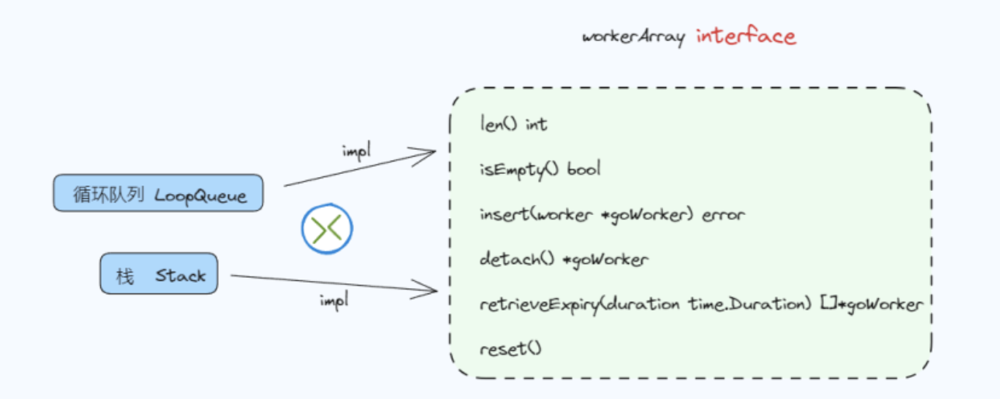

## 初识 Ants

Go 的协程非常轻量，但是在超高并发场景，每个请求创建一个协程也是低效的，一个简单的思想就是协程池

Ants 实现了一个具有固定容量的 goroutine 池，管理和回收大量 goroutine，允许开发人员限制并发程序中的 goroutines 数量

官方：

- GitHub 仓库：<https://github.com/panjf2000/ants>
- 文档地址：<https://ants.andypan.me/>

## 前置知识点

但是为什么要用池化的方式呢？机器资源总是有限的，如果创建了几十万个 goroutine，那么就消耗比较大了，在一些需要对并发资源进行控制、提升性能、控制生命周期的场景中，还是需要用到协程池去处理

### sync.Locker

sync.Locker 是 go 标准库 sync 下定义的锁接口：

```go
// A Locker represents an object that can be locked and unlocked.
type Locker interface {
    Lock()
    Unlock()
}
```

任何实现了 Lock 和 Unlock 两个方法的类，都可以作为一种锁的实现，最常见的为 go 标准库实现的 `sync.Mutex`



在 ants 中，作者不希望使用 Mutex 这种重锁，而是自定义实现了一种轻量级的自旋锁：



Ants 的自旋锁是基于 CAS 机制和指数退避算法实现的一种自旋锁，主要利用了下面几个关键的点：

- `sync.Locker` 接口
- 指数退避算法
- `sync. atomic` 原子包中的方法了解
- `runtime.Gosched()` 让当前 goroutine 让出 CPU 时间片

该锁实现原理：

- 通过一个整型状态值标识锁的状态：0-未加锁；1-加锁
- 加锁成功时，即把 0 改为 1；解锁时则把 1 改为 0；改写过程均通过 atomic 包保证并发安全
- 加锁通过 for 循环 + cas 操作实现自旋，无需操作系统介入执行 park 操作
- 通过变量 backoff 反映抢锁激烈度，每次抢锁失败，执行 backoff 次让 cpu 时间片动作；backoff 随失败次数逐渐升级，封顶 16

```go
// 实现 Locker 接口
type spinLock uint32
// 最大回退次数
const maxBackoff = 16
// 加锁
func (sl *spinLock) Lock() {
    backoff := 1
    // 基于 CAS 机制，尝试获取锁
    for !atomic.CompareAndSwapUint32((*uint32)(sl), 0, 1) {
        // 执行 backoff 次 cpu 让出时间片次数
        for i := 0; i < backoff; i++ {
            // 使当前goroutine让出CPU时间片
            runtime.Gosched()
        }
        if backoff < maxBackoff {
            // 左移后赋值 等于 backoff = backoff << 1
            // 左移一位就是乘以 2 的 1 次方
            backoff <<= 1
        }
    }
}

// 释放锁
func (sl *spinLock) Unlock() {
    atomic.StoreUint32((*uint32)(sl), 0)
}
```

### sync.Cond

`sync.Cond` 是 golang 标准库提供的并发协调器，用于实现在指定条件下阻塞和唤醒协程的操作

## 核心数据结构


Pool 就是协程池的实际结构

```go
type Pool struct {

	// 协程池容量
	capacity int32

	// 当前协程池中正在运行的协程数
	running int32

	// ants 实现的自旋锁，用于同步并发操作
	lock sync.Locker

	// 存放一组 Worker
	workers workerArray

	// 协程池状态 （1-关闭、0-开启）
	state int32

	// 并发协调器，用于阻塞模式下，挂起和唤醒等待资源的协程
	cond *sync.Cond

	// worker 对象池
	workerCache sync.Pool

	// 等待的协程数量
	waiting int32

	// 回收协程是否关闭
	heartbeatDone int32

	// 关闭回收协程的控制器函数
	stopHeartbeat context.CancelFunc

	// 协程池的配置
	options *Options
}
```

- workerCache ：这是 `sync.Pool` 类型，主要作用保存和复用临时对象，减少内存分配，降低 GC 压力，在 Ants 中是为了缓存释放的 Worker 资源

- options：可配置化过期时间、是否支持预分配、最大阻塞数量、panic 处理、日志，这里是通过函数式选项模式进行实现的

### goWorker

goWorker 是运行任务的实际执行者，它启动一个 goroutine 来接受任务并执行函数调用，这个协程是一个长期运行不会被主动回收的

goWorker 可以简单理解为一个长时间运行而不回收的协程，用于反复处理用户提交的异步任务

```go
type goWorker struct {
    // goWorker 所属的协程池
    pool *Pool
    // 接收实际执行任务的管道
    task chan func()
    // goWorker 回收到协程池的时间
    recycleTime time.Time
}
```

### WorkerArray

workerArray 是一个接口（ interface），其实现包含 stack 栈版本和 queue 队列两种实现



它定义了几个通用和用于回收过期 goWorker 的 api

```go
type workerArray interface {
	// worker 列表长度
	len() int
	// 是否为空
	isEmpty() bool
	// 插入一个goworker
	insert(worker *goWorker) error
	// 从WorkerArray获取可用的goworker
	detach() *goWorker
	// 清理pool.workers中的过期goworker
	retrieveExpiry(duration time.Duration) []*goWorker
	// 重置，清空WorkerArray中所有的goWorker
	reset()
}
```

## 核心方法

### 创建 Pool

创建 Pool 其实就是 New 一个 Pool 实例，对 Pool 中结构体的属性进行初始化、加载一些配置


代码实现和注释如下：

```go
func NewPool(size int, options ...Option) (*Pool, error) {
    // 读取一些自定义的配置
    opts := loadOptions(options...)

    ...
    // 创建 Pool 对象
    p := &Pool{
        capacity: int32(size),
        lock:     internal.NewSpinLock(),
        options:  opts,
    }
     // 指定 sync.Pool 创建 worker 的方法
    p.workerCache.New = func() interface{} {
        return &goWorker{
            pool: p,
            task: make(chan func(), workerChanCap),
        }
    }
    // 初始化 Pool 时是否进行内存预分配
    // 区分 workerArray 的实现方式
    if p.options.PreAlloc {
        if size == -1 {
            return nil, ErrInvalidPreAllocSize
        }
        // 预先分配固定 Size 的池子
        p.workers = newWorkerArray(loopQueueType, size)
    } else {
        // 初始化不创建，运行时再创建
        p.workers = newWorkerArray(stackType, 0)
    }

    p.cond = sync.NewCond(p.lock)

    // 开启一个 goroutine 清理过期的 worker
    go p.purgePeriodically()

    return p, nil
}
```

workerChanCap：确定工作程序的通道是否应为缓冲通道，当获取给 GOMAXPROCS 设置的值等于 1 时表示单核执行，此时的通道是无缓冲通道，否则是有缓冲通道，且容量是 1

这里讲的是默认未进行预分配，采用 workerStack 栈实现 workerArray 的初始化

## 参考资料

- <https://www.51cto.com/article/777732.html>
- <https://mp.weixin.qq.com/s/Uctu_uKHk5oY0EtSZGUvsA>