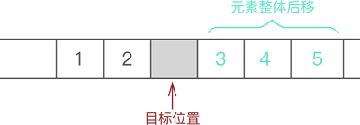
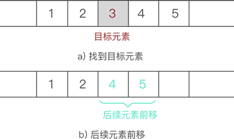

## 顺序表（顺序存储结构）

线性表的顺序存储是指用一组地址连续的存储单元依次存储线性表中的数据元素，使得线性表中在逻辑结构上相邻的数据元素在物理位置上也相邻

即通过数据元素物理存储的连续性来反映数据元素之间逻辑上的相邻关系

在这种存储方式下，元素间的逻辑关系无须占用额外的空间来存储

可将顺序表归纳为：

- 关系线性化
- 结点顺序存

## 地址的计算

假设线性表中有 n 个数据元素，以 `Loc(a1)` 表示线性表中第一个元素的存储位置

`L` 表示表中每个元素所占空间的字节数

则可通过如下公式计算出第 i 个元素的地址 `Loc(ai)`：

```plain
Loc(ai) = Loc(ai) + ( i - 1 ) * L
```

其中，`Loc(a1)` 称为基地址

根据该计算关系，可随机存取表中的任一元素

## 优缺点

优点：

- 可随机存取表中的元素

缺点：

- 插入和删除操作需要移动元素
  - 在插入前需要移动元素以挪出空的存储单元，然后再插入元素
  - 删除时同样需要移动元素，以填充被删除的元素空出来的存储单元

## 顺序表的基础操作

使用顺序表存储数据之前，除了要申请足够大小的物理空间之外，为了方便后期使用表中的数据，顺序表还需要实时记录以下 2 项数据：

1. 顺序表申请的存储容量；
2. 顺序表的长度，也就是表中存储数据元素的个数；

需要自定义顺序表，C 语言实现代码如下：

```c
typedef struct Table {
  int *head; // 声明了一个名为 head 的长度不确定的数组，也叫“动态数组”
  int length; // 记录当前顺序表的长度
  int size;   // 记录顺序表分配的存储容量
} table;

```

建立顺序表需要做如下工作：

- 给 head 动态数据申请足够大小的物理空间；
- 给 size 和 length 赋初值；

C 语言实现代码如下：

```c
#define Size 5 // 对 Size 进行宏定义，表示顺序表申请空间的大小

table initTable() {
  table t;
  t.head =
      (int *)malloc(Size * sizeof(int)); // 构造一个空的顺序表，动态申请存储空间
  if (!t.head) // 如果申请失败，作出提示并直接退出程序
  {
    printf("初始化失败");
    exit(0);
  }
  t.length = 0;  // 空表的长度初始化为 0
  t.size = Size; // 空表的初始存储空间为 Size
  return t;
}

```

### 顺序表的插入

#### 流程

向已有顺序表中插入数据元素，根据插入位置的不同，可分为以下 3 种情况：

1. 插入到顺序表的表头；
2. 在表的中间位置插入元素；
3. 尾随顺序表中已有元素，作为顺序表中的最后一个元素；

虽然数据元素插入顺序表中的位置有所不同，但是都使用的是同一种方式去解决，即：通过遍历，找到数据元素要插入的位置，然后做如下两步工作：

- 将要插入位置元素以及后续的元素整体向后移动一个位置；
- 将元素放到腾出来的位置上；

#### 图解

例如，在 `{1,2,3,4,5}` 的第 3 个位置上插入元素 6，实现过程如下：

- 遍历至顺序表存储第 3 个数据元素的位置


- 将元素 3 以及后续元素 4 和 5 整体向后移动一个位置



- 将新元素 6 放入腾出的位置


#### 代码实现

动态数组额外申请更多物理空间使用的是 realloc 函数。

并且，在实现后续元素整体后移的过程，目标位置其实是有数据的，还是 3，只是下一步新插入元素时会把旧元素直接覆盖。

```c
// 插入函数，其中，elem 为插入的元素，add 为插入到顺序表的位置
table addTable(table t, int elem, int add) {
  // 判断插入本身是否存在问题（如果插入元素位置比整张表的长度 +1
  // 还大（如果相等，是尾随的情况），或者插入的位置本身不存在，程序作为提示并自动退出）
  if (add > t.length + 1 || add < 1) {
    printf("插入位置有问题\n");
    return t;
  }
  // 做插入操作时，首先需要看顺序表是否有多余的存储空间提供给插入的元素，如果没有，需要申请
  if (t.length == t.size) {
    t.head = (int *)realloc(t.head, (t.size + 1) * sizeof(int));
    if (!t.head) {
      printf("存储分配失败\n");
      return t;
    }
    t.size += 1;
  }
  // 插入操作，需要将从插入位置开始的后续元素，逐个后移
  for (int i = t.length - 1; i >= add - 1; i--) {
    t.head[i + 1] = t.head[i];
  }
  // 后移完成后，直接将所需插入元素，添加到顺序表的相应位置
  t.head[add - 1] = elem;
  // 由于添加了元素，所以长度 +1
  t.length++;
  return t;
}
```

#### 复杂度分析


### 顺序表的删除

#### 流程

从顺序表中删除指定元素，实现起来非常简单，只需找到目标元素，并将其后续所有元素整体前移 1 个位置即可

后续元素整体前移一个位置，会直接将目标元素删除，可间接实现删除元素的目的

#### 图解

例如，从 `{1,2,3,4,5}` 中删除元素 3 的过程如图 4 所示：



#### 代码实现

顺序表删除元素的 C 语言实现代码为：

```c
table delTable(table t, int add) {
  if (add > t.length || add < 1) {
    printf("被删除元素的位置有误\n");
    return t;
  }
  // 删除操作
  for (int i = add; i < t.length; i++) {
    t.head[i - 1] = t.head[i];
  }
  t.length--;
  return t;
}

```

#### 复杂度分析


http://c.biancheng.net/view/3335.html

https://blog.51cto.com/u_15888443/5881408

https://www.educity.cn/rk/prog/index.html