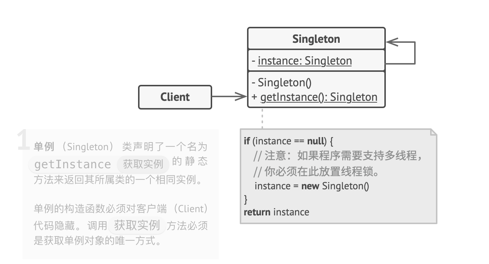

## 模式简介

单例模式（Singleton Pattern）：保证一个类仅有一个对象，并提供一个访问它的全局访问点


单例模式是一种创建型设计模式， 让你能够保证一个类只有一个实例， 并提供一个访问该实例的全局节点

### 问题

单例模式同时解决了两个问题， 所以违反了单一职责原则：

1. 保证一个类只有一个实例。 为什么会想要控制一个类所拥有的实例数量？ 最常见的原因是控制某些共享资源 （例如数据库或文件） 的访问权限

   它的运作方式是这样的： 如果创建了一个对象， 同时过一会儿后决定再创建一个新对象， 此时会获得之前已创建的对象， 而不是一个新对象

   注意， 普通构造函数无法实现上述行为， 因为构造函数的设计决定了它必须总是返回一个新对象

2. 为该实例提供一个全局访问节点。 还记得那些存储重要对象的全局变量吗？ 它们在使用上十分方便， 但同时也非常不安全， 因为任何代码都有可能覆盖掉那些变量的内容， 从而引发程序崩溃

   和全局变量一样， 单例模式也允许在程序的任何地方访问特定对象。 但是它可以保护该实例不被其他代码覆盖

   还有一点： 不会希望解决同一个问题的代码分散在程序各处的。 因此更好的方式是将其放在同一个类中， 特别是当其他代码已经依赖这个类时更应该如此

如今， 单例模式已经变得非常流行， 以至于人们会将只解决上文描述中任意一个问题的东西称为单例

客户端甚至可能没有意识到它们一直都在使用同一个对象：


### 解决方案

所有单例的实现都包含以下两个相同的步骤：

- 将默认构造函数设为私有， 防止其他对象使用单例类的 `new` 运算符
- 新建一个静态构建方法作为构造函数。 该函数会 “偷偷” 调用私有构造函数来创建对象， 并将其保存在一个静态成员变量中。 此后所有对于该函数的调用都将返回这一缓存对象

如果代码能够访问单例类， 那它就能调用单例类的静态方法。 无论何时调用该方法， 它总是会返回相同的对象

### 真实世界类比

政府是单例模式的一个很好的示例。 一个国家只有一个官方政府。 不管组成政府的每个人的身份是什么，  “某政府” 这一称谓总是鉴别那些掌权者的全局访问节点

## 单例模式结构



## 伪代码

数据库连接类即是一个单例。 该类不提供公有构造函数， 因此获取该对象的唯一方式是调用 `获取实例`方法。 该方法将缓存首次生成的对象， 并为所有后续调用返回该对象

```c
// 数据库类会对 `getInstance（获取实例）` 方法进行定义以让客户端在程序各处
// 都能访问相同的数据库连接实例
class Database is
    // 保存单例实例的成员变量必须被声明为静态类型
    private static field instance: Database

    // 单例的构造函数必须永远是私有类型，以防止使用 `new` 运算符直接调用构
    // 造方法
    private constructor Database() is
        // 部分初始化代码（例如到数据库服务器的实际连接）
        // ……

    // 用于控制对单例实例的访问权限的静态方法
    public static method getInstance() is
        if (Database.instance == null) then
            acquireThreadLock() and then
                // 确保在该线程等待解锁时，其他线程没有初始化该实例。
                if (Database.instance == null) then
                    Database.instance = new Database()
        return Database.instance

    // 最后，任何单例都必须定义一些可在其实例上执行的业务逻辑
    public method query(sql) is
        // 比如应用的所有数据库查询请求都需要通过该方法进行。因此，可以
        // 在这里添加限流或缓冲逻辑
        // ……

class Application is
    method main() is
        Database foo = Database.getInstance()
        foo.query("SELECT ……")
        // ……
        Database bar = Database.getInstance()
        bar.query("SELECT ……")
        // 变量 `bar` 和 `foo` 中将包含同一个对象
```

## 实现方式

1. 在类中添加一个私有静态成员变量用于保存单例实例
2. 声明一个公有静态构建方法用于获取单例实例
3. 在静态方法中实现"延迟初始化"。 该方法会在首次被调用时创建一个新对象， 并将其存储在静态成员变量中。 此后该方法每次被调用时都返回该实例
4. 将类的构造函数设为私有。 类的静态方法仍能调用构造函数， 但是其他对象不能调用
5. 检查客户端代码， 将对单例的构造函数的调用替换为对其静态构建方法的调用

## 单例模式适合应用场景

- 如果程序中的某个类对于所有客户端只有一个可用的实例， 可以使用单例模式

单例模式禁止通过除特殊构建方法以外的任何方式来创建自身类的对象。 该方法可以创建一个新对象， 但如果该对象已经被创建， 则返回已有的对象

- 如果需要更加严格地控制全局变量， 可以使用单例模式

单例模式与全局变量不同， 它保证类只存在一个实例。 除了单例类自己以外， 无法通过任何方式替换缓存的实例

请注意， 可以随时调整限制并设定生成单例实例的数量， 只需修改获取实例方法， 即 getInstance 中的代码即可实现

## 单例模式优缺点

### 优点

- 可以保证一个类只有一个实例
- 获得了一个指向该实例的全局访问节点
- 仅在首次请求单例对象时对其进行初始化

### 缺点

- 违反了单一职责原则。 该模式同时解决了两个问题
- 单例模式可能掩盖不良设计， 比如程序各组件之间相互了解过多等
- 该模式在多线程环境下需要进行特殊处理， 避免多个线程多次创建单例对象
- 单例的客户端代码单元测试可能会比较困难， 因为许多测试框架以基于继承的方式创建模拟对象。 由于单例类的构造函数是私有的， 而且绝大部分语言无法重写静态方法， 所以需要想出仔细考虑模拟单例的方法。 要么干脆不编写测试代码， 或者不使用单例模式

## 与其他模式的关系

- 外观模式类通常可以转换为单例模式类， 因为在大部分情况下一个外观对象就足够
- 如果能将对象的所有共享状态简化为一个享元对象， 那么享元模式就和单例类似了。 但这两个模式有两个根本性的不同
  1. 只会有一个单例实体， 但是享元类可以有多个实体， 各实体的内在状态也可以不同
  2. 单例对象可以是可变的。 享元对象是不可变的
- 抽象工厂模式、 生成器模式和原型模式都可以用单例来实现
