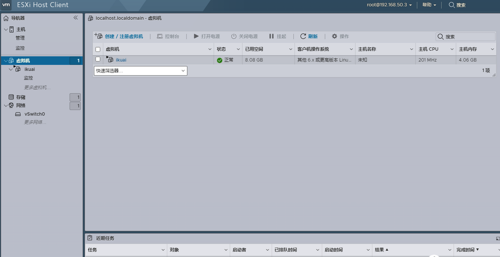

## 主路由与旁路由

旁路由是一个接入主路由的设备，只是比较特殊，具备网关还有其他一些特定的功能

旁路由应该叫旁路网关更合适，主路由从设备上收到数据包，首先发送到 OpenWrt 旁路由进行处理，包括去广告、留学等等，处理好之后再发回主路由，转发到外网

同样主路由接受到外网的数据包，首先也会将数据发送到旁路由进行处理，然后将处理过的数据，再根据数据包的目的地址发送到设备

数据走向：

- 第 1 步：设备通过网线第一个接入的路由器叫做主路由，主要实现拨号上网功能，ikuai 就是主路由，设备的数据首先会来到 ikuai 主路由
- 第 2 步：我们已经将 ikuai 网关指向了 openwrt，ikuai 会将数据传输到 openwrt 进行处理
- 第 3 步：openwrt 的网关指向了 ikuai 主路由，openwrt 处理后的数据回再传回 likuai 主路由
- 第 4、5 步：openwrt 的网关指向了 ikuai 主路由，会再传回 likuai 主路由。收到 openwrt 处理后的数据后，ikuai 会将数据通过光猫转换发送出去


## 镜像转换

使用 qemu-img 工具进行转换

安装工具：

```bash
dnf -y install qemu-img
```

转换命令（文件名以openwrt.img为例）：
```bash
qemu-img convert -f raw openwrt.img -O vmdk openwrt.vmdk
```

<https://http.ooo/7.html>

<https://oldtang.com/3424.html>

## 安装虚拟机

首先进入 ESXi 后台，新建虚拟机，点击创建新虚拟机：




输入虚拟机名称，名称填写 openwrt，客户操作系统选择 Linux，openwrt 系统也是基于 Linux 开发的，客户机操作版本选择选择【其他 5X Linux (64 位)】、【其他 Linux (64 位)】版本也可以：


存储部分，无需更改，点击下一步：


虚拟硬件设置：

- 【CPU 设置】4 核，默认每个插槽一核，其他默认。

- 【内存】：内存分配 2GB，1GB 也够用。如果说内存足够的话，分配个 4G、8G 也是可以的，后面要折腾不少东西，可以多预留一些，这个不用纠结，后面可以根据内存的使用情况随时调整，在虚拟机关机的状态下，可以通过编辑更改内存大小

内存一定勾选【预留所有客户机内存 (全部锁定)】选项，如果刚开始设置没有看到【预留所有客户机内存 (全部锁定)】的话，等下面都设置好了，再返回来检查一下，一定要保证选上，因为我们需要直通一个网卡作为 openwrt 的物理 lan 口，需要锁定内存

- 【硬盘设置】：将硬盘配置删掉即可，后面创建虚拟机时，系统会自动生成分区。剩下的像 SCSI 控制器、USB 控制器、CD/DVD 控制器不需要的删掉，保留一个 SATA 控制器

- 【网络适配器】：这里着重说一下，如果我们添加了这个适配器，安装 openwrt 后，esxi 会自动虚拟产生一个 eth0 虚拟网卡，作为默认 lan 口，桥接到 esxi 虚拟机。虚拟的网口是万兆网口，但是还是会一定程度上损失网速，所以我们这里不使用虚拟网口。而是直接直通一个物理网卡给 openwrt 作为 lan 口。我们前面已经用网线将整个 lan 口物理交换机连接了，ikuai 和物理交换机也连接了，所以 ikuai 主路由和 openwrt 也进行了物理连接，而不是采用虚拟网口连接。这样的好处就是，不使用 ESXi 的虚拟网口，虽然 ESXi 虚拟的网口是万兆的，但是虚拟网口在一定程度上还是会损失网速和占用 CPU


选择 EFI 启动，记得一定要把下面的是否为此虚拟机启用 UEFI 安全引导去掉，否则会安装后无法启动。也可以采用，引导方式选择 BIOS，其他不用管。如果安装后有问题可以检查一下自己下载的镜像格式，或者两种引导方式来回替换看下
