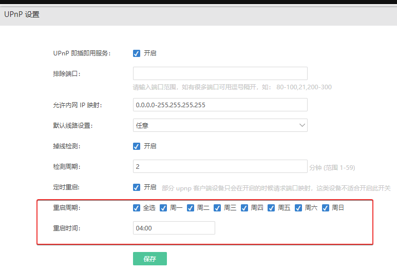

## 内网设置 DHCP

为 iKuai 新增一个 DHCP 服务器，给接入 ikuai 软路由的设备，自动分配 IP

按照自己设定的网关进行填写：

- 客户端地址 (DHCP 地址池) 为 10.244.244.20-10.244.244.100 / 子网掩码：255.255.255.0

作用是以后有新设备连接到 iKuai 后，会自动分配从 20 到 100 之间的 IP 地址，局域网内的设备就可以通过自动获取 IP 地址上网了；设置好之后重启 DHCP 服务。没有使用改网段的所有 IP，预留其他 IP 地址用来自定义使用

- 网关：10.244.244.1；先设置为 ikuai 的网关，先保证能够上网

- 自动 DNS

  - 首选 DNS：10.244.244.1

  - 备用 DNS：8.8.8.8

> 国内主流 DNS 服务器：
>
> - 阿里公共 DNS：223.5.5.5，223.6.6.6 类型选择：UDP
> - 腾讯公共 DNS：119.29.29.29 类型选择：UDP
> - 百度公共 DNS：180.76.76.76 类型选择：UDP
> - 华为云公共 DNS ：122.112.208.1，139.9.23.90 类型选择：UDP
> - 114 公共 DNS：114.114.114.114，114.114.115.115 类型选择：UDP
> - OpenerDNS：42.120.21.30 类型选择：UDP
> - DNS 派 电信 / 移动 / 铁通：101.226.4.6，218.30.118.6 类型选择：UDP
> - DNS 派 联通：123.125.81.6，140.207.198.6 类型选择：UDP

## 内网设置 DNS

ikuai 下方就是 DNS，设置，根据上面国内主流的 DNS 服务器，添加两个 DNS

## iKuai 软路由 lan 口扩展网卡

LAN 口扩展网卡，选择 lan1 —— 高级设置 —— 勾选 eth0，如果还有别网卡也一并点上，这样网口就都设置为 ikuai 的 lan 口了，点确定

这里连接的时候一定要注意，前面 eth0 网口是没有直通的，性能肯定不如 eth2 网口，连接设备或者交换机一定要用 eth2 口

## 上网模式及链路选择

选择【系统设置】-【基础设置】，更改上网模式和链路模式：上网模式及链路模式具有多样性

上网模式支持 NAT4、NAT1、路由模式三种选项。

- NAT4：对称 NAT（网络地址转换），NAT 类型中安全性最高的方式，也是设备默认上网模式

- NAT1：完全锥形 NAT（网络地址转换），NAT 类型中安全性较低的方式，一般用于特殊需求场景，不建议开启

- 路由模式：所有数据不进行 NAT 转发，直接将内网 IP 不做伪装传送到外网，适用于内网 IP 都为公网地址时使用。路由模式下，路由器的所有行为都会以 lan 口的 IP 地址进行的。路由模式下无法使用端口映射功能

可根据部署环境选择当前设备的部署模式。链路模式分为：主干模式、旁路模式和 SD-WAN 网桥三种：主干模式和旁路模式、SD-WAN 模式

- 主干模式：主干模式在爱快路由器作为主网关出口时使用，默认不需要修改
- 旁路模式：仅 X86 大路由支持旁路模式，在爱快作为旁路，不通过爱快上网但是需要爱快来管理 AP 以及设置钉钉认证、使用钉钉闪传、web 认证
- SD-WAN 网桥：透明网桥模式，在不改变现有网络结构下实现数据互访

这里 ikuai 作为主路由选择主干模式即可

## 开启 UPnP

路由器的 UPNP是英语 Universal Plug and Play 的首字母缩写，一般翻译成通用即插即用。UPNP 是各种各样的智能设备、无线设备和个人电脑等实现遍布全球的对等网络连接（P2P）的结构。UPNP 是一种分布式的。开放的网络架构，UPNP 是独立的媒介。在任何操作系统中，利用任何编程语言都可以使用 UPNP 设备

路由器通用即插即用 UPnP 功能用于局域网络计算机和智能移动设备，流畅使用网络，加快 P2P 软件访问网络的速度，如观看在线视频和多点下载等方面的软件

> - 开启后能方便智能监控设备直接透传到因特网，无需做烦琐的映射端口设置
> - 开启后能方便智能网络存储设备与因特网进行数据传输，节省手动设置时间
> - 开启后能方便在因特网使用 ERP、CRM、第三方远程桌面等软件
> - 开启后能提高穿透服务（如 nat123 全端口映射 P2P 穿透）的穿透成功率，节省服务器的带宽

1.【排除端口】：可以通过此处的端口设置可以排除掉外网中特殊应用的端口以及周知端口等。空着为不排除。填写时多个不连续的端口使用逗号隔开，连续端口可以使用 “—”

2.【允许内网 IP 映射】：0.0.0.0-255.255.255.255 表示内网所有 IP 都可以映射。为空表示不映射任何内网 IP

3.【默认线路设置】：此处设置可以指定 upnp 设备自动映射端口的线路。选择默认即可

4.【掉线检测】：开启之后周期时间检测 upnp 客户端 2 分钟内是否有流量，如果没有流量，将会清理掉 upnp 状态中的映射规则

5.【定时重启】：可设置周期性重启 upnp 服务

