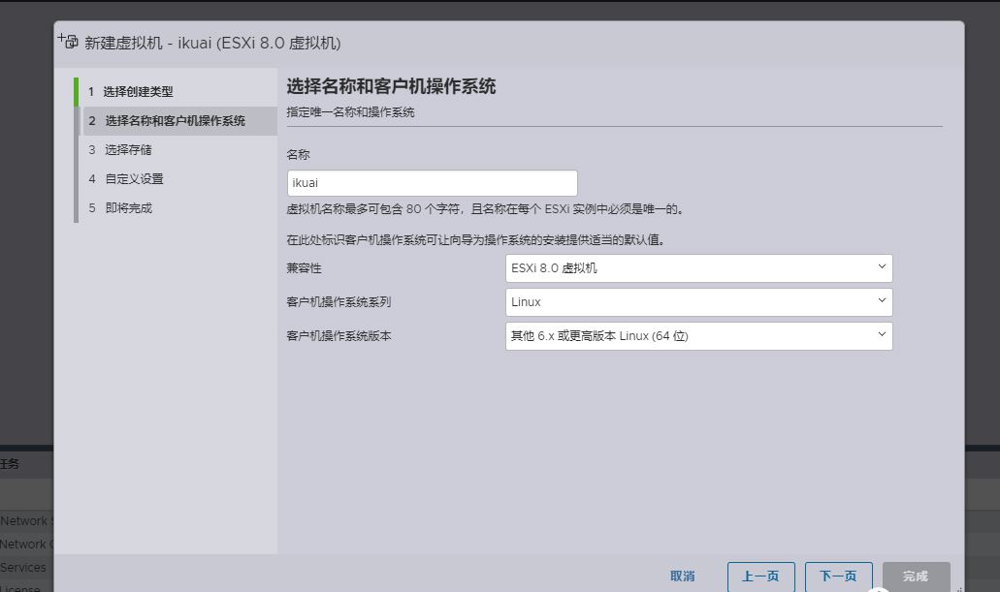
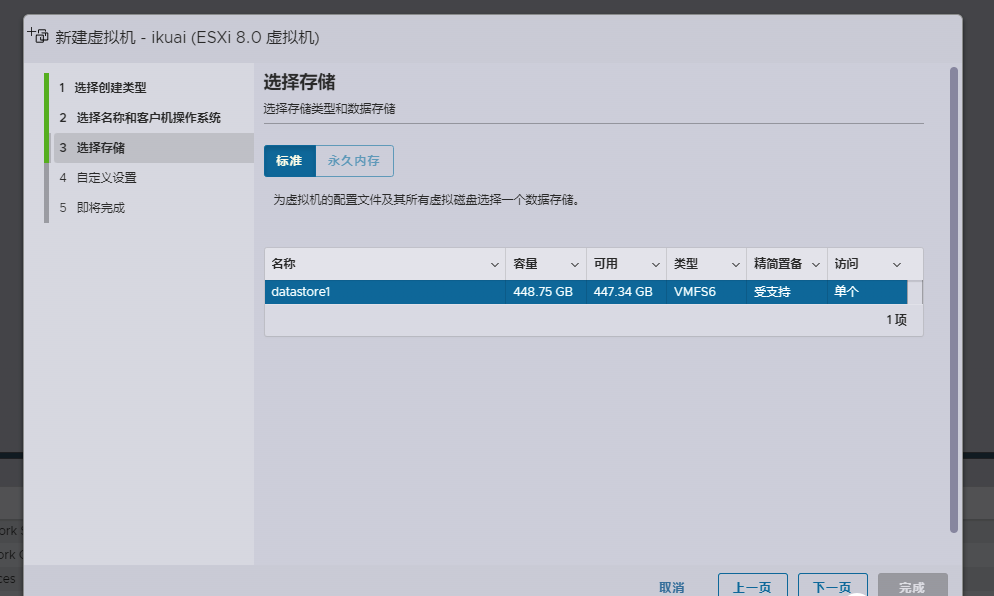
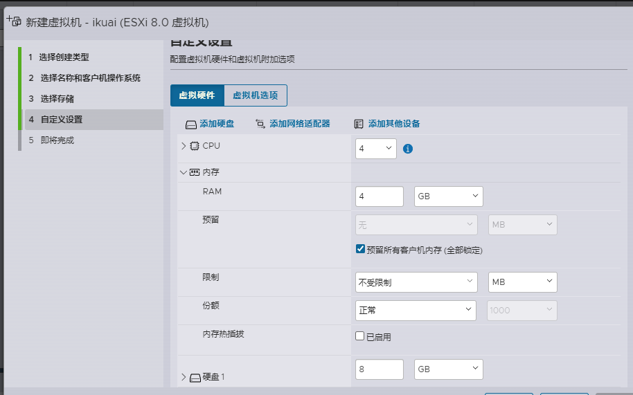
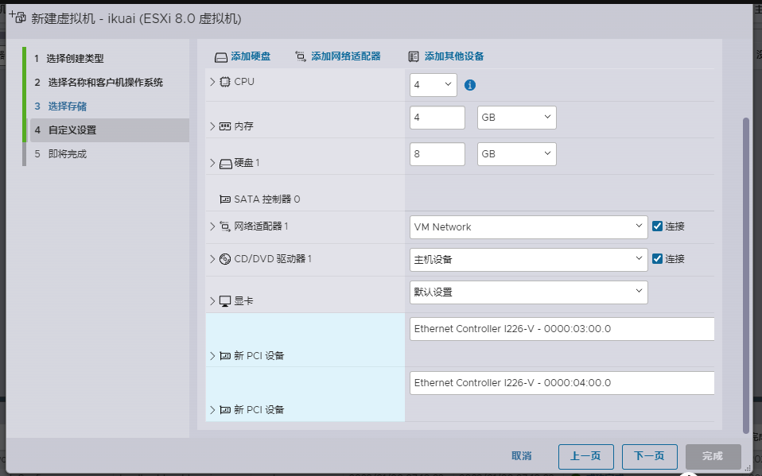
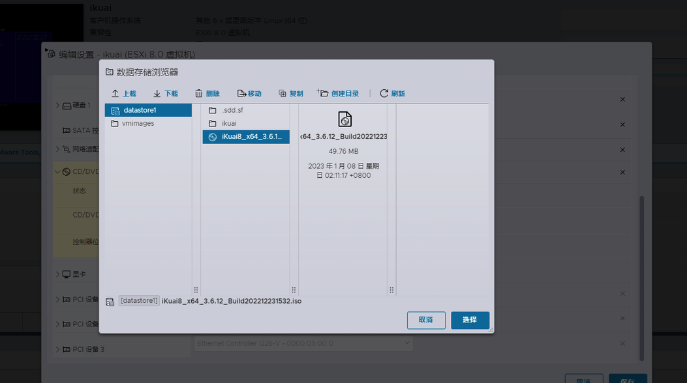
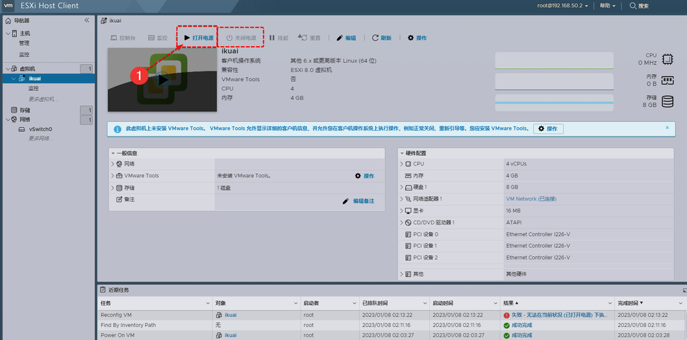
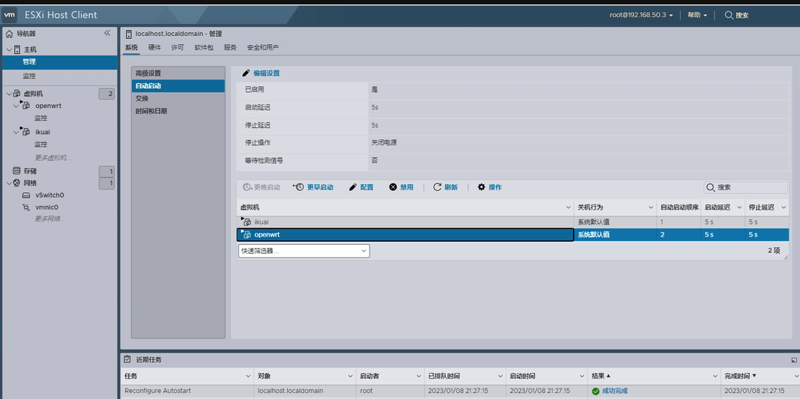

虚拟机安装 iKuai 主路由

进入 ESXi 后台，新建虚拟机，点击创建新虚拟机：

输入虚拟机名称，名称填写 iKuai，客户操作系统选择 Linux，爱快系统是基于 Linux 开发的。

客户机操作版本选择【其他 6X 或更高的 Linux (64 位)】版本，选择【其他 5X Linux (64 位)】版本也可以，一定要注意，安装 32 系统这里就选择 32 位，和下载的镜像版本一定要对好

点击下一步：

选择存储，无需更改，点击下一步：

自定义设置

- 【CPU 设置】：4 核，默认每个插槽一核。

- 【内存】：4GB，内存设置一定要勾选【预留所有客户机内存 (全部锁定)】选项，下面要直通网卡，需要锁定内存，如果刚开始设置没有看到【预留所有客户机内存 (全部锁定)】的话，等下面都设置好了，再返回来检查一下，有没有选项，一定要保证选上

- 【硬盘设置】：一般设置 2G 就够用了了，后面如果折腾 DOCKER 或者在 ikuai 内套娃安装虚拟机可以大一点；如果 32 位的系统一般设置内存 2G，硬盘 2G 即可够用。

硬盘置备选择：厚置备，置零

添加直通网卡，选择添加其他设备——PCI设备：

将前面直通的网卡按照顺序插入：

> **为何要直通 (Passthrough) 网卡：**
>
> VT-d、 DirectPath l/O，通过 DirectPath /O，虚拟机可以使用 I/0 内存管理单元访问平台上的物理 PCI 功能，就是俗称的虚拟化直通，简单理解就是允许宿主机将某些硬件资源的管辖权直接移交给虚拟机，虚拟机会以直通独占的方式使用硬件，宿主机将不能再使用此硬件，利用效率几乎等同于将硬件插到了虚拟机的主板扩展槽里一样，最实用的目的是避免了虚拟化平台自身软件层转换带来的效能下降。
>
> 例如在服务器上将某个物理网卡直接划给某台虚拟机使用，以达到几乎和物理机搭配物理网卡类似的网络性能。更可观的场景是，将磁盘控制器直通给虚拟机独占使用，那么虚拟机往往最瓶颈的磁盘性能，将得到非常可观的提升。esxi 下面默认网卡是虚拟的，所以受限于驱动及性能的影响，导致很多时候速率达不到网卡原本的速率，但是通过直通后，网卡的性能就毫无保留的发挥出来了。

虚拟机选项设置，选择 EFI 启动，记得一定要把下面的是否为此虚拟机启用 UEFI 安全引导的选项去掉，否则会安装后无法启动

点击完成，返回到 ESXI 内即看到刚才创建的虚拟机，在电源关闭状态下

加载 ISO 镜像，点击 CD/DVD 驱动器，选择数据存储 ISO 文件，并勾选连接、打开电源时连接。点击浏览加载上一步我们下载好的 ikuai ISO 镜像文件

弹出的对话框，点击【上载】，找到 ISO 文件，双击确定，打开：

选择刚刚上载的 ISO 镜像，点击右下角选择，保存生效：

回到 ESXI 打开电源，即可启动 ikuai 安装：

安装过程略过，按照提示安装即可

安装完成后，开启 iKuai 的自动启动，点击 ESXi 的管理 —— 自动启动，设置一个自动启动参数，然后把自动启动参数，配置给 ikuai 即可，设置之后每次重启两个软路由会自动重启

