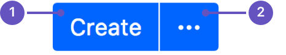
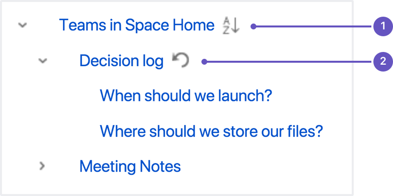

## Confluence

Confluence 作为一个知识管理的平台，让团队成员协作、分享信息，查找工作所需的资料，从此打破不同团队、不同部门以及个人之间信息孤岛的僵局，Confluence 真正实现了组织资源共享。同时 Confluence 让团队从无休止的邮件和会议中解脱出来，让每天的工作更有效能

## 如何创建和编辑页面

官方文档：<https://confluence.atlassian.com/doc/create-and-edit-pages-139476.html>

### 创建页面

可以在 Confluence 中的任何位置创建页面。只需在标题中选择 Create（创建）即可。页面是捕获所有重要（且不重要）信息的地方； 从空白页开始，可添加富文本，任务，图像，Macro 和链接，或使用有用的蓝图之一捕获会议记录，决定等。

如果要快速创建空白页，请点击标题中的 Create（创建）按钮； 如果要从模板创建页面，请单击从模板创建按钮。

- 创建空白页
- 从模板创建

- （1）Select space（选择空间）：选择将在其中创建内容的空间。

- （2）Page templates（页面模板）：从模板创建页面或创建其他类型的内容。

- （3）Parent page（父页面）：页面将是该页面的子页面。

确定空白页或蓝图后，将直接进入 Confluence 编辑器。您可以在编辑器中为页面命名或重命名，添加内容并设置其格式。 添加一些内容后，请选择 > Preview（预览）以窥视已完成页面的外观，并准备好将其显示在空间中时进行发布。

保存后，您会在 view（查看）模式下看到该页面。您可以随时通过选择 Edit（编辑）” 或按键盘上的 E 来重新输入编辑器。

- （1）Confluence header（汇合标题）：创建空白页，模板中的页面并访问空间或您的个人资料。

- （2）Space sidebar（空间侧边栏）：访问页面，博客和管理空间。

- （3）Page tools（页面工具）：编辑或共享页面，观看页面以获取更新并执行更多操作。

**协作编辑**：可多个人可以同时编辑页面。在编辑器中单击 Invite（邀请）按钮，然后获取链接，或输入一些人或组来通过电子邮件邀请（他们当然需要适当的 Confluence 和空间权限）。

**合作或限制**：创建页面后，可以决定是否要使用限制使其保持私密性，还是要使用 `@` 提及，共享和评论与其他人协作。

**组织和移动**：还可以按层次结构组织页面，其中子页面和 / 或父页面用于紧密相关的内容。当您导航到 Confluence 页面并选择标题中的 Create 按钮时，默认情况下，您正在创建的页面将成为您正在查看的页面的子级。在层次结构中具有所需的子页面和级别，如果要更改其位置，请移动页面。如果要查看 Confluence 空间中的所有页面，请在侧栏中选择 Pages（页面）。

**其他页面动作**：

- 复制页面及其子页面
- 删除页面或删除页面的特定版本
- 通过页面通知监控页面更新和其他活动
- 查看页面历史记录，以及管理和比较页面版本
- 搜索页面内容，包括附件
- 将页面导出为 Word，PDF，HTML 或 XML
- 像网页一样

**注意**：

保存超大页面时可能会遇到问题。Confluence 可以接受大约 5mb 的内容（不包括附件），大约相当于 80 万个单词。如果您确实遇到错误，表明该页面太大而无法保存，则应将该页面分成几个较小的页面。

## 如何使页面布局更舒适

## 如何添加，删除和搜索标签

官方文档：<https://confluence.atlassian.com/doc/add-remove-and-search-for-labels-136419.html>

标签是可以添加到页面，博客文章和附件中的关键字或附件。您可以定义自己的标签，并使用它们来对 Confluence 中的内容进行分类，标识或添加书签。

例如，您可以为网站上所有与帐户相关的页面分配标签 accounting。然后，您可以在单个空间或整个站点中浏览带有该标签的所有页面，显示带有该标签的页面列表，或基于该标签进行搜索。由于标签是用户定义的，因此您可以添加任何可帮助您识别站点内容的单词。还可以将标签（称为类别）应用于空间，以帮助组织 Confluence 空间。

**标记页面或博客文章**

任何有权编辑页面的用户都可以在页面上添加标签。任何现有标签将显示在页面内容下方页面的右下方。

**要将标签添加到页面或博客文章：**

- 在页面底部，选择编辑标签或按键盘上的L键。
- 输入新标签（键入时建议使用现有标签）。
- 选择添加。

## 移动和重新排序页面

官方文档：<https://confluence.atlassian.com/doc/move-and-reorder-pages-146407727.html>

在 Confluence 中设置页面位置的最简单方法是导航到您希望页面驻留的空间，并在必要时找到其父页面并选择创建。不过有时候，您可能想在创建页面时或创建页面后更改页面的位置。

您还可以在页面树（层次结构）中移动页面并对其重新排序。

**设置页面位置或移动页面**

- 请执行以下任一操作：

  - **While creating a page（创建页面时）**–选择页面顶部的位置图标。

  - **Once a page is created（创建页面后）**–选择...>Move（移动）。

- 使用设置页面位置对话框左侧的选项卡可帮助您找到页面的新空间和 / 或父页面（对话框底部的 Current location - 当前位置和 New location - 新位置面包屑指示当前父页面和新页面） 父页面）。

- 如果要将页面移动到子页面之间的其他位置，请选择 Reorder（重新排序）（当您在下一步中选择 Move（移动）时，就可以对页面进行重新排序）。

- 选择移动（如果要对子页面重新排序，请为页面选择新位置，然后选择重新排序）。

该页面 - 以及所有附件，评论和子页面 - 已移至您选择的位置。Confluence 将自动调整指向已移动页面的所有链接，以指向其新位置的页面。

注意：完成 New parent page（新建父页面）字段后，您需要选择 Confluence 自动完成建议的页面。键入或粘贴页面名称（或使用浏览器的自动完成功能）将无效。

**重新排列空间中的页面**

您可以更改页面在其空间内的位置，并在层次结构中对页面重新排序。 这使您可以：

- 将单个页面或一组页面移动到该空间中的另一父页面。
- 重新排序是同一父级的子级的页面。

页面的所有链接都将保留。移动父页面时，子页面的整个层次结构也会移动。

要移动或重新排序页面：

- 转到空间，然后从侧边栏底部选择 Space tools（空间工具）>Reorder pages from the bottom of the sidebar（对页面重新排序）
- 展开分支以找到要移动的页面。
- 将页面拖动到树中的新位置。

另外，您可以选择按字母顺序（A-Z）图标按字母顺序对一组子页面进行排序。 如果当前是手动对页面系列进行排序，则仅按字母顺序（A-Z）图标显示在父页面旁边。

如果您改变主意，则可以使用 Undo Sorting（撤消排序）图标恢复为先前的手动页面顺序。 仅在对页面进行排序后，而您仍在 Reorder Pages（重新排序页面）选项卡上，并且尚未执行任何其他操作时，此选项才可用。

- 按字母顺序：按字母顺序对所有子页面进行排序。
- 撤消：撤消排序。