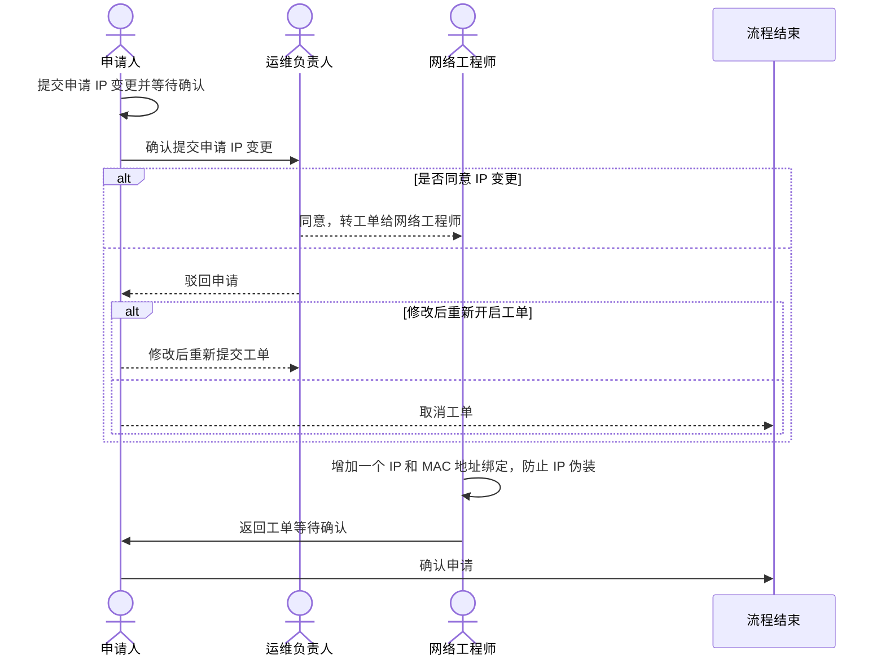

## 开通白名单

## 申请 IP 预留

## 申请 IP 变更

需要提供的工单信息

- 申请人
- 网卡 Mac 地址
- 当前 IP 地址
- 变更后 IP 地址

```mermaid
sequenceDiagram
actor REQ as 申请人
actor OPSM as 运维负责人
actor OPSN as 网络工程师
actor OPSN as 网络工程师
participant E as 流程结束
REQ->>REQ: 提交申请 IP 变更并等待确认
REQ->>OPSM: 确认提交申请 IP 变更
alt 是否同意 IP 变更
  OPSM-->>OPSN: 同意，转工单给网络工程师
else
  OPSM-->>REQ: 驳回申请
  alt 修改后重新开启工单
    REQ-->>OPSM: 修改后重新提交工单
  else
    REQ-->>E: 取消工单
  end
end
OPSN->>OPSN: 增加一个 IP 和 MAC 地址绑定，防止 IP 伪装
OPSN->>REQ: 返回工单等待确认
REQ->>E: 确认申请
```

