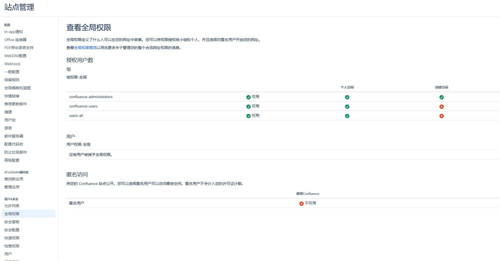
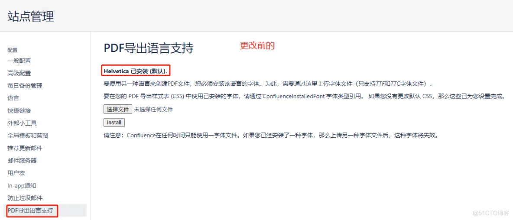

## OIDC 登录

授予权限

## 权限控制

需要允许第三方登录的组可以访问，同时回收创建空间权限



## Confluence 附件索引禁用

Confluence 提供给了对附件内容索引的功能，比如上传一个 word 格式的附件，Confluene 会解析附件的内容并对其内容建立索引，这样用户搜索时就可以搜到附件里的内容。这个功能看起来很好，但部署的规模大了后，confluence 的内容很多，建索引就变慢，索引占了很大的磁盘空间，更有甚者， 传一个大的附件上去就把 Confluence 直接搞死了

这个时候我们需要取舍，牺牲功能来换取稳定，大道至简， 在一些大型的应用上禁用了很了很多功能的都有

解决方法就是禁用 confluence 的附件索引，不解析中这些附件的功能，把相关的功能屏蔽掉

需要修改这两个 JAR 包里的 `atlassian-plugin.xml` 文件

- `confluence-attachment-extractors-x.x.jar` （pdf 解析插件）
- `OfficeConnector-x.x.jar`（Office 插件）

jar 包文件的路劲挂在 confluence 的安装目录（默认是 `/opt/atlassian/confluence`）下的 `confluence/WEB-INF/atlassian-bundled-plugins/`  的目录下 

解开 jar 包， 并修改 `atlassian-plugin.xml `文件（插件的模块文件）， 把相关模块禁用， 然后再重新打包

`confluence-attachment-extractors-x.x.jar` 把 pdfContentExtractor 注释掉

```xml
<atlassian-plugin key="com.atlassian.confluence.plugins.attachmentExtractors" name="Attachment Extractors">
    <plugin-info>
        <description>This plugin extracts searchable text from various attachment types.</description>
        <version>1.1</version>
        <vendor name="Atlassian Pty Ltd" url="http://www.atlassian.com/"/>
    </plugin-info>

    <!--
    <extractor name="PDF Content Extractor" key="pdfContentExtractor" class="com.atlassian.bonnie.search.extractor.PdfContentExtractor" priority="1100">
        <description>Indexes contents of PDF files</description>
    </extractor>
    -->

</atlassian-plugin>
```

`OfficeConnector-x.x.jar` 中需要禁用的模块有

- Word 97/2007 (`.doc` and `.docx`)

```xml
<extractor name="Word Content Extractor" key="wordContentExtractor" class="com.atlassian.confluence.extra.officeconnector.index.word.WordTextExtractor" priority="1099">
    <description>Indexes contents of Word 97/2007 files</description>
</extractor>
```

- PowerPoint 97 (`.ppt`)

```xml
<extractor name="PowerPoint 97 Content Extractor" key="ppt97ContentExtractor" class="com.atlassian.confluence.extra.officeconnector.index.powerpoint.PowerPointTextExtractor" priority="1099">
    <description>Indexes contents of PowerPoint 97 files</description>
</extractor>
```

- PowerPoint 2007 (`.pptx`)

```xml
<extractor name="PowerPoint 2007 Content Extractor" key="ppt2k7ContentExtractor" class="com.atlassian.confluence.extra.officeconnector.index.powerpoint.PowerPointXMLTextExtractor" priority="1099">
    <description>Indexes contents of PowerPoint 2007 files</description>
</extractor>
```

- Excel 97 (`.xls`)

```xml
<extractor name="Excel 97 Content Extractor" key="excel97ContentExtractor" class="com.atlassian.confluence.extra.officeconnector.index.excel.ExcelTextExtractor" priority="1099">
    <description>Indexes contents of Excel 97 files</description>
</extractor>
```

- Excel 2007 (`.xlsx`)

```xml
<extractor name="Excel 2007 Content Extractor" key="excel2k7ContentExtractor" class="com.atlassian.confluence.extra.officeconnector.index.excel.ExcelXMLTextExtractor" priority="1099">
    <description>Indexes contents of Excel 2007 files</description>
</extractor>
```

## Confluence 禁止删除空间

管理员登录，进入管理界面 ，外观 > 版式 , 编辑 主版式

然后在 head 的末尾加入一段代码

```js
#if ($userAccessor.hasMembership('confluence-administrators', $helper.action.remoteUser.name))
#else
    <script type="text/javascript">
        AJS.toInit(function(){
        AJS.$('li[data-web-item-key="removespace"]').hide();
        });
    </script>
#end
```

## Confluence 完全重建索引

1. 停 Confluence
2. 备份以下目录：
   - `<confluence-home>/index/`
   - `<confluence-home>/journal/`
3. 删除以下目录:
   - `<confluence-home>/index/`
   - `<confluence-home>/journal/`
4. 可选： 删除journalentry表内容：

```sql
SELECT COUNT(entry_id) FROM journalentry;

# 如果超过 10000 条
DELETE FROM journalentry;
```

最后，在 Confluence 管理页面上重建索引：Confluence Admin > Content Indexing 

## Confluence Plugin 的缓存清理

1. 关停 Confluence
2. 删除以下目录： （删除以前备份一下）
   - `<confluence-home>/bundled-plugins`
   - `<confluence-home>/plugins-cache`
   - `<confluence-home>/plugins-osgi-cache`
   - `<confluence-home>/plugins-temp`
   - `<confluence-home>/bundled-plugins_language`
3. 重启 Confluence

## Confluence 文件预览乱码

假设Confluence安装目录为`/opt/atlassian/confluence`，应用数据目录为`/var/atlassian/application-data/confluence`

1. 将 windows`C:\Windows\Fonts`目录下的字体文件复制到`/opt/atlassian/confluence/fonts`目录

2. 修改`/opt/atlassian/confluence/bin/setenv.sh`文件

   ```
   # vi /opt/atlassian/confluence/bin/setenv.sh
   CATALINA_OPTS="-Dconfluence.document.conversion.fontpath=/opt/atlassian/confluence/fonts/ ${CATALINA_OPTS}"
   ```

3. 删除应用临时预览文件

   ```
   cd /var/atlassian/application-data/confluence
   rm -rf viewfile/*
   rm -rf shared-home/dcl-document/*
   rm -rf shared-home/dcl-document_hd/*
   rm -rf shared-home/dcl-thumbnail/*
   ```

宏名称乱码：<https://blog.csdn.net/csdn_ds/article/details/126513385>

<https://blog.espnlol.com/?p=548

清空 confluence 的 home 下 viewfile 目录和 shared-home/dcl-document 目录里的所有缓存文档文件，不清空的话，confluence 预览旧文件时还是会显示方框，只有新文件才会正常

```
/viewfile/<br>
/thumbnails/<br>
/shared-home/dcl-document/<br>
/shared-home/dcl-document_hd/<br>
/shared-home/dcl-thumbnail/
```


## PDF 导出中文失败

安装 PDF 导出中文字体



- <https://github.com/chengda/popular-font>

## 页面添加返回顶部

设置 -> 自定义HTML -> BODY尾部中添加如下代码。

```html
<script type="text/javascript">
    //<![CDATA[
    AJS.toInit(function () {
        //If the scroll button doesn't exist add it and set up the listeners
        if (AJS.$('#scroll-top').length == 0) {
            AJS.$('#main-content').prepend('<button id="scroll-top" class="aui-button aui-button-primary scroll-top-button" style="display: none; position: fixed; bottom: 10px; right: 10px; z-index: 10;" title="返回顶部"><span class="aui-icon aui-icon-small aui-iconfont-chevron-up">Back to Top</span></button>');

            //Check to see if the window is top if not then display button
            AJS.$(window).scroll(function () {
                if (AJS.$(this).scrollTop() > 100) {
                    AJS.$('#scroll-top').fadeIn();
                } else {
                    AJS.$('#scroll-top').fadeOut();
                }
            });

            //Click event to scroll to top
            AJS.$('#scroll-top').click(function () {
                AJS.$('html, body').animate({scrollTop: 0}, 500);
                return false;
            });
        }
    });
    //]]>
</script>
```

## 开启插件上传

- 开启上传插件：<https://confluence.atlassian.com/conf85/managing-system-and-marketplace-apps-1283360882.html>

```
Option 1: Re-enable the UI upload button and API

Set the system property upm.plugin.upload.enabled to true.
Perform a restart.
Upload the app through the UPM UI.
We recommend that you disable the button once your upload is complete, using the additional steps below.

Set the system property upm.plugin.upload.enabled to false,

Perform a restart.

Option 2: Load custom plugins from your Confluence file system

 If the system property atlassian.confluence.plugin.scan.directory is not set, provide the target location of your custom plugins. We recommend a directory within the Confluence home directory, such as $CONFLUENCE_HOME/plugins/installed-plugins.

Restart Confluence.
```

修改系统属性，详见：<https://confluence.atlassian.com/conf88/configuring-system-properties-1354500668.html>

## Confluence 调整草稿保存间隔以缓解业务高峰时性能问题

在 Confluence业 务使用高峰时，可能会遇到写压力过大的问题， 数据库和 Confluence 服务器的 CPU 都居高不下

这种情况，可以调整草稿的保存间隔， 需要Confluence管理员 高级配置 中修改 草稿保存时间间隔

## Confluence 页面上添加水印

Confluence 提供了内置功能，可以修改站点或空间的布局，通过这个功能，可以为 Confluence 页面添加水印

修改布局配置的步骤：

1. 进入管理 Administration > 一般配置 General Configuration > 版式 Layouts (在外观 Look and Feel 里)
2. 单击内容版式 Content Layouts > 页面版式 Page Layouts 旁边的 Create Custom
3. 进行更改，然后单击保存

如果出现问题：点击 Reset Default 可以恢复原始布局

将光标移动到原始文本的最末尾，新增一行

```js
<script>
    (function devpodMark() {
        var bg = document.createElement('canvas');
        var body = document.getElementById('main-content');
        body.appendChild(bg);
        bg.width = 399;
        bg.height = bg.width;
        var mark = bg.getContext('2d');
        mark.fillStyle = "rgba(19,19,19,0.19)";
        mark.rotate(-39*Math.PI/360);
        mark.font = "19px Arial";
        mark.textAlign = "middle";
        mark.textBaseline = 'middle';
        var date = new Date();
        mark.fillText(date.toLocaleString(), 1, 399);
        mark.fillText("$!action.remoteUser.name", 1, 199);
        body.style.backgroundImage = "url("+bg.toDataURL("image/png")+")";
    })();
</script>
```

## 禁用保护管理员事务

Confluence 默认对管理员相关的功能启用了管理员事务保护，也就是管理员即使已经登录了，在操作管理员相关功能时，也需要再次登录一次，如果要禁用的话，在 “用户 & 安全→安全配置” 中，去掉默认勾选的保护管理员事务即可

## 配置全局样式表

```css
/* 调整字体和大小，优化中文显示效果 */
.wiki-content {
    font-family: "Helvetica Neue", "Luxi Sans", "DejaVu Sans", "Hiragino Sans GB", "Microsoft Yahei", sans-serif, "Apple Color Emoji", "Segoe UI Emoji", "Noto Color Emoji", "Segoe UI Symbol", "Android Emoji", "EmojiSymbols";
    font-variant-ligatures: no-common-ligatures !important;
    font-size: 16px;
    text-rendering: optimizeLegibility !important;
}
 
/* 优化等宽字体，也就是行内代码的显示效果 */
code {
    padding: 1px 5px 1px 5px;
    font-family: Consolas, Menlo, Monaco, Lucida Console, Liberation Mono, DejaVu Sans Mono, Bitstream Vera Sans Mono, Courier New, monospace, serif;
    background-color: #eeeeee;
}
```

## 修改 synchrony 最大堆内存

synchrony是Confluence用协同编辑的功能，默认堆内存为2G，这里可以修改成1G，或是禁用掉。

参考：

https://confluence.atlassian.com/doc/configuring-synchrony-858772125.html
https://confluence.atlassian.com/doc/recognized-system-properties-190430.html
https://confluence.atlassian.com/doc/configuring-system-properties-168002854.html

编辑 `/opt/atlassian/confluence/bin/setenv.sh` 文件，未尾增加如下内容：

## 导航栏添加自定义链接

参考：https://confluence.atlassian.com/confkb/how-do-i-add-links-to-confluence-5-x-s-top-global-header-navigation-bar-358908020.html

这里在导航栏上添加一个“空间目录”链接以直达空间目录列表，并将原来的“空间”下拉列表删除，方法如下，在HEAD尾部增加以下代码：

```js
<script>
    AJS.toInit(function(){
        AJS.$('.aui-header-primary .aui-nav').append('<li><a href="/confluence/spacedirectory/view.action" class=" aui-nav-imagelink">空间目录</a></li>');
        AJS.$('.aui-header-primary .aui-nav li').first().css("display", "none");
    });
</script>
```

## 配置站点通知横幅

进站点管理页面，在自定义 HTML 中将相关代码插入到 BODY 首部

```html
<!-- Message Banner -->
<div style="background-color: yellow; border: 2px solid red; margin: 4px; padding: 2px; font-weight: bold; text-align: center;">
本网站将于今晚进行升级维护、数据更新，可能会导致部分网页访问受到影响，无法正常浏览，特此告知。
</div>
```

可关闭的通知横幅

```html
<div class="aui-message closeable">
    <p class="title">
        <strong>通知</strong>
    </p>
    <p>本网站将于今晚进行升级维护、数据更新，可能会导致部分网页访问受到影响，无法正常浏览，特此告知。</p>
</div>
```

## 备份与恢复

## 参考文档

- <https://confluence.atlassian.com/doc/production-backup-strategy-38797389.html>

- <https://confluence.atlassian.com/doc/scheduling-a-backup-138348.html>

- Jira 集成 <https://confluence.atlassian.com/applinks/oauth-security-for-application-links-774045732.html>

- <https://www.midlane.top/wiki/pages/viewpage.action?pageId=10059974>

