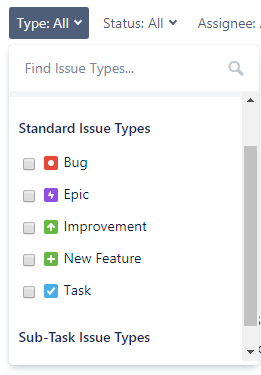

JIRA Issue 用于跟踪已完成或未完成的各项工作。JIRA 问题可能是软件错误或任何其他问题。在 Jira 中导入项目后，可以创建问题

## 问题类型

团队共同努力将工作分解为问题。问题可能代表软件错误，项目任务，子任务或任何其他项目工作。Jira项目附带默认问题类型，还可以创建自己的问题类型。

问题类型是工作单元的通用名称。在Jira中，我们在项目中有不同的工作单元，而问题类型字段区分了这一点。

创建问题时，您需要指定问题类型。甚至可以在创建问题后更改问题类型。

每个问题都有一个与之关联的图标，用于标识问题类型

自定义问题类型：它还用于创建自定义问题类型，为团队提供根据其项目创建自己的问题类型的灵活性

问题类型有三种类型：

- JIRA 核心默认问题类型
  - 任务：任务是团队完成的工作项，但不直接与用户的要求相关联。例如，升级团队使用的产品版本。
  - 子任务：这是另一个问题的一部分。它用于将问题分解为不同的工作。在创建问题时，问题类型字段下拉列表中未提供子任务问题，因为它包含一些父问题，因此可以说无法单独创建子任务问题。
- JIRA 软件默认问题类型
  - 故事：从用户的角度来看，这是一个要求。
  - 错误：这是产品中的缺陷，需要由开发人员修复。可以使用自己的问题类型跟踪它，以区别于其他类型的工作。
  - 史诗：史诗是一个包含其他问题的大问题。
- JIRA 服务台默认问题类型
  - 事件
  - 服务请求
  - 更改
  - 问题

### 为什么要使用问题类型？

## 问题类型方案

包含问题类型的集合

问题类型方案可以关联到项目中使用