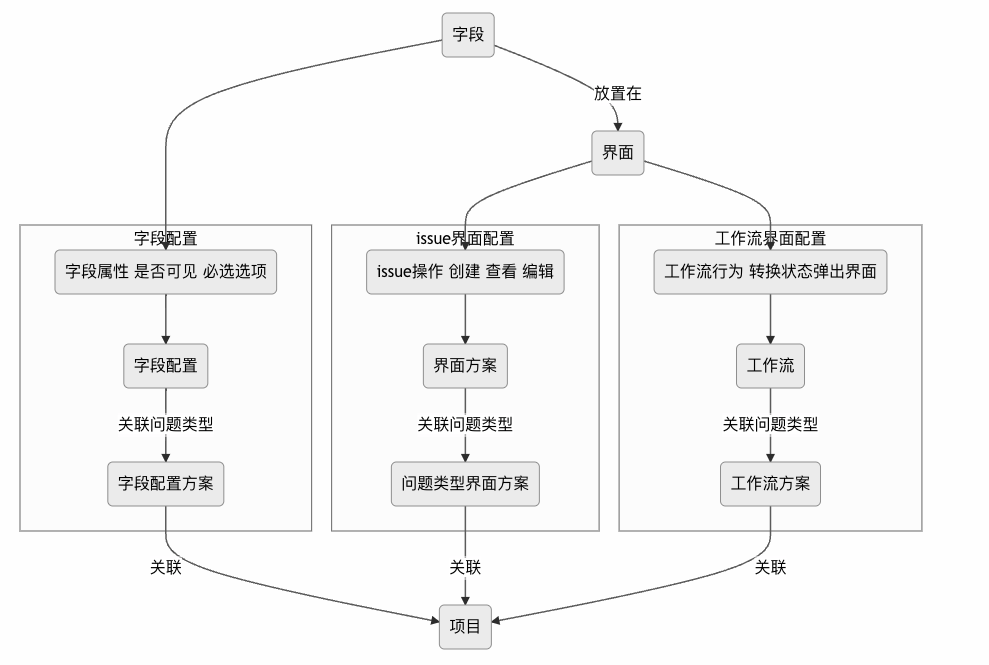
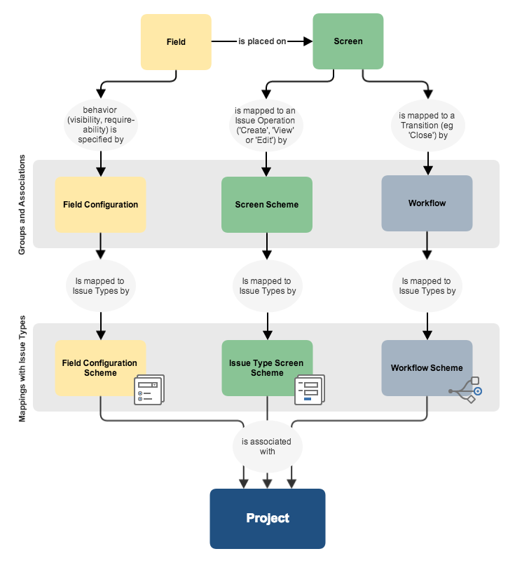

## Jira 简介

Jira 是 Atlassian 公司出品的项目与事务跟踪工具，被广泛应用于缺陷跟踪（bug 管理）、客户服务、需求收集、流程审批、任务跟踪、项目跟踪和敏捷管理等工作领域

## Jira 总览

每个事务的相关信息均保留在与该事务关联的字段中。您可以根据贵组织的需求调整这些字段。以下图表描述了这些字段是如何通过界面和方案与事务关联的。界面是用户的事务视图，并通过界面方案映射到特定事务操作（如创建事务或编辑事务）。然后，界面方案通过事务类型界面方案映射到某个事务类型。这一配置与项目关联，因此适用于项目内的所有事务

名词：

- 问题类型方案：关联项目和问题类型
- 问题类型

- Workflow Schema（工作流方案）：关联问题类型和工作流方案
- Workflow（工作流）
- Issue Type Screen Schema（问题类型界面方案）：关联界面方案和问题类型
- Screen Schema（界面方案）：关联问题操作和界面
- Screen（界面）：关联字段到页面显示
- Field Configuration Schema（字段配置方案）：绑定字段配置和问题类型
- Filed Schema（字段配置）
- Field（自定义字段、系统字段）

一个问题包含：

- 工作流
- 界面（提交的部分）
- 字段（记录问题信息）

通过自定义字段、界面和方案，可以充分利用 JIRA 系统的全部功能，并确保 Jira 的用户高效地工作

还可以设置通知方案，用于在用户事务更新时通知用户

## Jira 插件

好用的插件

| 插件名                                  | 用途                                                         | 地址                                                         |
| --------------------------------------- | ------------------------------------------------------------ | ------------------------------------------------------------ |
| JSU Automation Suite for Jira Workflows | 1、制作复杂，严谨的工作流必备 2、增强工作流的条件、验证器、后处理工程 2、 添加jira问题工作流转关的依赖检查， 数据聚合 3、 添加灵活的工作流检查条件 | <https://marketplace.atlassian.com/apps/5048/jsu-automation-suite-for-jira-workflows?tab=overview&hosting=datacenter> |
| ScriptRunner for Jira                   | 1、JIRA 工作流定制化开发 2、JIRA 界面定制化开发 3、通过 script 脚本灵活扩展 JIRA 功能 | <https://marketplace.atlassian.com/apps/6820/scriptrunner-for-jira?hosting=datacenter&tab=overview> |
| Chinese (China) Language Patch for Jira | 专业的中文翻译包，修复原厂翻译的错误， 修复超过 1000 处翻译问题 | <https://marketplace.atlassian.com/apps/1218796/chinese-china-language-patch-for-jira?tab=overview&hosting=datacenter> |
| Xporter - Export issues from Jira       | Issue 导出工具，可以定制模板，导出成 Excel 、 Word、 PDF 格式 | <https://marketplace.atlassian.com/apps/891368/xporter-export-issues-from-jira?hosting=datacenter&tab=overview> |
| eazyBI Reports and Charts for Jira      | 1、JIRA 数据分析工具，灵活的定制报表和数据展现 2、 支持通过拓展， 实现多维度的数据统计及展示 | <https://marketplace.atlassian.com/apps/1211051/eazybi-reports-and-charts-for-jira?tab=overview&hosting=datacenter> |
| Mattermost Connector for Jira           | 连接到 Mattermost                                            | <https://marketplace.atlassian.com/apps/1219477/mattermost-connector-for-jira?hosting=server&tab=overview> |
| Timesheets by Tempo                     | 1、JIRA 记录工时 2、按个人，项目、团队统计工时，生成报表 3、工时审批流程 |                                                              |
| Table Grid Editor                       | 增加 table的字段，可以在issue中使用表格类型字段              |                                                              |
| Structure - Project Management at Scale | 1、结构化、层次化展现JIRA Issue的关系 2、项目计划        |                                                              |
| ProForma: Forms & Checklist for Jira    | JIRA 动态表单                                                |                                                              |
| Xray : 测试管理                         | 1、测试用例管理 2、测试过程管理，包括测试执行，测试计划 3、测试需求覆盖率 4、测试 bug 关系管理 5、各种报表 |                                                              |

## 参考文档

- <https://www.atlassian.com/zh/software/jira/templates/software-development>

- <https://doc.devpod.cn/jsm/jira-service-management-17105048.html>

- Jira 使用：<https://www.yiibai.com/jira/jira-introduction.html>

- <https://doc.devpod.cn/jira/jira-15237264.html>

- <https://blog.csdn.net/Nicolege678/article/details/124605511>

- <https://blog.csdn.net/qq_41386332/article/details/108658431>

- <https://doc.devpod.cn/jira/jira-360469.html>

- <https://www.cnblogs.com/pluto4596/p/12434172.html>