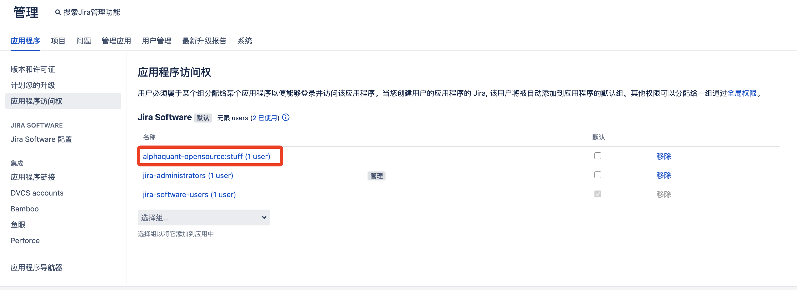

## 部署

镜像：<https://hub.docker.com/r/atlassian/jira-software>

数据库配置：<https://confluence.atlassian.com/adminjiraserver/connecting-jira-applications-to-postgresql-938846851.html>

兼容性列表：<https://confluence.atlassian.com/adminjiraserver/supported-platforms-938846830.html>

## 常见问题处理

- `Unable to create and acquire lock file for jira.home directory '/var/atlassian/application-data/jira`

解决：删除 jira_home 目录下的 lock 文件（`.jira-home.lock`），是一个隐藏文件，然后重启 jira 服务即可

- `Unable to clean the cache directory: /var/atlassian/application-data/jira/plugins/.osgi-plugins/felix`

解决：先停止 jira 服务，然后删除 `$JIRA_HOME/plugins/.osgi-plugins/felix/`，启动重启 jira 服务即可

- `There is/are [1] thread(s) in total that are monitored by this Valve and may be stuck.`

解决：等等就好了

## 配置 OIDC 登录

官方文档：<https://confluence.atlassian.com/enterprise/openid-connect-for-atlassian-data-center-applications-987142159.html>

注意为 group 授予访问的权限



## Userpicker 无法选择用户

新建 userpicker 类型的自定义字段，对于普通用户或者说某个用户组不能用，显示的是一个锁的状态，输入用户名也查询不到

Jira 的浏览用户权限是在全局设置里面配置的，是针对用户组来开放的，需要对特定用户组进行设置。

解决方法：给指定的用户组添加浏览用户的权限

## 禁用保护管理员事务

JIRA 要求用户必须通过一个安全管理会话使用 JIRA 管理屏幕，从而保护对其管理功能的访问。（这也称为 websudo。）当 JIRA 管理员（已登录到 JIRA）尝试访问管理功能时，系统将提示他们再次登录。这将使管理员登录到一个临时安全会话，授权访问 JIRA 管理屏幕

默认情况下，安全管理会话（即访问管理功能之前需要密码确认）处于启用状态。如果这会导致您的 JIRA 实例出现问题（例如在使用自定义身份验证机制时），可以通过在 `jira-config.properties` 文件中指定以下行来禁用此功能：

```ini
jira.websudo.is.disabled = true
```

可能在数据库：<https://confluence.atlassian.com/kb/websudo-is-disabled-after-migration-from-jira-cloud-to-jira-server-845939463.html>

```sql
select * from propertyentry where property_key like '%websudo%';
UPDATE propertyentry set propertytype=0 where id=<ID>;
```

## 开启插件上传

允许插件上传

```bash
JVM_SUPPORT_RECOMMENDED_ARGS="-Dupm.plugin.upload.enabled=true"
```

