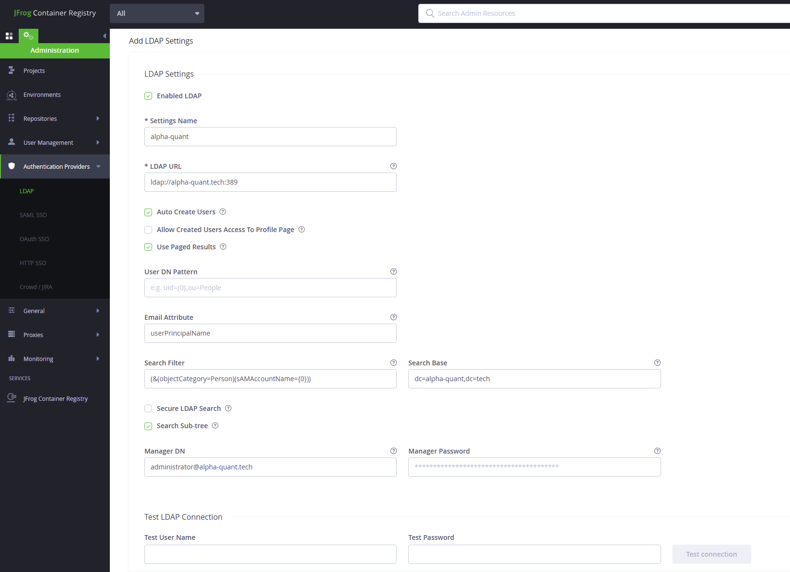

## 安装

使用 Docker 安装的官方文档地址：<https://www.jfrog.com/confluence/display/JFROG/Installing+Artifactory#InstallingArtifactory-DockerInstallation>

下载地址：<https://jfrog.com/download-jfrog-container-registry/>

### 镜像拉取

版本发布页面：<https://www.jfrog.com/confluence/display/JFROG/Artifactory+Release+Notes>

目前最新版本是 7.90.14，详见：<https://jfrog.com/help/r/jfrog-release-information/artifactory-release-notes>

文档使用的镜像清单

```bash
docker.io/openresty/openresty:1.21.4.1-2-alpine
releases-docker.jfrog.io/jfrog/artifactory-jcr:7.90.14
# docker.bintray.io/jfrog/artifactory-jcr:latest
# releases-docker.jfrog.io/jfrog/artifactory-jcr:latest
```

### 持久化目录

编辑 `.env` 文件

执行初始化脚本

```bash
./config.sh
```

先准备一个持久化目录

```bash
export JFROG_HOME=/registry
```

新建一个配置文件

```bash
mkdir -p $JFROG_HOME/artifactory/var/etc/

touch $JFROG_HOME/artifactory/var/etc/system.yaml
```

更改目录权限

```bash
chown -R 1030:1030 $JFROG_HOME/artifactory/var
```

修改 `system.yaml`

```bash
```


生成 master key

创建  Master Key

```bash
# Create a key
export MASTER_KEY=$(openssl rand -hex 32)
echo ${MASTER_KEY}
# 68884a25b2d196815f78583c85434f800d1c497d4ab95284af9d08bdf8c95b0d
 
# Create a secret containing the key. The key in the secret must be named master-key
# kubectl create secret generic my-masterkey-secret -n artifactory --from-literal=master-key=${MASTER_KEY}
```

创建 Join Key

```bash
# Create a key
export JOIN_KEY=$(openssl rand -hex 32)
echo ${JOIN_KEY}
# 2e367b1ef373d43f018ef965fbffe03f1bbe399f0e3d69a8ea28643153e86f78

# Create a secret containing the key. The key in the secret must be named join-key
# kubectl create secret generic my-joinkey-secret -n artifactory --from-literal=join-key=${JOIN_KEY}
```

### 启动容器

按照如下方式启动容器

```bash
docker run \
  --name artifactory \
  -itd \
  --restart=always \
  -v $JFROG_HOME/artifactory/var/:/var/opt/jfrog/artifactory \
  -p 8081:8081 \
  -p 8082:8082 \
  releases-docker.jfrog.io/jfrog/artifactory-jcr:7.90.14
```

访问浏览器，输入地址，例如 192.168.31.100:8081

初始用户名密码：admin /  password 登录后修改即可

登录后进行初始化流程：<http://192.168.31.100:8082/ui/admin/onboarding-page>

## 配置 LDAP



## 配置 Nginx 代理

先配置好镜像仓库使用的类型，比如这里选择的 port 方式

artifactory 会自动生成配置文件

```nginx
###########################################################
## this configuration was generated by JFrog Artifactory ##
###########################################################

## server configuration
server {
     
    listen 18082 ;
     
    server_name 192.168.31.100;
    if ($http_x_forwarded_proto = '') {
        set $http_x_forwarded_proto  $scheme;
    }
    ## Application specific logs
    ## access_log /var/log/nginx/192.168.31.100-access.log timing;
    ## error_log /var/log/nginx/192.168.31.100-error.log;
    rewrite ^/$ /ui/ redirect;
    rewrite ^/ui$ /ui/ redirect;
    chunked_transfer_encoding on;
    client_max_body_size 0;
    location / {
    proxy_read_timeout  2400s;
    proxy_pass_header   Server;
    proxy_cookie_path   ~*^/.* /;
    proxy_buffer_size 128k;
    proxy_buffers 40 128k;
    proxy_busy_buffers_size 128k;
    proxy_pass          http://192.168.31.100:8082;
    proxy_set_header    X-JFrog-Override-Base-Url $http_x_forwarded_proto://$host:$server_port;
    proxy_set_header    X-Forwarded-Port  $server_port;
    proxy_set_header    X-Forwarded-Proto $http_x_forwarded_proto;
    proxy_set_header    Host              $http_host;
    proxy_set_header    X-Forwarded-For   $proxy_add_x_forwarded_for;
    add_header X-Content-Type-Options "nosniff" always;
 
        location ~ ^/artifactory/ {
            proxy_pass    http://192.168.31.100:8081;
        }
    }
}

## server configuration
server {
    listen 60080;
     
     
    server_name 192.168.31.100;
    if ($http_x_forwarded_proto = '') {
        set $http_x_forwarded_proto  $scheme;
    }
    ## Application specific logs
    ## access_log /var/log/nginx/192.168.31.100-access.log timing;
    ## error_log /var/log/nginx/192.168.31.100-error.log;
    rewrite ^/(v1|v2)/(.*) /artifactory/api/docker/group-images/$1/$2;
    chunked_transfer_encoding on;
    client_max_body_size 0;
    location / {
    proxy_read_timeout  2400s;
    proxy_pass_header   Server;
    proxy_cookie_path   ~*^/.* /;
    proxy_buffer_size 128k;
    proxy_buffers 40 128k;
    proxy_busy_buffers_size 128k;
    proxy_pass          http://192.168.31.100:8082;
    proxy_set_header    X-JFrog-Override-Base-Url $http_x_forwarded_proto://$host:$server_port;
    proxy_set_header    X-Forwarded-Port  $server_port;
    proxy_set_header    X-Forwarded-Proto $http_x_forwarded_proto;
    proxy_set_header    Host              $http_host;
    proxy_set_header    X-Forwarded-For   $proxy_add_x_forwarded_for;
    add_header X-Content-Type-Options "nosniff" always;
 
        location ~ ^/artifactory/ {
            proxy_pass    http://192.168.31.100:8081;
        }
    }
}

```

启动一个 nginx 容器来代理

```bash
docker run -itd --name nginx-artifactory-proxy \
    -v /data/artifactory-data/nginx.conf:/etc/nginx/conf.d/nginx.conf \
    --network host \
    openresty/openresty:1.21.4.1-2-alpine
```

## 参考文档

- 安装 Artifactory：<https://www.jfrog.com/confluence/display/JFROG/Installing+Artifactory#1147598461cac81dc9df443cca4c115804d331211>
- Artifactory Docker Registry 的配置 <https://www.jfrog.com/confluence/display/JFROG/Docker+Registry>

- <https://www.cnblogs.com/anliven/p/13543970.html>