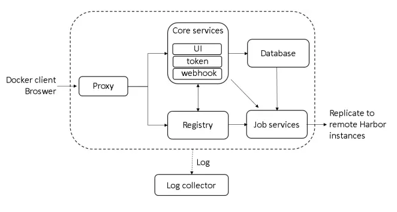

## Harbor 简介

Harbor 是一款开源的企业级 Docker Registry 服务，它提供了一个安全、可靠、高效的 Registry 管理平台，支持多租户、LDAP、AD 认证等特性

它主要用于管理、存储、分发 Docker 镜像，并提供镜像的安全性、可追溯性、可管理性等方面的支持

官方：

- GitHub 仓库：<https://github.com/goharbor/harbor>
- 文档：<https://goharbor.io/>

## Harbor 的设计架构

### 主要组件

Harbor 主要包含以下组件：

- Proxy：Harbor 的 registry、UI、token services 等组件，都处在一个反向代理后边。该代理将来自浏览器、docker clients 的请求转发到后端服务上
- Core services: Harbor 的核心功能，主要包括如下 3 个服务
  - Log Collector：日志收集器，用于收集 Harbor 的日志信息并输出到指定的日志存储系统中
    - 支持收集 Harbor 的运行日志、错误日志、访问日志等相关信息
    - 支持输出到指定的日志存储系统中，如ELK等
  - Job services: 主要用于镜像复制，本地镜像可以被同步到远程 Harbor 实例上
  - UI：Web界面，用于管理 Harbor 服务
    - 支持用户、角色、项目、镜像、标签等相关信息的管理
    - 支持权限控制和用户认证
    - 支持镜像的搜索和查看

- Registry：镜像仓库，用于存储 Docker 镜像
  - 支持安全的镜像上传和下载
  - 支持多租户和权限控制
  - 支持镜像复制和同步
  - 支持镜像标签和元数据的管理
- Database：数据库，用于存储 Harbor 的元数据信息
  - 存储 Harbor 的用户、角色、项目、镜像、标签等相关信息
- Redis：缓存，用于存储 Harbor 的会话信息等
  - 存储 Harbor 的会话信息、缓存信息、消息队列等相关信息
- Notary：签名和验证服务，用于对镜像进行数字签名和验证
  - 支持对 Docker 镜像进行数字签名和验证
  - 支持自定义签名策略和验证策略
