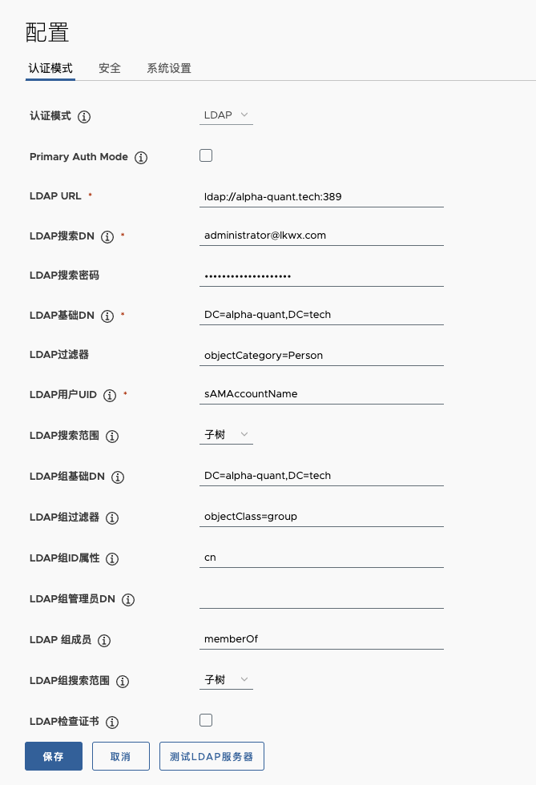
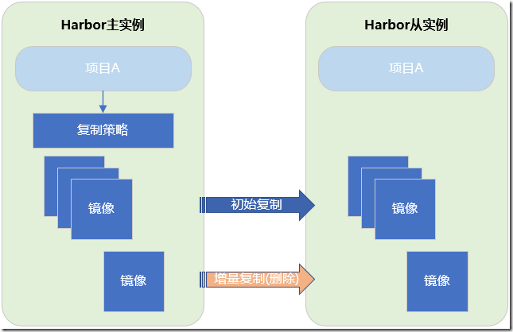
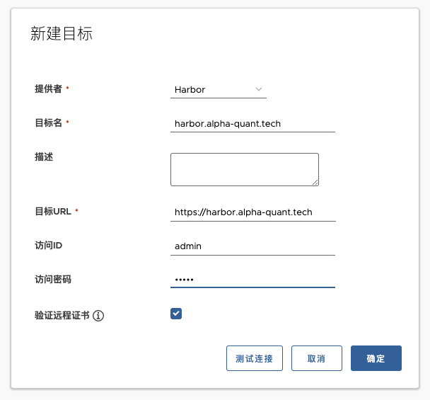

## 部署 Harbor

### 下载离线包

官网给出了两种安装模式，在线安装包或离线安装包。其区别是离线安装包里面含有镜像，在线版本在安装时则去 Docker Hub 拉取镜像

这里使用离线安装包

最新版本可以从 github 获取：<https://github.com/goharbor/harbor/releases>

```bash
export INST_HARBOR_VERSION=v2.11.0

cd $(mktemp -d)
wget https://github.com/goharbor/harbor/releases/download/${INST_HARBOR_VERSION}/harbor-offline-installer-${INST_HARBOR_VERSION}.tgz \
  -O harbor-offline-installer-${INST_HARBOR_VERSION}.tgz

tar zxvf harbor-offline-installer-${INST_HARBOR_VERSION}.tgz -C /data

cd /data/harbor
```

准备证书目录和证书

```bash
mkdir -p /data/harbor/https-cert

# ls /data/harbor/https-cert
tls.crt tls.key

```

### 初始化配置

在 harbor 文件夹里可以看到有一份文件 harbor.yml.tmpl，这是 Harbor 的配置信息，我们复制一份并进行修改

```bash
cp harbor.yml.tmpl harbor.yml
```

以下仅显示修改部分：

```bash
# 访问域名
yq -i '.hostname = "harbor.alpha-quant.tech"' harbor.yml
yq -i '.external_url = "https://harbor.alpha-quant.tech"' harbor.yml

# 端口
yq -i '.http.port = 80' harbor.yml
yq -i '.https.port = 443' harbor.yml

# https 证书
yq -i '.https.certificate = "/data/harbor/https-cert/tls.crt"' harbor.yml
yq -i '.https.private_key = "/data/harbor/https-cert/tls.key"' harbor.yml

# 初始密码
yq -i '.harbor_admin_password = "Lsr1142._harbor"' harbor.yml
yq -i '.database.password = "Lsr1142._mysql"' harbor.yml

# 数据目录
yq -i '.data_volume = "/data/harbor-data"' harbor.yml
```

### 运行 harbor

修改完毕后，直接运行

```bash
bash ./install.sh --with-trivy
```

并等待 Docker Compose 执行完毕

部署完毕后，就可以使用这台机器的 5000 端口看到 Harbor 界面了

## 第三方登录

### 对接 MAD

文档：<https://goharbor.io/docs/2.11.0/administration/configure-authentication/>



### 对接 OIDC

CLI 密钥与 OIDC ID 令牌相关联。Harbor 将尝试刷新令牌，因此 CLI 密钥在 ID 令牌过期后仍然有效。但是，如果 OIDC 提供商未提供刷新令牌或刷新失败，CLI 密钥将失效。在这种情况下，请注销并通过 OIDC 提供商重新登录 Harbor，以便 Harbor 可以获取新的 ID 令牌。然后 CLI 密钥将再次起作用。

原文：<https://goharbor.io/docs/2.11.0/administration/configure-authentication/oidc-auth/>

## 升级 Harbor

- <https://goharbor.io/docs/2.11.0/administration/upgrade/>

## 仓库主从同步配置



在 Harbor 从仓库管理配置 Harbor 主仓库的信息，可以测试验证连通性



在 Harbor 从仓库 复制管理配置 新建规则，可以创建手动执行规则和定时规则，对应选项有相关解析

- 名称:复制规则的名称，自定义

- 复制模式：Pull-based

- 原仓库：选这个上面新建的连接

- 触发模式：可以手动，也可以定时

- 勾选覆盖

保存

## Trivy 镜像扫描

- <https://mp.weixin.qq.com/s/hTnKPBDUqjbaLpX3Q9BEYQ>

## Notary 镜像签名

- <https://mp.weixin.qq.com/s/pwFa4M1tqG6OnNmZr2BwQg>

`Docker Content Trust`(`DCT`)提供了对从远程 `Docker` 仓库上传和下载的镜像文件，使用数字签名的能力，其能够保证镜像文件的完整性和发布者的可信性。`DCT` 通过 `Docker` 标签对镜像文件是否进行签名进行区分，镜像发布者可以自行决定在哪些标签上进行签名
