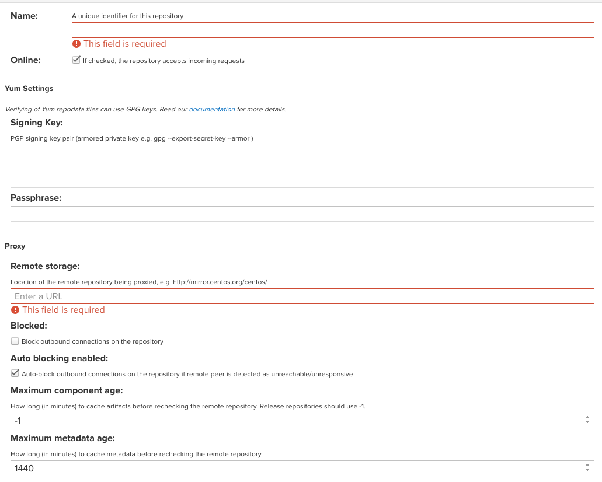
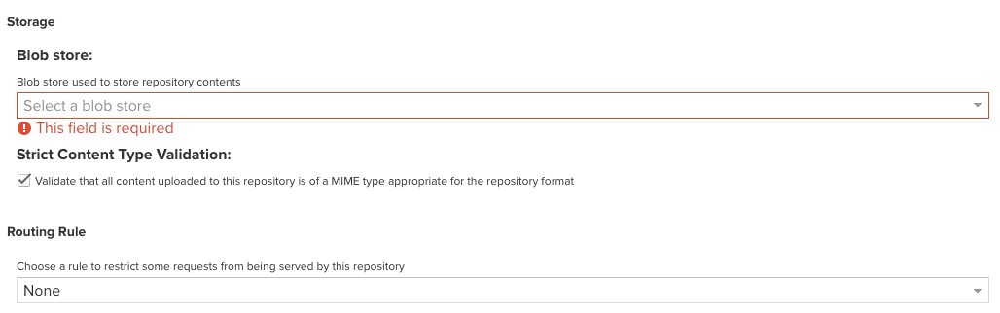
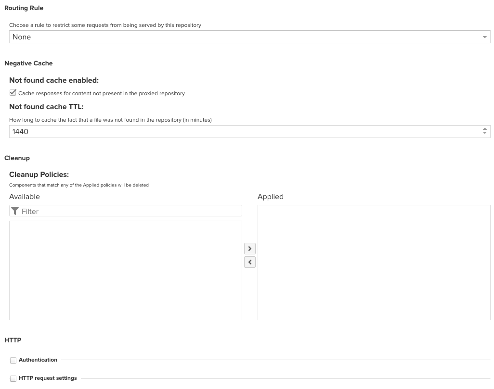

## 仓库类型

- 【proxy】代理仓库，用来代理像 清华大学开源软件镜像站 <https://mirrors.tuna.tsinghua.edu.cn/>、阿里巴巴开源镜像站 <https://developer.aliyun.com/mirror/> 等站点。
- 【hosted】本地仓库，可以用来存放自己的 jar 包、docker 镜像等，属于自己的仓库。
- 【group】仓库组，可以将多个代理仓库或宿主仓库合并在一起，然后向外提供服务。

## 仓库详情填写

以下详细介绍各个属性的意义，并给出填写示例。

- Name: 仓库名，需要唯一，不能与其他已经仓库的仓库重名，最好能通过名称知道仓库的意义
- Signing Key 和 Passphrase: gpg 签名相关，一般不使用
- Remote storage: 远程存储仓库的 URL 地址，如直接代理清华大学的centos源，其地址是 <https://mirrors.tuna.tsinghua.edu.cn/centos/>
- Block outbound connections on the repository， 阻止出站连接，不勾选。
- Auto-block outbound connections on the repository if remote peer is detected as  unreachable/unresponsive,  如果检测到远程对等方无法访问/没有响应，则自动阻止存储库上的出站连接，建议关闭。即远程代理仓库不可用时，这个代理仓库会自动阻止出站连接，也就是不去访问这个远程仓库。
- How long (in minutes) to cache artifacts before rechecking the remote  repository,  在多少分钟内会再次检查远程仓库，也就是在多少分钟内使用缓存的归档文件，默认 1440分 钟，也就是 1 天。可以改大点，测试时，保持默认即可。
- How long (in minutes) to cache metadata before rechecking the remote repository. 原数据缓存多少分钟，默认1440分钟，也就是1天。如果一直保存，设置为 `-1`。建议是设置较大的值。

- Blob store used to store repository contents，存储库使用的 blob,可以使用默认的 default，也可以自己新建 blob。建议每个仓库新建同名的 Blob

- Strict  Content Type Validation：校验 Content Type，建议关闭

- Routing Rule：一般保持默认选择即可
- Not found cache enabled / Not found cache TTL 在存储库中找不到文件时，缓存多少分钟，默认 1440 分钟，也就是 1 天。建议关闭此功能，时间设置为 -1
- Cleanup，清理策略，按需设置。
- Authentication，用于 HTTP 认证的，通常开源镜像站不需要认证。有需要认证时，才勾选此处。我们不勾选即可。
- HTTP request setting，HTTP 请求设置，一般只需要设置一下 User-Agent 请求头即可，如填写 `Sync yum repo. email: xxx@alpha-quant.tech`。