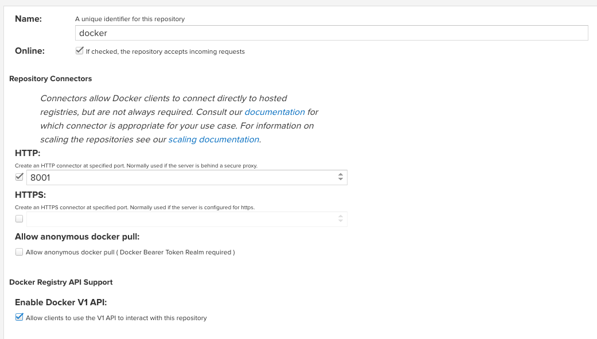

Docker 代理仓库说明：



- name: docker
- format: docker
- type: proxy
- HTTP 端口：8001
- HTTPS 端口：不勾选，忽略
- Allow anonymous docker pull ( Docker Bearer Token Realm required )： 允许匿名下载镜像，勾选该处。
- Enable Docker V1 API: 允许 docker 客户端使用 V1 API，勾选该处。


- Remote storage: 远程存储仓库的 URL 地址，如直接代理 `docker.io`

- Docker Index: 选择使用 Docker Hub

- Maximum component age / Metadata age：均设置为 -1，永久保存

测试代理仓库下载镜像 

```bash
# cat daemon.json
{
    "insecure-registries":[
        "0.0.0.0/0",
    ],
    "registry-mirrors":[
        "http://nexus-mirror.alpha-quant.tech:8001",
    ],
    "data-root": "/data/docker"
}
```

