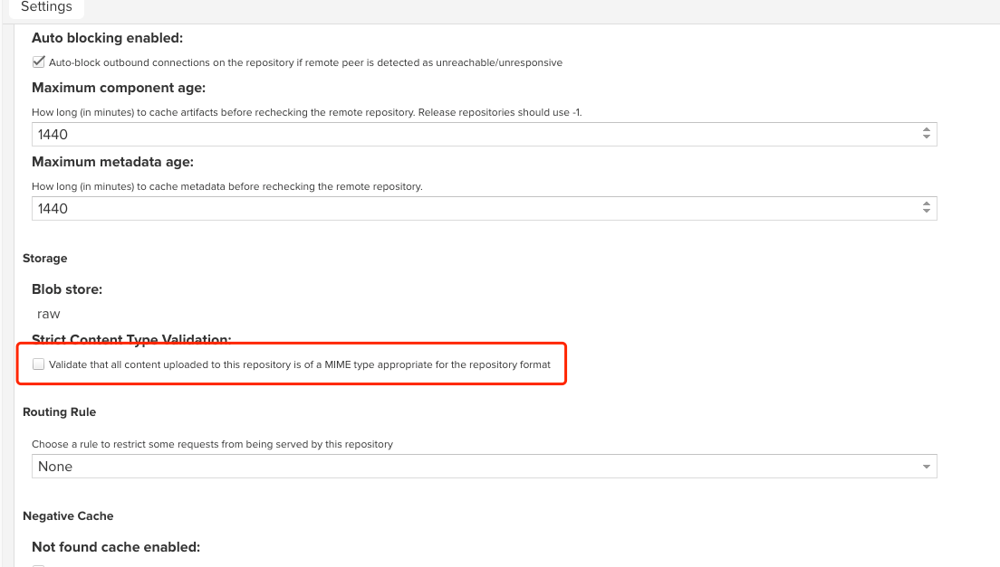

## Pytorch 无法代理问题

Pytorch 无法代理问题，采用：

```bash
https://mirror.sjtu.edu.cn/pytorch-wheels/torch_stable.html
```

安装时

```bash
pip install \
    --index-url https://pypi.tuna.tsinghua.edu.cn/simple \
    --find-links https://mirror.sjtu.edu.cn/pytorch-wheels/torch_stable.html \
    --no-cache-dir \
    torch===2.0.0+cpu
```

## Nexus 报 Detected content type 错误问题处理

这是由于 Nexus 会去校验仓库内容是否是适用于存储库格式的 MIME 类型，这里在仓库设置中取消校验设置即可：如下图



## Could not download page bundle

Open `Administration` -> `System` -> `Capabilities`. Select the `Outreach Management` capability.

Click the `Disable` button. Your changes are immediately saved.