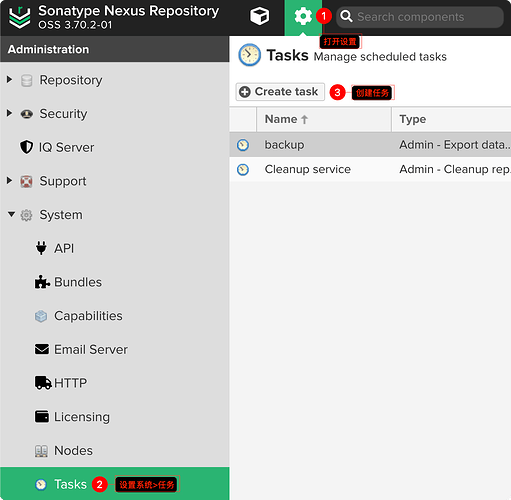
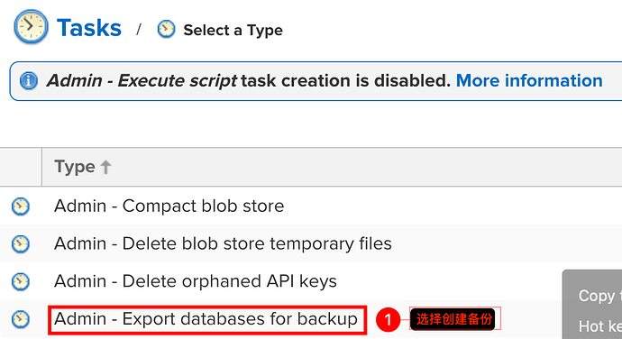
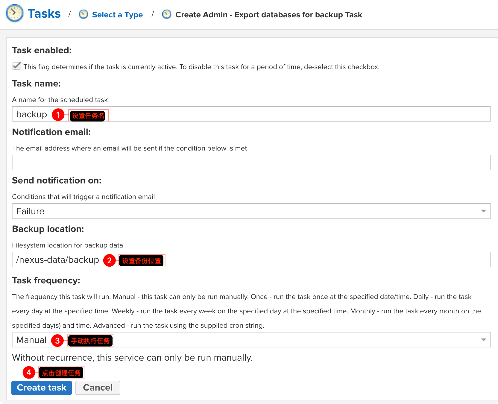
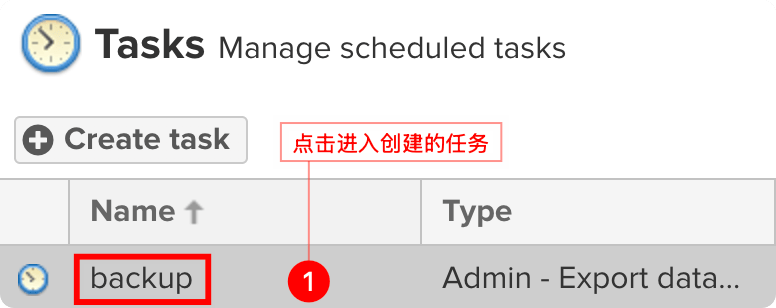
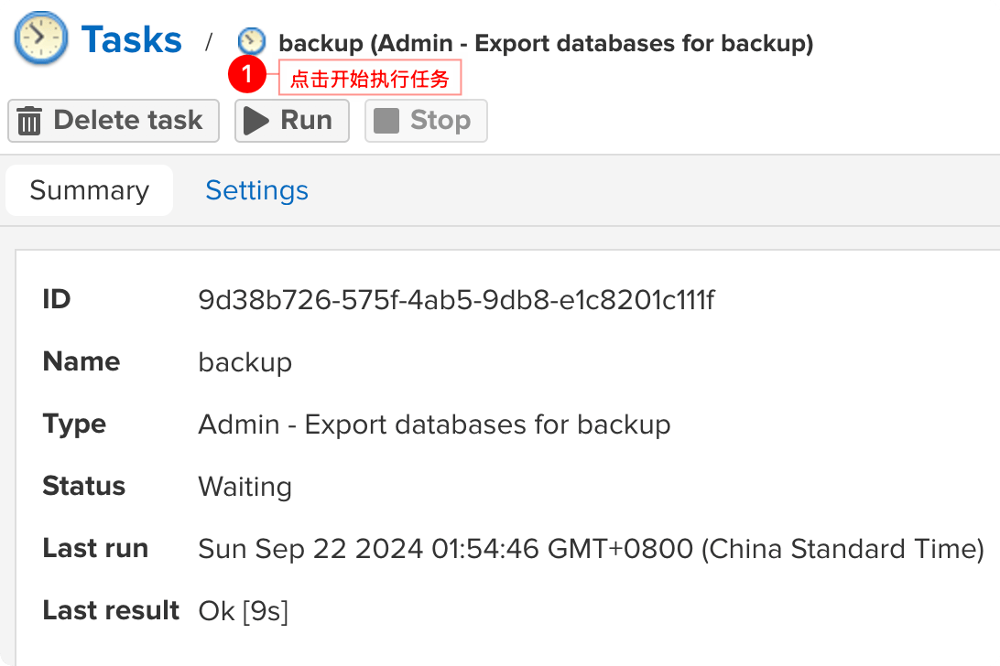
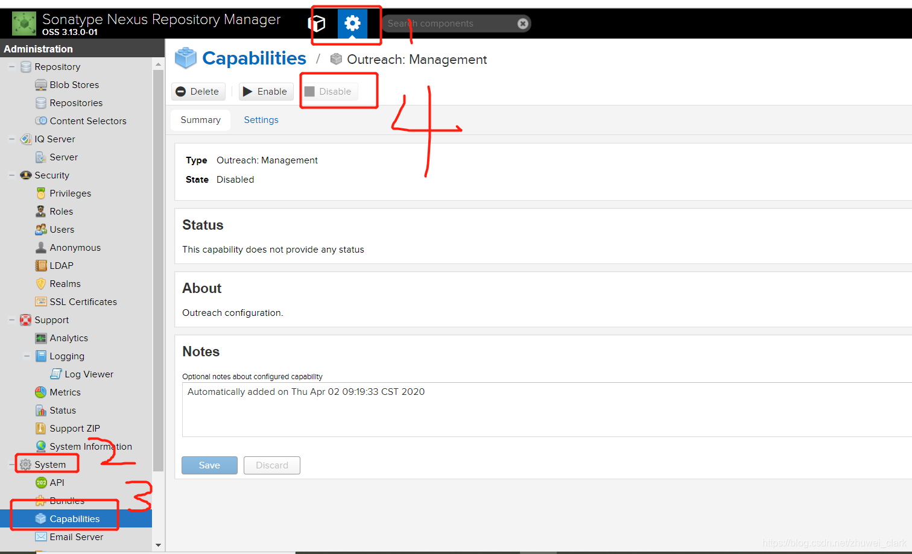

## Nexus 升级路线

- <https://help.sonatype.com/en/supported-nexus-repository-manager-upgrade-paths.html>

## 3.70 -> 3.71 breaking changes

- <https://help.sonatype.com/en/upgrading-to-nexus-repository-3-71-0-and-beyond.html>

从 3.70 升级到 3.71+ 有很多 breaking changes

### 升级前准备

先下载数据库升级工具

- <https://help.sonatype.com/en/orientdb-downloads.html>
- <https://download.sonatype.com/nexus/nxrm3-migrator/nexus-db-migrator-3.70.3-01.jar>

先升级到 3.70.3（最后一个版本）

```bash
services:
  nexus:
    # https://hub.docker.com/r/sonatype/nexus3/tags
    image: sonatype/nexus3:3.70.3
    # ...
```

创建 `nexus` 备份文件











### 升级

`https://download.sonatype.com/nexus/nxrm3-migrator/nexus-db-migrator-<version版本号>.jar` 要符合自己镜像的版本。

jar 的下载页面为 [3.70.x Downloads (for OrientDB)](https://help.sonatype.com/en/orientdb-downloads.html)

停止服务

```bash
services:
  nexus:
    # https://hub.docker.com/r/sonatype/nexus3/tags
    image: sonatype/nexus3:3.70.3
    command:
      - /bin/bash
      - -c
      - 'sleep infinity'
```


然后执行

```bash
# 1. 进入容器
docker compose exec -it nexus /bin/bash

# 2. 进入备份文件夹，查看备份的文件
cd /nexus-data/backup/
ls -ahl

# 3. 下载迁移工具
# 如果无法使用 curl 直接下载，建议在良好的网络环境下载好文件
# 把文件复制到 docker 容器中的 /nexus-data/backup 文件夹中
curl -s -L -O https://download.sonatype.com/nexus/nxrm3-migrator/nexus-db-migrator-3.70.3-01.jar

# 4. 将数据迁移到 `H2` 数据库
java -jar nexus-db-migrator-3.70.3-01.jar --migration_type=h2

# 5. 查看迁移的数据文件
ls -ahl nexus.mv.db

# 6. 将迁移的数据文件复制到 `db` 文件夹中
cp nexus.mv.db /nexus-data/db
```

修改 `nexus` 使用 `H2` 数据库

```bash
# 1. 退出容器修改配置文件 设置使用 H2 数据库
vi ${HOST_NEXUS_DATA_DIR}/etc/nexus.properties
# 在文件中添加一行
nexus.datastore.enabled=true

# 2. 去除 sleep 启动命令重新创建容器

# 3. 查看 H2 数据库正确启动
docker compose logs nexus | grep H2
# 控制台输出
nexus  | 2024-09-21 00:00:00,000+0000 INFO  [FelixStartLevel] *SYSTEM org.sonatype.nexus.datastore.DataStoreConfigurationDefaultSource - Loaded 'nexus' data store configuration defaults (Embedded H2)
nexus  | 2024-09-21 00:00:00,000+0000 INFO  [FelixStartLevel] *SYSTEM org.sonatype.nexus.datastore.mybatis.MyBatisDataStore - nexus - MyBatis databaseId: H2
```

切换 `nexus` 到指定版本

```bash
services:
  nexus:
    # https://hub.docker.com/r/sonatype/nexus3/tags
    image: sonatype/nexus3:3.74.0
    # ...
```

`docker compose up -d` 创建容器

升级完毕

后续版本继续升级即可

### 解决其他问题

配置 Default Secret Encryption Key

使用环境变量

```bash
NEXUS_SECRETS_KEY_FILE=/nexus-secret-keys.json
```

- <https://help.sonatype.com/en/re-encryption-in-nexus-repository.html>

从 API 触发

```bash
curl -X 'PUT' \
  'https://nexus.alpha-quant.tech/service/rest/v1/secrets/encryption/re-encrypt' \
  -H 'accept: application/json' \
  -H 'Content-Type: application/json' \
  -H 'NX-ANTI-CSRF-TOKEN: <your-token>' \
  -H 'X-Nexus-UI: true' \
  -d '{
  "secretKeyId": "string",
  "notifyEmail": "string"
}'
```

解决报错

```bash
# org.apache.http.conn.HttpHostConnectException: Connect to sonatype-download.global.ssl.fastly.net:443
```


