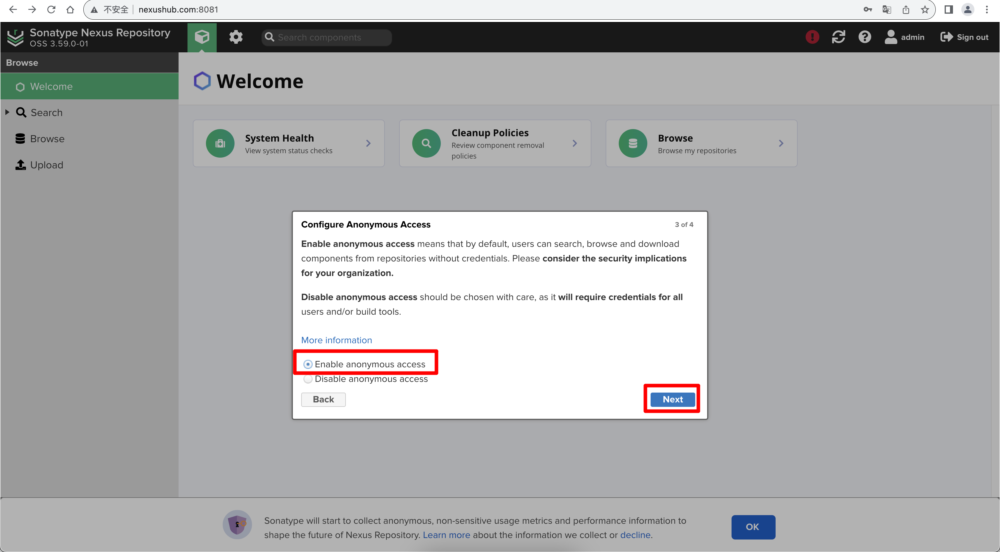

## 部署 Nexus

初始化密码

目前的 Nexus3 用户名 admin 的初始化密码不再是 admin123，需要在文件中去查看密码。

```bash
docker compose exec -it nexus cat /opt/sonatype/sonatype-work/nexus3/admin.password
```

输出后的密码是一个 uuid，这个就是密码，不要考虑太多，直接全部复制去登陆。登录成功后会有个提示修改密码的操作，修改密码就可以了。

修改密码后一定要记住，在修改密码完成之后 admin.password ⽂件会⾃动删除。

允许匿名访问：按需设置，如果是内部公共仓库则可以开启



## 时区问题

增加 `TZ="Asia/Shanghai"` 环境变量

容器中的 `Asia/Shanghai` 时区文件

```bash
# config timezone
dnf install -y tzdata \
&& rm -f /etc/localtime \
&& ln -fs "/usr/share/zoneinfo/Asia/Shanghai" /etc/localtime \
&& echo "Asia/Shanghai" > /etc/timezone

```

## Cracking

验证 License 的方法：`org.sonatype.licensing.trial.internal.DefaultTrialLicenseManager.verifyLicense`

查找类名所在文件夹

