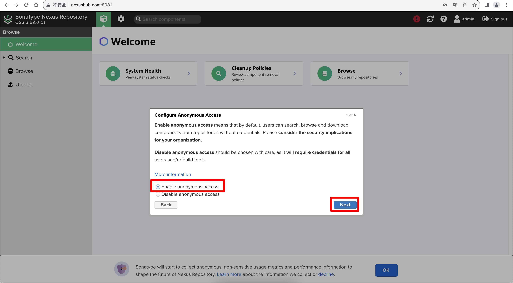

## 部署 Nexus

初始化密码

目前的 Nexus3 用户名 admin 的初始化密码不再是 admin123，需要在文件中去查看密码。

```bash
docker compose exec -it nexus cat /opt/sonatype/sonatype-work/nexus3/admin.password
```

输出后的密码是一个 uuid，这个就是密码，不要考虑太多，直接全部复制去登陆。登录成功后会有个提示修改密码的操作，修改密码就可以了。

修改密码后一定要记住，在修改密码完成之后 admin.password ⽂件会⾃动删除。

允许匿名访问：按需设置，如果是内部公共仓库则可以开启



## 时区问题

增加 `TZ="Asia/Shanghai"` 环境变量

容器中的 `Asia/Shanghai` 时区文件

```bash
# config timezone
dnf install -y tzdata \
&& rm -f /etc/localtime \
&& ln -fs "/usr/share/zoneinfo/Asia/Shanghai" /etc/localtime \
&& echo "Asia/Shanghai" > /etc/timezone

```

## Cracking

验证 License 的方法：`org.sonatype.licensing.trial.internal.DefaultTrialLicenseManager.verifyLicense`

查找类名所在文件夹

## 二进制下载地址

- <https://help.sonatype.com/en/download-archives---repository-manager-3.html>

例如：<https://download.sonatype.com/nexus/3/nexus-3.93.0-06-linux-x86_64.tar.gz>

- 文档地址：<https://help.sonatype.com/en/sonatype-nexus-repository-system-requirements.html#filehandles>

用户

```bash
groupadd -g 200 nexus && useradd -u 200 -g nexus -r -s /sbin/nologin -M nexus
chown -R nexus:nexus /mnt/nexus/sonatype-work
```

systemd

```ini
# /usr/lib/systemd/system/nexus.service
[Unit]
Description=Sonatype Nexus
After=network.target
# 在挂载完成之后才启动
# After=mnt-nexus.mount
# Requires=mnt-nexus.mount
RequiresMountsFor=/mnt/nexus

[Service]
Type=forking
LimitNPROC=65536
LimitNOFILE=65536
# 设置工作目录为挂载点
WorkingDirectory=/mnt/nexus/nexus-3.93.0-06
ExecStart=/mnt/nexus/nexus-3.93.0-06/bin/nexus start
ExecStop=/mnt/nexus/nexus-3.93.0-06/bin/nexus stop
User=nexus
Restart=on-abort

[Install]
WantedBy=multi-user.target
```

