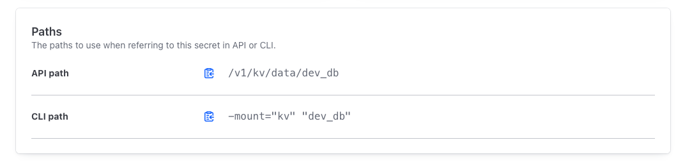

## 启用 KV 引擎

默认 KV 无版本控制，易导致数据丢失。KV v2 支持版本历史

1. 在 UI：`Secret Engines` > `Enable new engine`
2. 选择 `KV`，比如 `Maximum number of versions`最多保留几个版本输入 `2`，路径 `kv`
3. 启用后，创建 `/dev_db` secret（同上）



API 获取最新版本：

```bash
curl \
  --header "X-Vault-Token: ..." \
  --request GET \
  https://vault.alpha-quant.tech/v1/kv/data/dev_db
```

或者

```bash
vault kv get -version=1 -mount="kv" "dev_db"
```

创建新版本：在 UI 点击 `Create new`，修改（如 `port` 从字符串 “3306” 改数字 3306）

直接请求获取最新版本

获取特定版本：

```bash
curl \
  --header "X-Vault-Token: ..." \
  --request GET \
  'https://vault.alpha-quant.tech/v1/kv/data/dev_db?version=1'
```

## Python SDK 调用

示例代码（读取 KV）

```python
import hvac

client = hvac.Client(
    url='http://[你的IP]:8300',
    token="[你的root_token]"
)
is_authenticated = client.is_authenticated()
assert is_authenticated, print(is_authenticated)

# 读取最新版本
read_response = client.secrets.kv.read_secret_version(
    path='/dev_db',
    raise_on_deleted_version=False
)
print(read_response)

# 读取版本 1
read_response_v1 = client.secrets.kv.read_secret_version(
    path='/dev_db',
    raise_on_deleted_version=False,
    version=1
)
print(read_response_v1)

```


## 参考文档

KV 引擎：<https://developer.hashicorp.com/vault/docs/secrets/kv>

