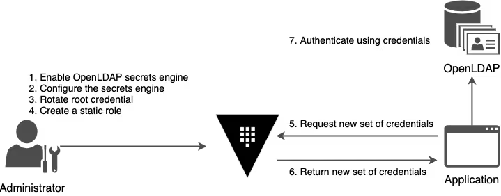

## LDAP 引擎

可以授权用户管理他们自己的 LDAP 条目，并且可以配置他们的密码以根据管理员指定的生存时间值自动轮换



## 使用 LDAP 引擎

创建一个 OpenLDAP 测试容器

```bash
docker run -itd \
    --name vault-openldap \
    --env LDAP_ORGANISATION="learn" \
    --env LDAP_DOMAIN="learn.example" \
    --env LDAP_ADMIN_PASSWORD="ldap-vault" \
    -p 389:389 \
    -p 636:636 \
    osixia/openldap:1.5.0
```

准备 LDAP 子账号的配置文件

```bash
cat > learn-vault-example.ldif <<EOF
dn: ou=groups,dc=learn,dc=example
objectClass: organizationalunit
objectClass: top
ou: groups
description: groups of users

dn: ou=users,dc=learn,dc=example
objectClass: organizationalunit
objectClass: top
ou: users
description: users

dn: cn=dev,ou=groups,dc=learn,dc=example
objectClass: groupofnames
objectClass: top
description: testing group for dev
cn: dev
member: cn=alice,ou=users,dc=learn,dc=example

dn: cn=alice,ou=users,dc=learn,dc=example
objectClass: person
objectClass: top
cn: learn
sn: learn
memberOf: cn=dev,ou=groups,dc=learn,dc=example
userPassword: 1LearnedVault
EOF
```

将配置文件拷贝到 docker 容器中

```bash
docker cp learn-vault-example.ldif vault-openldap:/tmp/
```

使用 ldapadd 添加此配置

```bash
docker exec -it vault-openldap ldapadd -cxWD "cn=admin,dc=learn,dc=example" -f /tmp/learn-vault-example.ldif
```

启用 LDAP 引擎

```bash
vault secrets enable ldap
```

配置 LDAP 密钥引擎

```bash
vault write ldap/config \
    binddn=cn=admin,dc=learn,dc=example \
    bindpass=ldap-vault \
    url=ldap://172.31.24.199
```

轮换根凭证（非必要）

创建角色

```bash
vault write ldap/static-role/learn \
    dn='cn=alice,ou=users,dc=learn,dc=example' \
    username='alice' \
    rotation_period="24h"
```

创建一个策略

```bash
vault policy write alice-read-policy - <<EOF
path "ldap/static-cred/learn" {
    capabilities = [ "read" ]
}
EOF
```

创建访问 token

```bash
vault token create -policy="alice-read-policy"
```

使用上述 Token 登录后，查看 vault 中记录的 LDAP 密码信息

```bash
vault read ldap/static-cred/learn
```

登陆到 OpenLDAP 容器，使用上面步骤中获取到的密码后，执行查询操作

```bash
docker exec -ti vault-openldap ldapsearch -b "cn=alice,ou=users,dc=learn,dc=example" \
    -D 'cn=alice,ou=users,dc=learn,dc=example' \
    -w ...
```

## LDAP 接入

ldap 配置

```bash
vault auth enable ldap

vault write auth/ldap/config \
    url="ldap://ldap.alpha-quant.tech:389" \
    userattr="cn" \
    userdn="ou=users,dc=alpha-quant,dc=tech" \
    groupattr="cn" \
    groupdn="ou=groups,dc=alpha-quant,dc=tech" \
    groupfilter="(&(objectClass=group)(member={{.UserDN}}))"
    upndomain="alpha-quant.tech" \
    binddn="CN=ldap-service,OU=users,DC=alpha-quant,DC=tech" \
    bindpass='' \
    insecure_tls=true \
    starttls=false
```

ldap policy 权限设置

```bash
vault write auth/ldap/groups/devops policies=policy-devops

vault policy write policy-srliao - <<EOF
path "*" {
    capabilities = ["sudo","read","create","update","delete","list","patch"]
}
EOF

vault write auth/ldap/users/srliao policies=policy-srliao
```

登录

```bash
vault login -method=ldap username=srliao
```

