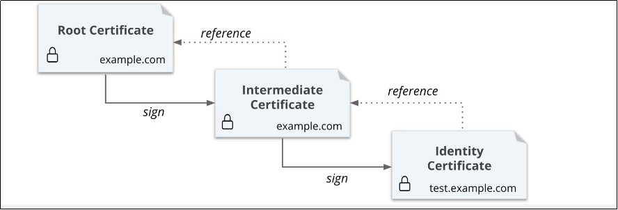

## PKI 引擎

企业内部对安全要求比较高的话，会需要启用 TLS 加密。考虑使用自建的 CA 体系。



- <https://developer.hashicorp.com/vault/tutorials/pki/pki-engine>

## 使用 PKI 引擎

搭建一个根（root）CA，由它签发一个中间（intermediate）CA，中间 CA 负责为最终的使用者（一般为 Web 服务器 / APP）签发证书

### 生成根证书颁发机构

在 pki 路径上启用 pki 密钥引擎

```bash
vault secrets enable -path='ca_pki-alpha-quant' pki
```

修改 pki 密钥引擎以颁发最长生存时间 （TTL） 为 10 年的证书

```bash
vault secrets tune -max-lease-ttl=3650d 'ca_pki-alpha-quant'
```

生成 example.com 的根 CA，为其指定颁发者名称，并将其证书保存在文件 `example.com.CA.crt` 中。

这将生成新的自签名 CA 证书和私有密钥。库 在租约期 （TTL） 结束时自动撤销生成的根。CA 证书对其自己的证书吊销列表 （CRL） 进行签名。

```bash
vault write -field=certificate pki/root/generate/internal \
     common_name="alpha-quant.tech" \
     issuer_name="root-ca" \
     ttl=3650d > example.com.CA.crt
```

列出根 CA 的颁发者信息

```bash
vault list pki/issuers/
```

使用其 ID 读取颁发者，以获取有关颁发者的证书和其他元数据。使用如下的命令跳过证书内容的输出，但列出颁发者元数据和使用情况信息。

```bash
vault read pki/issuer/$(vault list -format=json pki/issuers/ | jq -r '.[]') | tail -n 13
```

为根 CA 创建角色。创建此角色允许在必要时为此方案指定颁发者。这也提供了一种简单的方法，通过名称引用一个颁发者来从一个颁发者过渡到另一个颁发者

```bash
vault write pki/roles/services allow_any_name=true
```

配置 CA 和 CRL URL

```bash
vault write pki/config/urls \
    issuing_certificates="$VAULT_ADDR/v1/pki/ca" \
    crl_distribution_points="$VAULT_ADDR/v1/pki/crl"
```

当在同一挂载中使用多个颁发者时，建议使用每个颁发者 AIA 字段，而不是全局 （/config/urls） 变体。这是为了正确性：某些应用程序需要这些字段来构建链和自动 CRL 检测。如果它们指向错误的发行者信息，这些应用程序可能会中断

### 生成中间 CA

在 pki_int 路径启用 pki 密钥引擎

```bash
vault secrets enable -path=pki_int pki
```

修改 pki_int 密钥引擎以颁发最大生存时间 （TTL） 为  3650d 的证书

```bash
vault secrets tune -max-lease-ttl=3650d pki_int
```

执行以下命令生成一个中间文件，并将 CSR 另存为 `pki_intermediate.csr`

```bash
vault write -format=json pki_int/intermediate/generate/internal \
    common_name="example.com Intermediate Authority" \
    issuer_name="example-dot-com-intermediate" \
    | jq -r '.data.csr' > pki_intermediate.csr
```

使用根 CA 私有密钥对中间证书进行签名，并将生成的证书另存为 `intermediate.cert.pem`，这个文件实际上也就是证书链文件

```bash
vault write -format=json pki/root/sign-intermediate \
    issuer_ref="root-ca" \
    csr=@pki_intermediate.csr \
    format=pem_bundle ttl="3650d" \
    | jq -r '.data.certificate' > intermediate.cert.pem
```

签署 CSR 并且根 CA 返回证书后，可以将其导入回 Vault

```bash
vault write pki_int/intermediate/set-signed certificate=@intermediate.cert.pem
```

### 删除过期的证书

```bash
vault write pki_int/tidy tidy_cert_store=true tidy_revoked_certs=true
```

## 参考资料

- <https://miyunda.com/vault-ca-acme/>