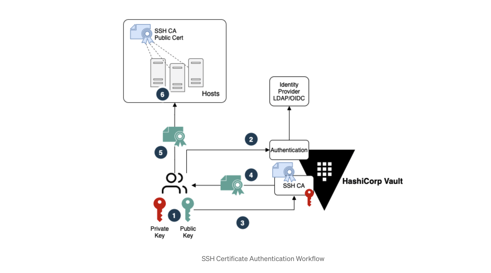
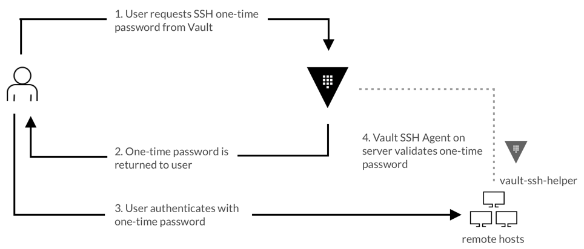

## SSH 引擎

Vault SSH 机密引擎为通过 SSH 协议访问机器提供安全的身份验证和授权功能。Vault SSH 机密引擎有助于管理对机器基础设施的访问，提供多种颁发 SSH 凭据的方法。

官方文档地址：<https://developer.hashicorp.com/vault/docs/secrets/ssh>

Vault SSH 机密引擎支持以下模式：

- 签名的 SSH 证书：<https://developer.hashicorp.com/vault/docs/secrets/ssh/signed-ssh-certificates>
- 一次性 SSH 密码：<https://developer.hashicorp.com/vault/docs/secrets/ssh/one-time-ssh-passwords>

## 签名的 SSH 证书

在客户端可以请求对他们的 SSH 密钥进行签名之前，必须配置 Vault SSH 机密引擎。通常由 Vault 管理员或安全团队执行这些步骤。也可以使用 Chef、Puppet、Ansible 或 Salt 等配置管理工具来自动化这些操作。



以下步骤：

1. 用户创建个人 SSH 密钥对。
2. 用户使用其身份提供商 （IDP） 凭证向 Vault 进行身份验证。
3. 通过身份验证后，用户将其 SSH 公钥发送到 Vault 进行签名。
4. Vault 对 SSH 密钥进行签名，并将 SSH 证书返回给用户。
5. 用户使用 SSH 证书启动 SSH 连接。
6. Host 验证客户端 SSH 证书是否由受信任的 SSH CA 签名并允许连接。

### 对客户端密钥签名

#### 签名密钥 & 配置角色

SSH 机密引擎在使用前必须先挂载：

```bash
vault secrets enable -path=ssh-client-signer ssh
```

透过 `/config/ca` 端点给 Vault 配置一个 CA ，用以对客户端密钥进行签名。如果我们没有内部 CA，Vault 会为我们生成一个密钥对(keypair)。

```bash
vault write ssh-client-signer/config/ca generate_signing_key=true
```

如果已经有了密钥对，将公钥和私钥部分指定为有效载荷的一部分：

```bash
vault write ssh-client-signer/config/ca \
    private_key="..." \
    public_key="..."
```

无论是生成的还是上传的，用以对客户端进行签名的公钥都可以通过 API 的 `/public_key` 端点访问到。

将公钥添加到所有目标主机的 SSH 配置中。该进程可以手工完成，或是借助于配置管理工具。该公钥可以通过 API 得到，不需要经过身份验证：

```bash
curl -o /etc/ssh/trusted-user-ca-keys.pem http://127.0.0.1:8200/v1/ssh-client-signer/public_key
```

或者

```bash
vault read -field=public_key ssh-client-signer/config/ca > /etc/ssh/trusted-user-ca-keys.pem
```

将存有公钥的文件路径保存在 SSH 配置文件中的 `TrustedUserCAKeys` 配置项上：

```bash
# /etc/ssh/sshd_config
# ...
TrustedUserCAKeys /etc/ssh/trusted-user-ca-keys.pem
```

重启 SSH 服务以加载变更

创建用于签署客户端密钥的命名 Vault 角色。

在 Vault 1.9 之前，如果角色没有配置 `"allowed_extensions"` 或是配置为空白，Vault 会采用允许的默认值：分配给该角色的任何用户都可以指定任意扩展值作为对 Vault 服务器的证书请求的一部分。这可能会对依赖 `extensions` 字段来获取安全关键信息的第三方系统产生重大影响。在这些情况下，请考虑使用模板来指定默认扩展，并在字段为空或未设置时将 `allowed_extensions` 显式设置为任意非空字符串。

由于一些 SSH 证书功能实现的方式，选项以字典的方式传递。下面的例子中为证书添加了 `permit-pty` 扩展，并允许用户在请求证书时为 `permit-pty` 和 `permit-port-forwarding` 自行设置值：

```bash
vault write ssh-client-signer/roles/ssh-certs-role -<<"EOH"
{
  "algorithm_signer": "rsa-sha2-256",
  "allow_user_certificates": true,
  "allowed_users": "*",
  "allowed_extensions": "permit-pty,permit-port-forwarding",
  "default_extensions": [
    {
      "permit-pty": ""
    }
  ],
  "key_type": "ca",
  "default_user": "server",
  "ttl": "30m0s"
}
EOH
```

#### 客户端 SSH 身份验证


希望通过身份验证连接到由 Vault 管理的机器的客户端（用户）需要执行以下步骤。这些命令通常从过年客户端运行的本地工作站运行：

定位或生成 SSH 公钥。通常公钥在 `~/.ssh/id_rsa.pub`。如果没有 SSH 密钥对，可以生成一个：

```bash
ssh-keygen -t rsa -C "user@example.com"
```

请求 Vault 签名公钥。该文件通常以 `.pub` 为后缀名，内容的开头为 `ssh-rsa ...`。

```bash
vault write ssh-client-signer/sign/ssh-certs-role \
    public_key=@$HOME/.ssh/id_rsa.pub
```

返回结果包含了序列号以及签名后的密钥。该密钥也是一个公钥。

要自定义签名参数，请使用 JSON 载荷：

```bash
vault write ssh-client-signer/sign/ssh-certs-role -<<"EOH"
{
  "public_key": "ssh-rsa AAA...",
  "valid_principals": "my-user",
  "key_id": "custom-prefix",
  "extensions": {
    "permit-pty": "",
    "permit-port-forwarding": ""
  }
}
EOH
```

将经过签名的公钥保存到磁盘上。可以根据需要限制权限：

```bash
vault write -field=signed_key ssh-client-signer/sign/ssh-certs-role \
    public_key=@$HOME/.ssh/id_rsa.pub > signed-cert.pub
```

如果将证书直接保存在 SSH 密钥旁边，在文件名后添加 `-cert.pub` 后缀(`!/.ssh/id_rsa-cert.pub`)。如果按照这种规范命名，OpenSSH 会自动在进行身份验证时使用经签名的公钥。

查看经签名的密钥的已启用的扩展(extnsions)、主体(principals)以及元数据：

```bash
ssh-keygen -Lf ~/.ssh/signed-cert.pub
```

使用经签名的密钥 SSH 连接至主机。需要同时提供从 Vault 获取的经签名的公钥以及相对应的私钥作为身份验证信息来发起 SSH 调用：

```bash
ssh -i signed-cert.pub -i ~/.ssh/id_rsa server@<IP> -p <端口>
```

### 对主机密钥签名

为了增加额外的安全性，建议启用主机密钥签名。与客户端密钥签名结合使用可以提供额外的完整性层。启用后，SSH 代理将在尝试 SSH 之前验证目标主机是否有效且受信任。这将减少用户通过 SSH 意外连接到非托管或恶意机器的可能性。

#### 签名密钥配置

挂载机密引擎。为了最大程度的安全，请挂载到与签名客户端时不同的路径上：

```bash
vault secrets enable -path=ssh-host-signer ssh
```

通过 Vault 的 `/config/ca` 端点配置一个对主机密钥进行签名用的 CA 证书。如果没有内部的 CA，Vault 可以生成一个密钥对。

```bash
vault write ssh-host-signer/config/ca generate_signing_key=true
```

如果已经有了密钥对，请将公钥和私钥部分指定为有效载荷的一部分：

```bash
vault write ssh-host-signer/config/ca \
    private_key="..." \
    public_key="..."
```

无论是生成的还是上传的，用以对主机进行签名的公钥都可以通过 API 的 `/public_key` 端点访问到。

延展主机密钥证书的 TTL：

```bash
vault secrets tune -max-lease-ttl=87600h ssh-host-signer
```

创建用于对主机密钥进行签名的角色。一定要填写 allowed domains 列表，或设置 `allow_bare_domains`，或同时设置两者：

```bash
vault write ssh-host-signer/roles/hostrole \
    key_type=ca \
    algorithm_signer=rsa-sha2-256 \
    ttl=87600h \
    allow_host_certificates=true \
    allowed_domains="localdomain,example.com" \
    allow_subdomains=true
```

对主机的 SSH 公钥进行签名：

```shell
vault write ssh-host-signer/sign/hostrole \
    cert_type=host \
    public_key=@/etc/ssh/ssh_host_rsa_key.pub
```

将返回的经签名的证书保存到磁盘：

```bash
vault write -field=signed_key ssh-host-signer/sign/hostrole \
    cert_type=host \
    public_key=@/etc/ssh/ssh_host_rsa_key.pub > /etc/ssh/ssh_host_rsa_key-cert.pub
```

将证书文件的权限设置为 `0640`：

```bash
chmod 0640 /etc/ssh/ssh_host_rsa_key-cert.pub
```

将主机密钥及证书添加到 SSH 配置文件中：

```bash
# /etc/ssh/sshd_config
# ...

# For client keys
TrustedUserCAKeys /etc/ssh/trusted-user-ca-keys.pem

# For host keys
HostKey /etc/ssh/ssh_host_rsa_key
HostCertificate /etc/ssh/ssh_host_rsa_key-cert.pub
```

重启 SSH 服务以加载变更

客户端对主机进行验证

#### 客户端对主机进行验证

获取主机使用的 CA 公钥来验证目标机器的签名：

```bash
vault read -field=public_key ssh-host-signer/config/ca
```

将返回的公钥添加到 `known_hosts` 文件的 authority 中：

```bash
# ~/.ssh/known_hosts
@cert-authority *.example.com ssh-rsa AAAAB3NzaC1yc2EAAA...
```

像往常一样 SSH 连接到目标机器。


## SSH OTP 

