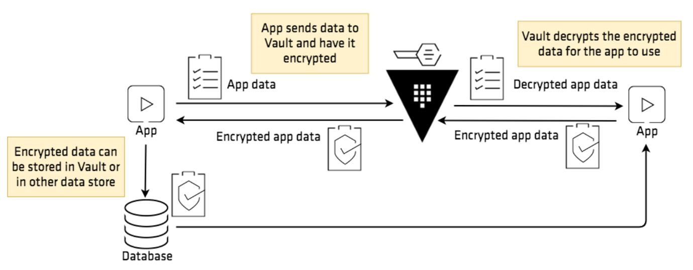
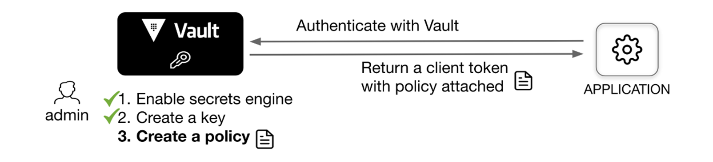

## Transit 引擎

Transit 主要用途是帮助加密应用程序发来的数据，然后应用程序在其主要数据存储中保存经过加密的数据。该机密引擎将正确加解密数据的重担从应用程序的开发者身上转移到 Vault

一般会使用对称加密算法来加密该类数据，对称加密算法的关键是加密密钥。拥有加密密钥的人可以解密对应的密文数据。如果在应用程序代码中调用加密库加解密信息，那么不可避免地就要与密钥打交道，密钥的管理、访问密钥的权限、密钥的轮替和紧急状态下吊销密钥这些工作就都落在应用程序开发者身上。所以 Vault 提供了名为 transit 的机密引擎，对外提供了“加密即服务”功能（Encryption as a Service）。



vault transit 引擎提供一个密钥，应用程序将明文数据 plaintext 发给 vault，vault 用密钥对 plaintext 进行加密，然后把加密后的内容返回给应用程序

## 使用 Transit 引擎

```bash
vault secrets enable transit
```

创建一个密钥环 orders，才能开始使用加密服务

```bash
vault write -f transit/keys/orders
```



为应用程序配置访问密钥环的权限

```bash
vault policy write app-orders - << EOF
path "transit/encrypt/orders" {
    capabilities = [ "update" ]
}
path "transit/decrypt/orders" {
    capabilities = [ "update" ]
}
EOF
```

为应用程序创建一个 vault Token

```bash
vault token create -policy=app-orders
```

这个新 Token 拥有两个 Policy：app-orders 与 default。default 是默认所有用户都拥有的策略

尝试加密一段数据

```bash
vault write transit/encrypt/orders plaintext=$(base64 <<< "Abcd@1234")
```

得到加密后的文本

```bash
Key            Value
---            -----
ciphertext     vault:v1:8ptepvkBQx7otxfSpsR8YO52wOzHTr4p/zdVATVKWL3pA0ydnQ8=
key_version    1
```

输出结果中 key_version 为 1，并且密文头部也有 `vault:v1:` 的前缀。这是因为 transit 引擎支持多版本密钥管理以及密钥轮替操作

还可以多执行几次，可以看到每次获得的 ciphertext 都是不一样的

对上面生成的多个 ciphertext 都执行下解密，可以看到得出的结果都是 `Abcd@1234`

```bash
vault write transit/decrypt/orders ciphertext="vault:v1:8ptepvkBQx7otxfSpsR8YO52wOzHTr4p/zdVATVKWL3pA0ydnQ8="| tail -1 | awk '{print $NF}'| base64 -d
```

## 密钥轮转

Transit 允许同时保存一个密钥环的多个版本的密钥

执行 rotate 轮转 orders 这个密钥的命令，这将生成一个新密钥并将其添加至命名密钥的密钥环中

```bash
vault write -f transit/keys/orders/rotate
```

再次查看秘钥版本

```bash
vault read transit/keys/orders
```

可以看到，最新密钥版本变成 2，而 min_decryption_version 还是 1，这代表轮替后将默认使用版本号为 2 的密钥加密数据，但使用版本号为 1 的密钥加密的数据仍然可以正常解密

Rotate 操作并不会造成老的密文的不可解密，还可以设置自动轮转时间

如果数据库中目前存储的是 v1 版本的密文，在轮替密钥后，希望把旧版本密文全部更新成新版本，可以使用 Vault 的 rewrap 来完成。

```bash
vault write transit/rewrap/orders ciphertext="vault:v1:8ptepvkBQx7otxfSpsR8YO52wOzHTr4p/zdVATVKWL3pA0ydnQ8="
```

通过 rewrap，在不知晓明文的前提下，将密文的密钥版本从 v1 更新到 v2。

最佳实践：假设在数据库中存放了大量密文数据，一种比较好的实践是定期用 rotate 命令轮替生成新的密钥，并且编写定时任务，通过 rewrap 命令定时将密文全部更新到最新密钥版本，这样即使密文意外泄漏，存放在 Vault 中的密钥可能也已经被抛弃。

在生产环境中定期轮替生成新密钥，但老密钥还是被保存在Vault中，长此以往会在Vault中留下大量的无用密钥（旧密文已被定期更新到新密钥版本）。可以设置密钥环的最低解密密钥版本

```bash
vault write transit/keys/orders/config min_decryption_version=2
```

需要注意的是，抛弃密钥前必须确保所有旧版本密文都已被更新到新密钥版本，否则抛弃旧密钥等同于删除旧版本密文