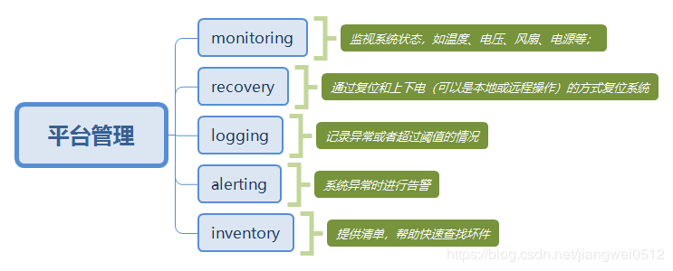

## 平台管理

平台管理（platform management）

平台管理表示的是一系列的监视和控制功能，操作的对象是系统硬件。比如通过监视系统的温度，电压，风扇、电源等等，并做相应的调节工作，以保证系统处于健康的状态

## 参考资料

- <https://www.cnblogs.com/xia-dong/p/14293234.html>
- BMC 的几种接口：<https://www.ctyun.cn/developer/article/485802038153285>
- <https://www.cnblogs.com/ainingxiaoguai/p/16382623.html>
