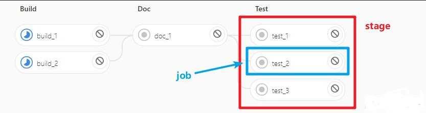

## .gitlab-ci.yml 常用配置

### image

该关键字指定一个任务（job）所使用的 docker 镜像。例如`image: python:latest`使用 Python 的最新镜像。或是 `image: python:3.7` 指定某一个特定版本的 python

### stage 与 stages

stages 是定义在 YML 文件在外层的内容，值是一个数组，用于定义一个 pipeline 不同的流程节点（可以认为是执行指令的先后顺序）

在每一个 job 中，需要指定 stage，从而可以指定不同 job 的执行顺序

```yaml

image: python:3.7
stages: # 这里定义 pipeline
  - build
  - doc
  - test
build_1: # 这里是一个 job
  stage: build
  script:
    - echo $PWD
build_2:
  stage: build # 与 job:build_1 的 stage 相同
  script:
    - echo $PWD
doc_1:
  stage: doc
  script:
    - echo $PWD
test_1:
  stage: test
  script:
    - echo $PWD
test_2:
  stage: test
  script:
    - echo $PWD
test_3:
  stage: test
  script:
    - echo $PWD

```

最终可以在 gitlab 中可视化的看到如下的 pipeline。可以看到当两个任务对应 stage 相同时会并列



### script

在上面的例子中可以看到每个 `job` 中都有关键词 `script`。它是当前 `pipeline` 节点（某个 `job`）运行的 `shell` 脚本（以项目根目录为上下文执行）。

这个 script 是控制 CI 流程的核心。所有的工作：从安装，编译到部署都是通过 script 中定义的 shell 脚本来完成的。如果脚本执行成功，`pipeline` 就会进入下一个 `Job` 节点，如果执行失败那么 `pipeline` 就会终止。

下面是一个最简单的 `script`，打印当前的路径，以及当前文件夹内的文件：

```bash
pages:
  stage: doc
  script:
    - echo $PWD
    - echo $(ls .)

```

### tags

`tags` 关键字指定了使用哪个 `Runner`（哪个机器）去执行我们的任务，注意与 `only` 关键字的 `tags` 进行区分。这里的 `tag` 是 `git tag`

```yaml
image: python:3.6
job1:
  only:
    - dev # 只有提交分支是 dev 的时候才触发
  tags:
    - machine1 # 指定哪个机器执行我们的任务
  script:
    - echo $PWD
```

### only 和 except

`only` 和 `except` 这两个关键词是用来控制任务触发的条件。例如当提交的分支是 `master` 分支时才触发，则可以按下面这样写：

```yaml
job1:
  only:
    - master
  script:
    - echo $PWD

```

或是当提交的分支为 `master` 或者打了 tags 才触发（及没有 tags 是不会触发的）

```yaml
# 举这个例子是想说明 only 关键字之间的关系是”或“关系
job1:
  only:
    - master
    - tags
  script:
    - echo $PWD
```

### when

stages 关键字可以控制每个任务的执行顺序，且后一个 stage 会等待前一个 stage 执行成功后才会执行。那如想要达到前一个 stage 失败了，后面的 stage 仍然能够执行的效果呢？ 这时候 when 关键字就可以发挥作用

它一共有五个值：

- on_success：只有前面 stages 的所有工作成功时才执行，这是默认值。
- on_failure：当前面 stages 中任意一个 jobs 失败后执行
- always：无论前面 stages 中 jobs 状态如何都执行
- manual：手动执行
- delayed：延迟执行

```yaml
# 官方示例
stages:
  - build
  - cleanup_build
  - test
  - deploy
  - cleanup
build_job:
  stage: build
  script:
    - make build
# 如果build_job任务失败，则会触发该任务执行
cleanup_build_job:
  stage: cleanup_build
  script:
    - cleanup build when failed
  when: on_failure
test_job:
  stage: test
  script:
    - make test
deploy_job:
  stage: deploy
  script:
    - make deploy
  when: manual
# 总是执行
cleanup_job:
  stage: cleanup
  script:
    - cleanup after jobs
  when: always

```

## 模板文件

- 其他项目使用 gitlab ci/cd 时，只需引用公共脚本仓库里的脚本，设置对应参数即可。隐藏具体实现细节，减轻使用者的负担
- 流水线脚本可能会进行改动、优化，只需改动公共脚本仓库即可，避免修改多个仓库的脚本，降低维护难度

此仓库的脚本被大量引用，修改时一定要注意向后兼容

放入要复用的脚本

```bash
.
├── README.md
├── common
│   ├── clean-image
│   │   ├── .gitlab-ci.yml
│   │   └── README.md
│   ├── deploy-to-k8s
│   │   ├── .gitlab-ci.yml
│   │   └── README.md
│   └── push-image
│       ├── .gitlab-ci.yml
│       └── README.md
├── golang
│   ├── build-image
│   │   ├── .gitlab-ci.yml
│   │   └── README.md
│   ├── golangci-lint
│   │   ├── 1.52.2
│   │   │   ├── .gitlab-ci.yml
│   │   │   └── base
│   │   │       └── .gitlab-ci.yml
│   │   ├── README.md
│   │   └── lint-rule.yml
│   └── unit-test
│       ├── .gitlab-ci.yml
│       ├── README.md
│       └── base
│           └── .gitlab-ci.yml
└── yarn
    ├── build-image
    │   ├── .gitlab-ci.yml
    │   └── README.md
    └── eslint
        ├── .eslintignore
        ├── .eslintrc
        ├── .gitlab-ci.yml
        ├── README.md
        └── base
            └── .gitlab-ci.yml
```

根据需求选择所需 job，大部分 job 都有 README，包含使用说明等

可以在每个脚本的最后加上帮助信息

```yaml
include: []

.template_stage:

  image:
    name:
    entrypoint: [""]

  retry: 2

  variables:

  before_script:

  script:

  after_script: |
    cat <<-EOD
    ----------------------------------------------------------
    Need help? Documentation on the semantic_release CI job can be found at:
    <https://gitlab.alpha-quant.tech/libs/gitlab-ci/-/blob/main/templates/tamplate_stage.md>
    EOD

```

