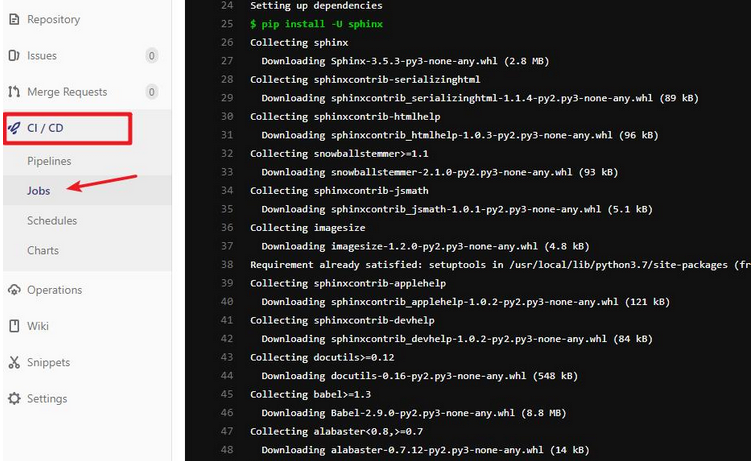

## 基础概念

`CI（continuous integration）`表示持续集成。是让一个自动化程序监测一个或是多个源代码仓库是否有变更。当有变更推送（`push/merge`）到仓库的时候，Gitlab 会检测到更改，并进行相关的单元测试等

`Gitlab-CI` 是 `Gitlab` 中内置的进行持续集成的工具。Gitlab 提供了一个叫 Gitlab-runner 的软件，只要在对应的平台（机器或 `docker` ）上下载并运行这个命令行软件，并输入从 `gitlab` 交互界面获取的 `token`，就可以把当前机器和对应的 `gitlab-ci` 流程绑定，也即：每次跑 `ci` 都在这个平台上进行

`Gitlab-CI` 的所有流程都是可视化的，每个流程节点的状态可以在 `gitlab` 的交互界面上看到，包括执行成功或失败。如下图所示：

### Pipeline 和 Job

Pipeline 是 Gitlab 根据项目的 `.gitlab-ci.yml` 文件执行的流程，它由许多个任务节点组成，而这些Pipeline 上的每一个任务节点，都是一个独立的 `Job`

在配置 `yml` 文件时，**每个 `Job` 都会配置一个 `stage` 属性，来表示这个 `Job` 所处的阶段。****一个 `Pipleline` 有若干个 `stage`，每个 `stage` 上有至少一个 Job（一个 stage 可以有多个 jobs）**，如下图所示，这张图会在后面有一个详细的说明：

### Runner

Gitlab Runner 有 3 种级别

- 全局共享：因为 executor 使用的是容器，不是 shell，所以非特殊要求，使用这个就行。如果是 shell，可能每个项目用到的环境不同，需要单独使用 runner

- 群组共享
- 项目独占

## 部署方式

Gitlab Runner 可以直接使用二进制、Docker 或者 k8s 来部署，而使用 k8s 部署带来的的好处是：合理利用资源，工作容器会被调度到资源相对空闲的节点（构建是一个比较耗费资源的过程）

## 权限
