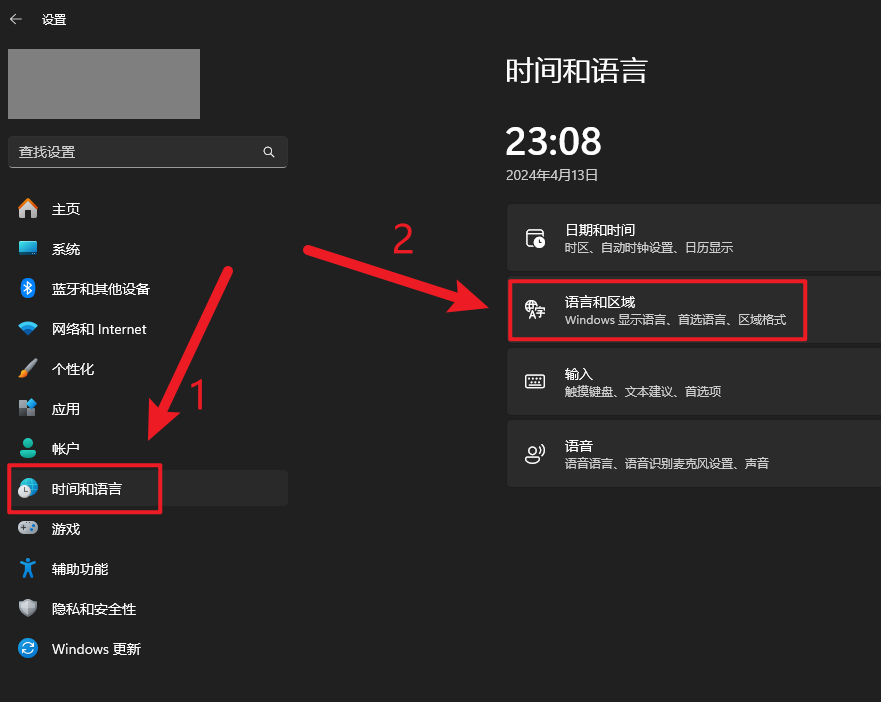
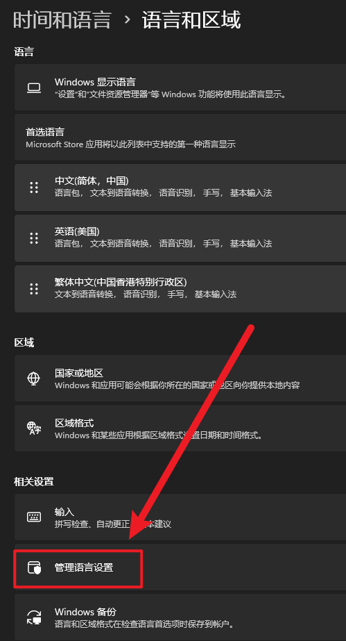
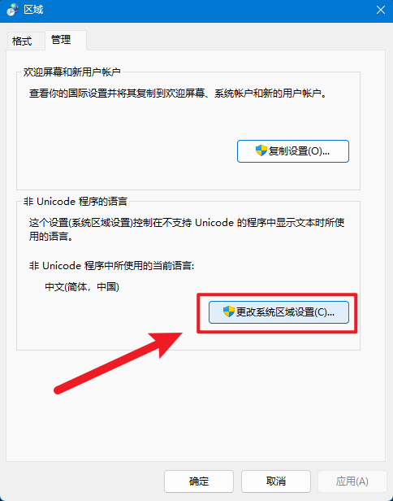
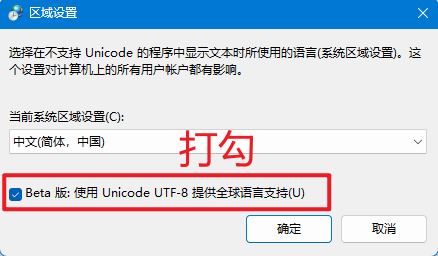

在 `.gitlab-ci.yml` 中设置

```yaml
build-job:
  stage: build
  before_script:
    - chcp.com 65001  # 加入这一行
  script:
    - echo "Compiling the code..."
```

在 Gitlab Runner 的 `config.toml` 中设置

```toml
concurrent = 1
check_interval = 0
connection_max_age = "15m0s"
shutdown_timeout = 0

[session_server]
  session_timeout = 1800

[[runners]]
  name = "Alice-WIndows-11"
  url = "https://gitlab.********.cn"
  id = 37
  token = "****-************************"
  token_obtained_at = 2024-04-11T16:39:42Z
  token_expires_at = 0001-01-01T00:00:00Z
  executor = "shell"
  shell = "powershell"
  pre_clone_script = "chcp 65001"    # 加入这两行
  pre_build_script = "chcp 65001"
  [runners.cache]
    MaxUploadedArchiveSize = 0

```

Windows 处变更







