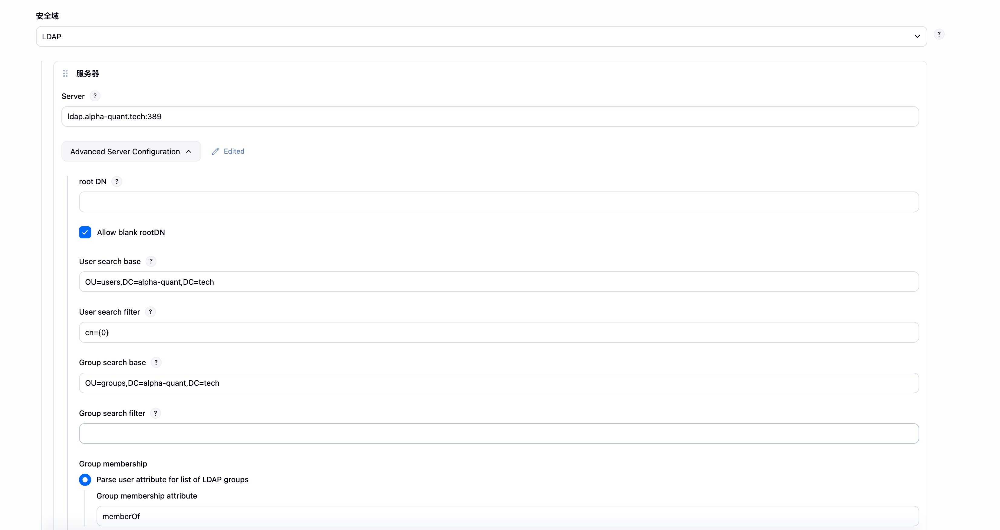
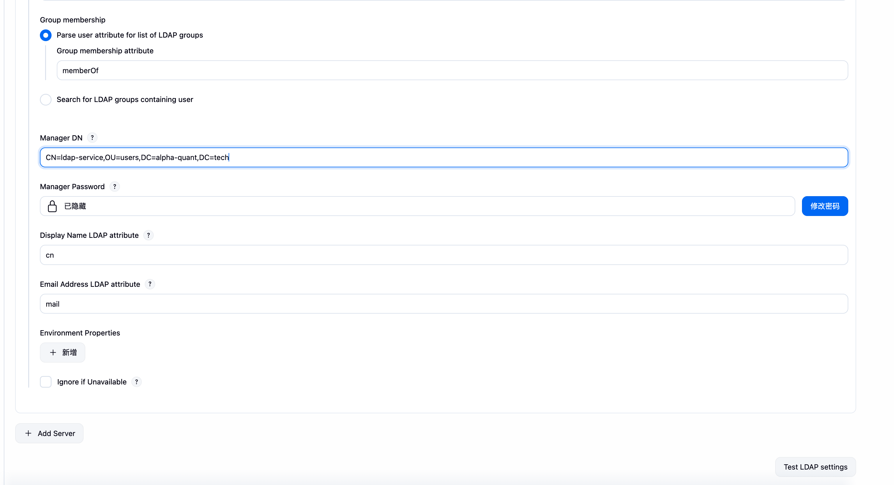

安装 LDAP 插件，进入全局安全设置

**Server**：服务器地址，可以直接填写 LDAP 服务器的主机名或 IP，例如`ldap.domain.com`（默认端口 389），或者`ldap.domain.com:1389`，如果用了 SSL，可以填写`ldaps://ldap.domain.com`（默认端口 636），或者`ldaps://ldap.domain.com:1636`

**root DN**：这里的 root DN 只是指搜索的根，并非 LDAP 服务器的 root dn。由于 LDAP[数据库](https://cloud.tencent.com/developer/techpedia/1471?from_column=20065&from=20065)的数据组织结构类似一颗大树，而搜索是递归执行的，理论上，我们如果从子节点（而不是根节点）开始搜索，因为缩小了搜索范围那么就可以获得更高的性能。这里的 root DN 指的就是这个子节点的 DN，当然也可以不填，表示从 LDAP 的根节点开始搜索

**User search base**：这个配置也是为了缩小 LDAP 搜索的范围，例如 Jenkins 系统只允许 ou 为 Admin 下的用户才能登陆，那么你这里可以填写`ou=Admin`，这是一个相对的值，相对于上边的 root DN，例如你上边的 root DN 填写的是`dc=domain,dc=com`，那么 user search base 这里填写了`ou=Admin`，那么登陆用户去 LDAP 搜索时就只会搜索`ou=Admin,dc=domain,dc=com`下的用户了

**User search filter**：这个配置定义登陆的 “用户名” 对应 LDAP 中的哪个字段，如果你想用 LDAP 中的 uid 作为用户名来登录，那么这里可以配置为`uid={0}`（{0} 会自动的替换为用户提交的用户名），如果你想用 LDAP 中的 mail 作为用户名来登录，那么这里就需要改为`mail={0}`。在测试的时候如果提示你`user xxx does not exist`，而你确定密码输入正确时，就要考虑下输入的用户名是不是这里定义的这个值了

**Group search base**：参考上边`User search base`解释

**Group search filter**：这个配置允许你将过滤器限制为所需的 objectClass 来提高搜索性能，也就是说可以只搜索用户属性中包含某个 objectClass 的用户，这就要求你对你的 LDAP 足够了解，一般我们也不配置

**Group membership**：组搜索关系

**Manager DN**：这个配置在你的 LDAP 服务器不允许匿名访问的情况下用来做认证（详细的认证过程参考文章 LDAP 落地实战（二）：SVN 集成 OpenLDAP 认证中关于 LDAP 服务器认证过程的讲解），通常 DN 为`cn=admin,dc=domain,dc=com`这样

**Manager Password**：上边配置 dn 的密码

**Display Name LDAP attribute**：配置用户的显示名称，一般为显示名称就配置为 uid，如果你想显示其他字段属性也可以这里配置，例如 mail

**Email Address LDAP attribute**：配置用户 Email 对应的字段属性，一般没有修改过的话都是 mail，除非你用其他的字段属性来标识用户邮箱，这里可以配置

下边还有一些配置如：环境变量 Environment Properties、servlet[容器](https://cloud.tencent.com/developer/techpedia/1532?from_column=20065&from=20065)代理等，很少用就不多解释了。有一个配置`Enable cache`可能会用得到，当你的 LDAP 数据量很大或者 LDAP 服务器性能较差时，可以开启缓存，配置缓存条数和过期时间，那么在过期时间内新请求优先查找本地缓存认证，认证通过则不会去 LDAP 服务器请求，以减轻 LDAP 服务器的压力

配置完成后可以点击下方的 “Test LDAP sttings” 来测试配置的准确性

如需 RBAC 授权，还需要安装 Role-based Authorization Strategy 插件