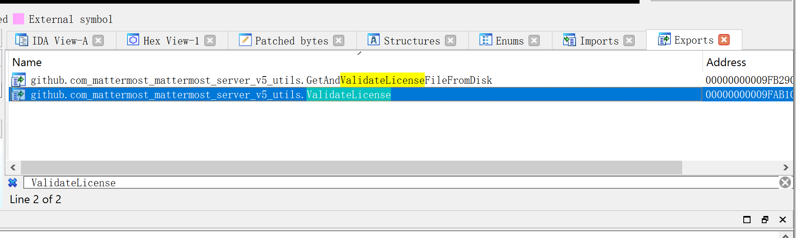
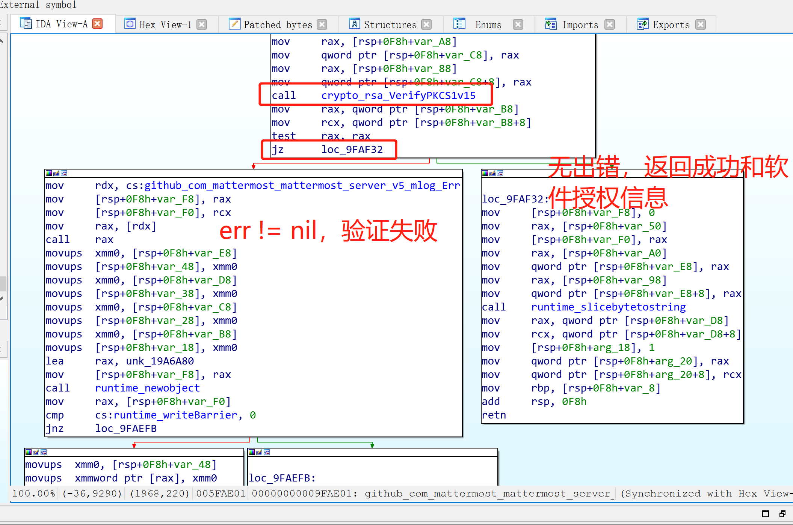

## Mattermost 简介

Mattermost 是一个 Slack 的开源替代品，用于跨团队和工具的安全通信、协作和工作编排。它为团队带来跨 PC 和移动设备的消息、文件分享、应用程序集成以及归档和搜索功能。

Mattermost 是为开发团队推动创新而构建的开源消息传递平台。支持私有云部署在不牺牲隐私的情况下提供了现代通信的优势。Mattermost 为企业提供了自治能力和可扩展性，使他们能够在满足需求的同时提高生产力 IT 和安全团队的要求

## 其他方案

`Rocket.Chat` 是一个令人印象深刻的 Slack 替代品，最初，它是与 Slack 类似的产品，现在它支持 `Matrix` 协议了，这有助于使其成为去中心化的解决方案

## 部署文档

Mattermost 是服务器端命令，mmctl 基于 API 的客户端命令

Docker 部署：<https://docs.mattermost.com/install/install-docker.html#>

部署文件：

- <https://github.com/mattermost/docker/blob/main/docker-compose.yml>

初始化：

- 系统控制台 【SITE CONFIGURATION】>【Users and Teams】> 【Max Users Per Team】值来设置团队人数
- 登录 Mattermost 控制台，打开：【ENVIRONMENT】>【Web Server】，修改 【Site URL】值
- 配置 SMTP，登录 Mattermost控制台，打开【ENVIROMENT】>【SMTP】
- 支持多语言（包含中文），可以登录控制台，通过【SITE CONFIGURATION】>【Localization】设置语言

## Mattermost 维护

### 插件

在 config.json 中开启插件上传

### 中文搜索

文档地址：<https://docs.mattermost.com/configure/enabling-chinese-japanese-korean-search.html>

配置 SCWS

```bash
# 取得 SCWS 代码
wget http://www.xunsearch.com/scws/down/scws-1.2.3.tar.bz2
# 解压缩
tar xvjf scws-1.2.3.tar.bz2
# 进入解压后的目录
cd scws-1.2.3
# 执行配置脚本、编译并安装
./configure --prefix=/usr/local/scws ; make ; make install

# 可选：检查文件是否存在
ls -al /usr/local/scws/lib/libscws.la
/usr/local/scws/bin/scws -h
# 可选：将词典安装在 /usr/local/scws/etc 中
cd /usr/local/scws/etc
wget http://www.xunsearch.com/scws/down/scws-dict-chs-gbk.tar.bz2
wget http://www.xunsearch.com/scws/down/scws-dict-chs-utf8.tar.bz2
tar xvjf scws-dict-chs-gbk.tar.bz2
tar xvjf scws-dict-chs-utf8.tar.bz2
```

配置 Zhparser

```
# 下载 Zhparser 源代码
git clone https://github.com/amutu/zhparser.git
# 进入下载后的目录
cd zhparser
# 编译并安装
SCWS_HOME=/usr/local/scws make && make install
```

自己构建

```bash
# 更新本地缓存
apt update
# 配置 SCWS 时需要的依赖
apt install wget make gcc
# 配置 Zhparser 时需要的依赖
apt install git postgresql-server-dev-13
```

使用 ES 进行索引 <https://docs.mattermost.com/scale/elasticsearch.html>

## Crack

参考：<https://i.urox.cn/2020-05-10-i-learned-assembly-language.html>





## Jira 集成

第一步：mattermost 上开启 jira 插件

启用插件，选择 “true”

复制 webhook secret 中的文本，组成 URL，例如

```
https://SITEURL/plugins/jira/api/v2/webhook?secret=YB96EBo3lBFfcqTnGItFeSVtTLj0Cy81
```

第二步：在jira配置webhook

系统 >> 网络钩子

输入名称、第一步获取到的URL，并把勾选上需要的事件

第三步：在 jira 上安装应用程序

在 mattermost 的聊天框中，输入 `/jira install` ，可以看到下面的信息

根据提示在 JIRA上进行配置，尤其注意 PUBLIC KEY 的部分

## 参考文档

- <https://cloud.tencent.com/developer/article/1639840>