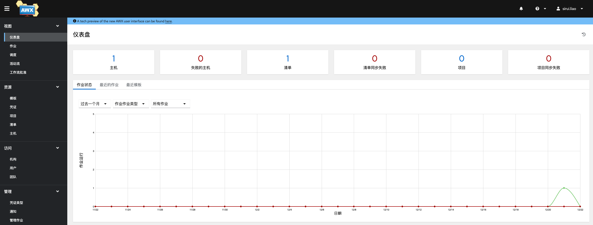
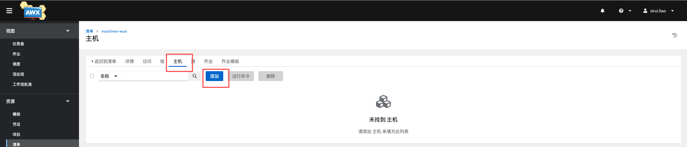
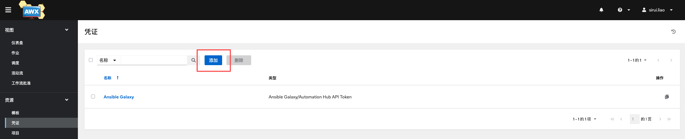
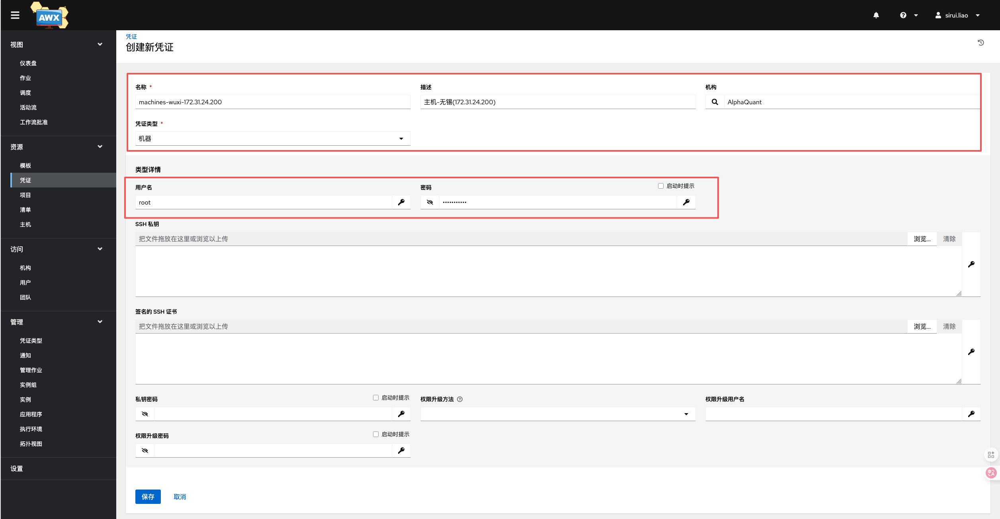
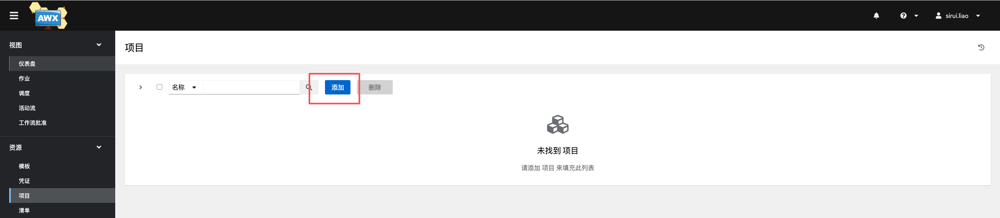
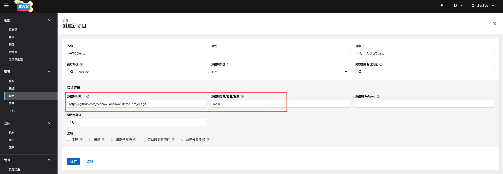
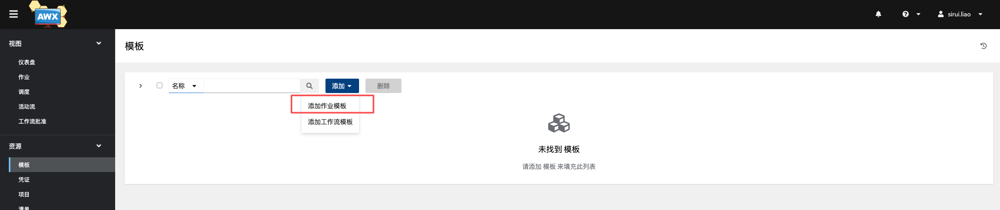
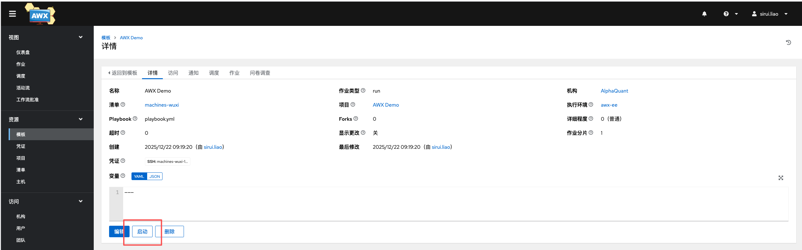

## 基础概念

- 清单（Inventories）：对应 Ansible 的 Inventory，即主机组和主机IP清单列表。
- 凭证（Credentials）：受控主机的用户名、密码（秘钥）以及提权控制
- 项目（Projects）：一个完整可运行的 Ansible 项目
- 模板（Templates）：将清单、项目和凭证关联起来的任务模板，一次创建，多次使用，可修改
- 作业（Jobs）：模板每一次运行视为一次作业

## 仪表板

仪表板（Dashboard）：awx 资源管理可视化界面，包括资源统计信息（如 hosts，inventories，projects 等），过往全部作业执行情况，近期使用模板，近期作业执行情况。

## 添加清单

清单（Inventories）：包含一组服务器信息。分为普通清单和智能清单，普通清单可以手工录入服务器信息，或者通过源导入；智能清单可以对已存在的清单进行条件过滤筛选出目标服务器，更加方便进行服务器资源的统一管理。

登录AWX，左侧菜单选择清单 ，下拉选择添加清单，如下图

来到新增主页面，填上名称和描述，点击保存，如下图

在详情页进入主机菜单，选择添加下拉框，如下图

把我们要部署的主机 IP 配置进去，然后保存。第一步配置完成。

## 添加凭证

凭证（Credentials）：定义awx在目标服务器上的操作用户、密码及sudo（su）权限控制

左侧菜单栏点击凭证，在页面中选择添加按钮，来到新增页面

在页面中输入名称，选择机构，凭证类型选择机器，然后配置连接账号和密码，其他不是必填参数可以不用配置，先忽略即可。页面如下图

## 添加项目

项目：关联 ansible 脚本目录，定义运行脚本

左侧菜单栏选择项目，点击添加来到新增主页面

这里用 demo 项目 <https://github.com/AlphaQuant/awx-demo-project.git>：如下图

## 添加模板

模板（Templates）：组合定义项目在指定的服务器中以指定的凭证运行

创建模板，把前三步配置好的清单、凭证、和项目给关联起来，就完成了一个简单模板的配置，如下图：

## 创建作业

作业（Jobs）：模板每一次运行视为一次作业

进入模板详情页，点击启动

