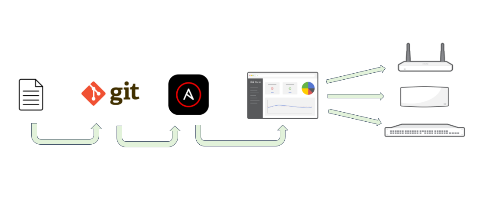

## AWX 简介

AWX 是 Ansible Tower 的开源版，Ansible Tower 是一个可视化界面的服务器自动部署和运维管理平台。AWX 提供基于 Web 的用户界面，REST API 和构建在 Ansible 之上的任务引擎

官方：

- GitHub：<https://github.com/ansible/awx>
- 文档：
  - <https://docs.ansible.com/projects/awx/en/latest/>
  - <https://readthedocs.ansible.org.cn/projects/awx/en/latest/userguide/index.html>

AWX 是企业级的 Ansible Web 管理平台

- AWX 允许控制访问帐号，以及分发 SSH 证书。AWX 允许对用户进行权限控制，即使某用户不能传送某 SSH 凭证，可以通过 AWX 来对该用户共享该凭证

- AWX 可以共享 Playbook 脚本，减少重复工作
- 此外 AWX 还可以收集和展现所有主机的 playbook 的执行状况，便于统计和分析主机的状态

## AWX 部署

- Docker Compose 部署：<https://github.com/ansible/awx/blob/24.6.1/tools/docker-compose/README.md>
- K8s 部署：AWXOperator

## 参考资料

- <https://readthedocs.ansible.org.cn/projects/awx/en/latest/userguide/projects.html#scm-types-git-and-subversion>
- <https://blog.csdn.net/2301_76699451/article/details/139870013>
- <https://blog.csdn.net/weixin_43902588/article/details/116753281>
