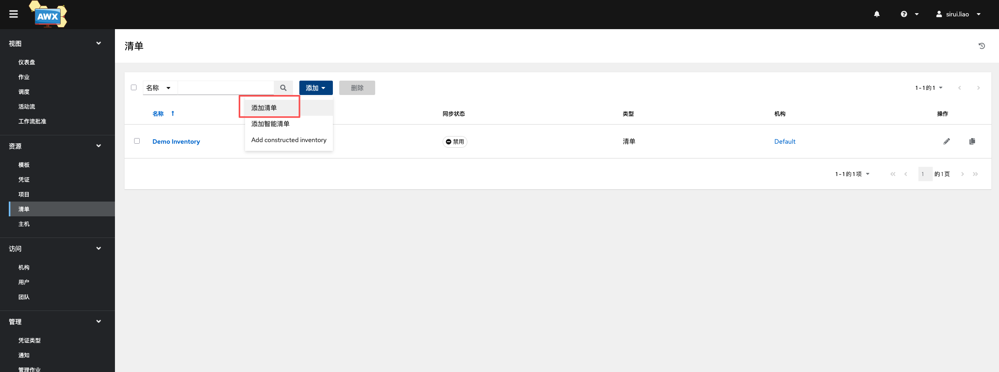
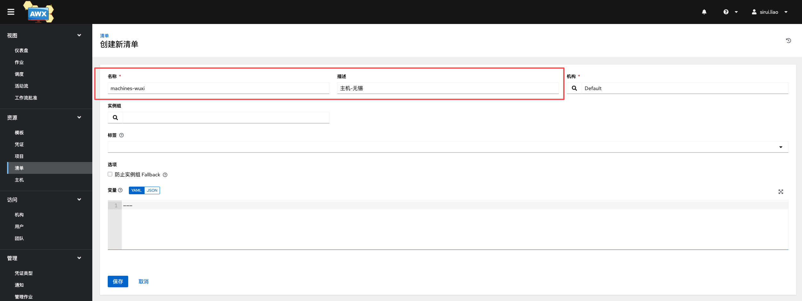
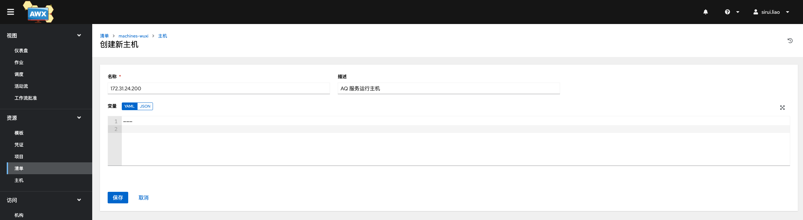

## 基础概念

- 清单（Inventories）：对应 Ansible 的 Inventory，即主机组和主机IP清单列表。
- 凭证（Credentials）：受控主机的用户名、密码（秘钥）以及提权控制
- 项目（Projects）：一个完整可运行的 Ansible 项目
- 模板（Templates）：将清单、项目和凭证关联起来的任务模板，一次创建，多次使用，可修改
- 作业（Jobs）：模板每一次运行视为一次作业

## 添加清单

登录AWX，左侧菜单选择清单 ，下拉选择添加清单，如下图

来到新增主页面，填上名称和描述，点击保存，如下图

在详情页进入主机菜单，选择添加下拉框，如下图

把我们要部署的主机 IP 配置进去，然后保存。第一步配置完成。

## 添加凭证

左侧菜单栏点击凭证，在页面中选择添加按钮，来到新增页面，在页面中输入Name，选择  Organization，Credential Type 选择  Machine，然后配置我们的连接账号和密码，其他不是必填参数可以不用配置，先忽略即可。页面如下图

## 添加项目

