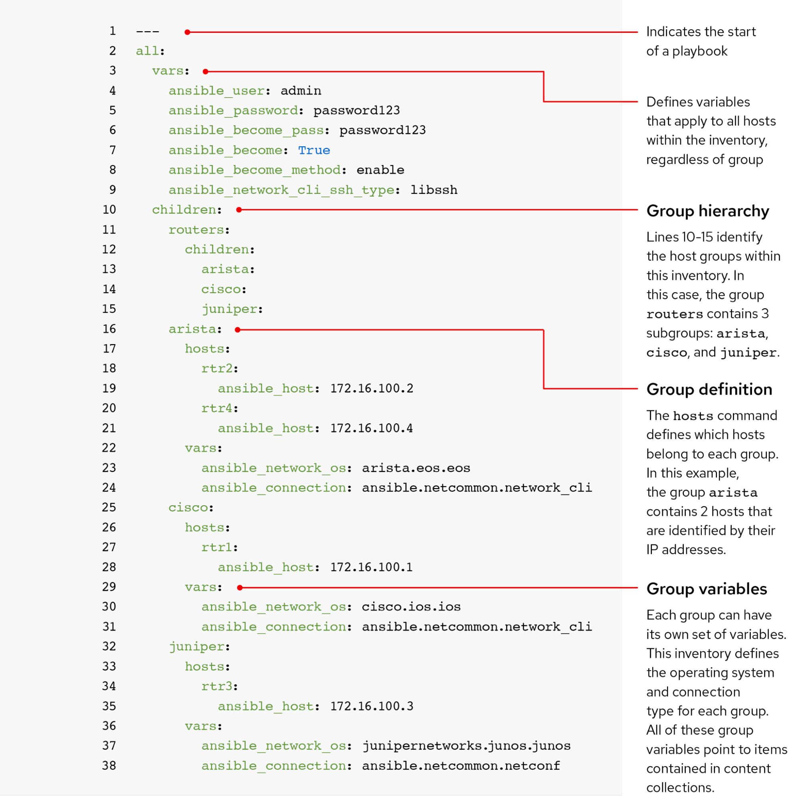

## Inventory




Ansible 能够同时对单台或多台机器亦或部分机器操作是通过 Inventory 来实现的。

Inventory 默认保存在 /etc/ansible/hosts 配置文件中，而 Ansible 通过这个文件就可以知道要追踪的服务器了。

在 Inventory 中列出我们需要操作的机器，可以单纯地列出这些主机，但是推荐有条理地为他们分组，这样在使用时就可以只对其中的某组操作。

Inventory 文件可以有多种不同的格式（如：INI、YAML 等），具体要取决于相应的插件

```ini
# 1.常用主机（IP 地址）分组，标题是组名，用于分类系统和决定系统的控制等，可以有一台或多台。
[test]
127.0.0.1
foo.example.com

# 2.分组后添加对该组机器的登录用户和验证方式。添加主机和用户名以及私钥文件。
[dev_test]
192.168.42.3 ansible_ssh_user=ubuntu ansible_ssh_private_key_file=/path/of/keyfile

# 3.不使用分组，采用文件别名的方式。通过端口及主机来描述。
Alias ansible_host=192.168.1.50 ansible_port=6666

# 4.控制本地机器
[local]
localhost ansible_connection=local
```

查看主机

```bash
ansible-inventory -i inventory.yaml  --graph
```

### 参数

主机连接

- ansible_connection 连接到主机的类型，任何可能的连接插件名称，例如，SSH 协议类型中有：ssh、smart 或 paramiko 。

一般连接

- ansible_host 要连接的主机名称。
- ansible_port ssh 端口号。
- ansible_user 默认 ssh 用户名。

具体的 SSH 连接

- ansible_ssh_pass ssh 密码
- ansible_ssh_private_key_file 由 ssh 使用的私钥文件。

内置参数如下：

```shell
ansible_ssh_host             # 要连接的主机名
ansible_ssh_port             # 端口号，默认22
ansible_ssh_user             # ssh连接时默认使用的用户名
ansible_ssh_pass             # ssh连接时的密码
ansible_sudo_pass            # 使用sudo连接用户时的密码
ansible_ssh_private_key_file # 秘钥文件如果不想使用 ssh-agent 管理时可以使用此选项
ansible_shell_type           # shell类型，默认 sh
ansible_connection           # SSH连接类型：local、ssh、paramiko，在 ansible 1.2之前默认 paramiko
ansible_python_interpreter   # 用来指定Python解释器的路径，同样可以指定ruby、Perl的路径
```

### 使用自定义 inventory

还可以通过 ANSIBLE_HOSTS 环境变量指定或者运行 ansible 和 ansible-playbook 的时候用 -i 参数临时设置。

然后在该目录中放入多个 hosts 文件，不同的文件可以存放不同的主机。

### 多个 Inventory 列表

首先需要在Ansible的配置文件ansible.cfg中hosts的定义改成一个目录，比如：hostfile = /etc/ansible/inventory，然后在该目录中放入多个hosts文件。

## ansible.cfg

ssh 连接时需要检查验证 HOST KEY ，可在 ssh 连接命令中使用 -o 参数将 StrictHostKeyChecking 设置为 no 来临时禁用检查

如果要保存设置，可修改 Ansible 配置文件，将 `/etc/ansible/ansible.cfg` 中的 host_key_checking 的注释符删除即可

## 动态 Inventory

动态 inventory 的意思就是所有的变量可以从外部获取，也就是说可以从 CMDB 一级 zabbix 系统拉取所有的主机信息然后使用 Ansible 进行管理。

只需要把 ansible.cfg 文件中的 inventory 定义值改成一个可执行脚本即可。

编写一个 inventory.py 文件模拟动态获取主机信息：

```python
#!/usr/bin/env python
# coding=utf-8
import json

ip1 = ["10.24.8.1"]

g1 = "test1"

host_data = {
    g1: {"hosts": ip1}, 
}

print(json.dumps(host_data, indent=4))

```

该脚本必须要有可执行权限才可以被 ansible 命令调用：

```bash
chmod +x inventory.py
```

运行 ansible 命令并调用该 python 脚本：

```bash
ansible -i inventory.py all -a "date" -k
```

示例输出

```json
{
    "databases"   : {
        "hosts"   : [ "host1.example.com", "host2.example.com" ],
        "vars"    : {
            "a"   : true
        }
    },
    "webservers"  : [ "host2.example.com", "host3.example.com" ],
    "atlanta"     : {
        "hosts"   : [ "host1.example.com", "host4.example.com", "host5.example.com" ],
        "vars"    : {
            "b"   : false
        },
        "children": [ "marietta", "5points" ]
    },
    "marietta"    : [ "host6.example.com" ],
    "5points"     : [ "host7.example.com" ]
}
```

