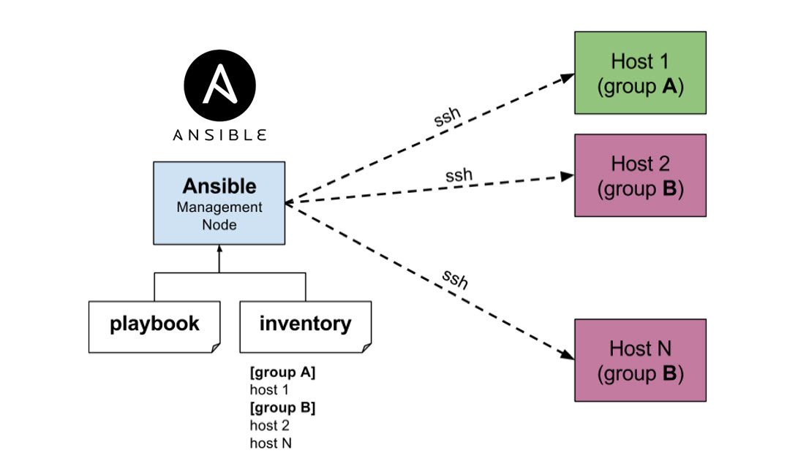
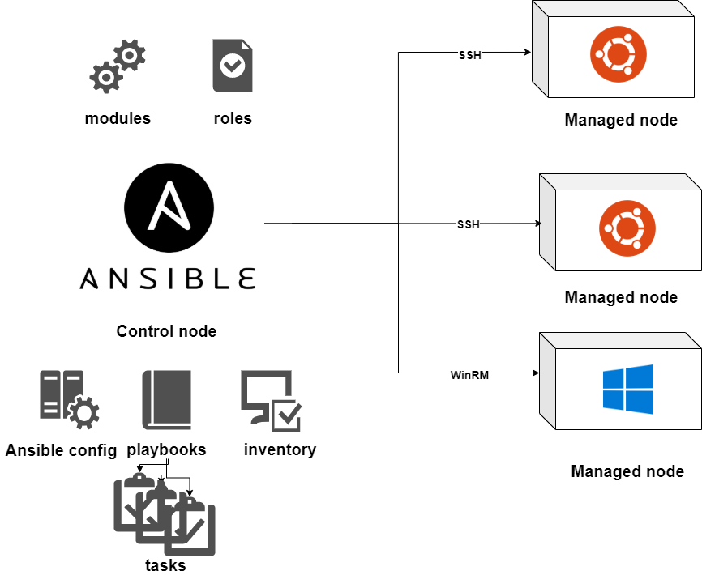
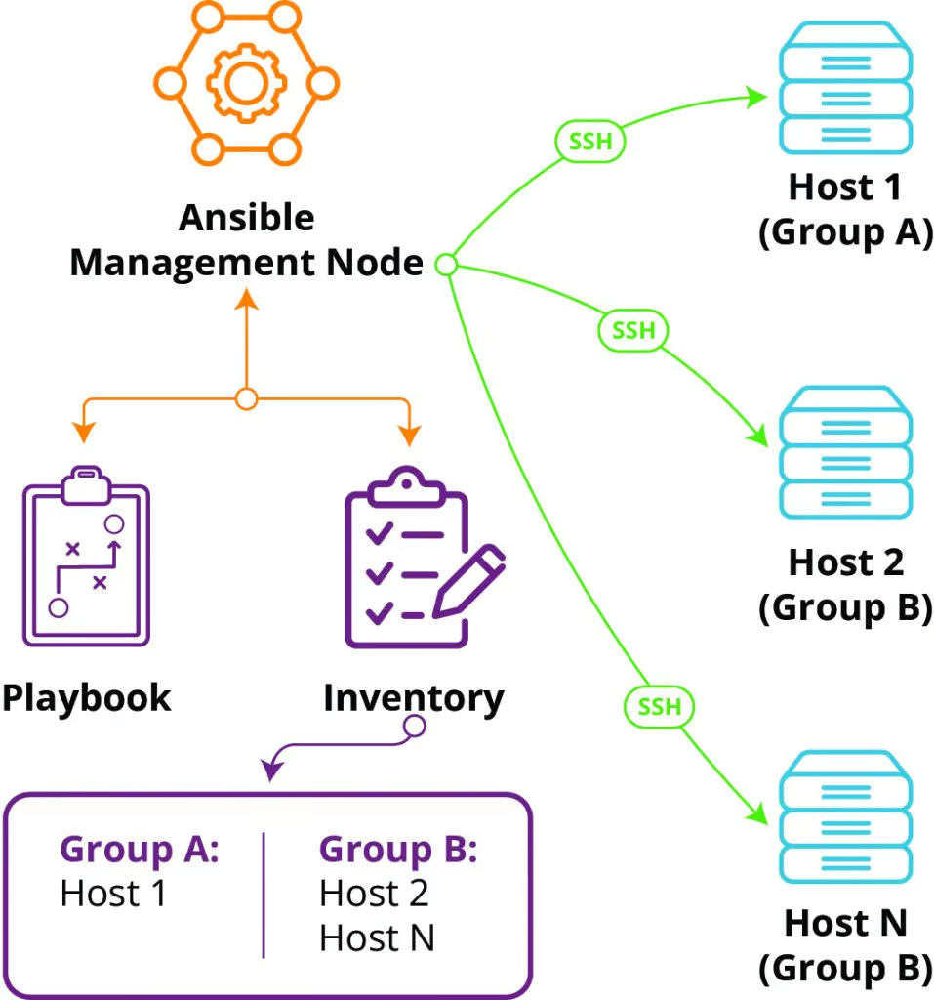
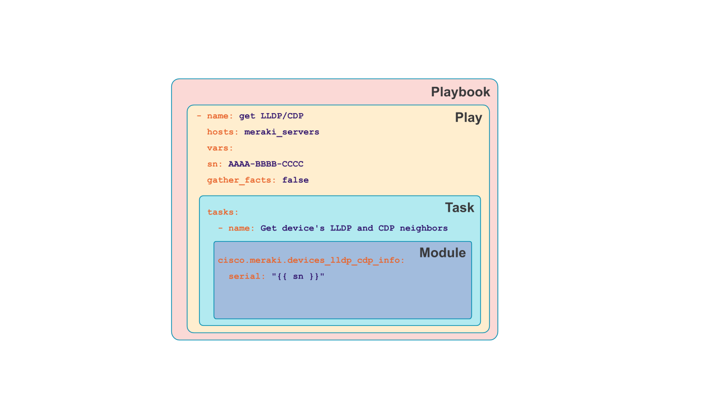

## Ansible 简介

Ansible 是一款基于 Python 开发，能够实现了批量系统配置、程序部署、运行命令等功能的自动化运维工具

Ansible 主要是基于模块进行工作的，本身没有批量部署的能力，真正实现部署功能的是运行的模块



## Ansible 基础概念

- 控制节点 Control Node

任何安装了 Ansible 的机器，可以通过从任何控制节点调用 `ansible` （运行 ad hoc commands）或 `ansible-playbook` （运行 playbook）

- 托管节点 managed node

使用 Ansible 管理的网络设备（服务器）。托管节点有时也称为 “hosts”。Ansible 未安装在受管节点上



- Inventory

受管节点列表。清单文件有时也称为“主机文件”。清单可以指定每个受管节点的 IP 地址等信息。清单还可以组织托管节点、创建和嵌套组以便于扩展



- Playbooks

已保存的有序 task 列表，以便可以按该顺序重复运行这些任务。剧本可以包括变量和任务

- Plays

Play 是 Ansible 执行的主要上下文，这个 playbook 对象将受管节点（hosts）映射到任务（tasks）。Play 中可以包含变量、角色（Roles）以及一组有序的任务列表，并且可以重复执行

- Modules

Ansible 执行的代码单元。每个模块都有特定的用途，从管理特定类型数据库上的用户到管理特定类型网络设备上的 VLAN 接口

可以使用 task 调用单个模块，或调用 playbook 中的多个不同模块

- Tasks

Ansible 中的动作单位。可以使用 ad hoc 命令（临时的命令行）执行一次任务

- Handlers

仅在机器上发生更改时才运行任务。例如，如果任务更新了该服务的配置，可能希望重新启动该服务，但如果配置未更改，则不需要。Ansible 使用 handlers 解决这个用例。Handlers 是仅在收到通知时运行的任务。每个处理程序都应该有一个全局唯一的名称



- Roles

Roles 是一种用来组织 playbook 组件（如 tasks、handlers、vars、defaults、files 等）的结构化方式，常用于：封装一组逻辑相关的任务、更好地管理和复用代码

- Collections

集合是 Ansible 内容的分发格式，可以包括剧本、角色、模块和插件。可以通过 Ansible Galaxy 安装和使用集合

Collections 是 Ansible 2.9+ 引入的更高级的打包方式，它包含：多个 roles、modules、plugins、playbooks、docs、tests

以 arista.avd collection 为例：Ansible 是核心的自动化引擎，AVD 是一个 Ansible Collection。它提供了一系列角色（roles）、模块（modules）和插件（plugins），使用户能够为 Layer 3 Leaf-Spine Network 生成并部署最佳实践配置


## Ansible 安装

通过 pip 安装

```bash
# 用 pyenv 安装较新版本的 python
export PIPX_DEFAULT_PYTHON=/opt/pyenv/shims/python3.13

pipx install \
    --python ${PIPX_DEFAULT_PYTHON} \
    --pip-args="--no-cache-dir" \
    --include-deps \
    "ansible"

# 如果是开发 ansible playbook，建议安装：
pipx install \
    --python ${PIPX_DEFAULT_PYTHON} \
    --pip-args="--no-cache-dir" \
    --include-deps \
    "ansible-dev-tools"
```

安装后确认：

```bash
ansible --version
```

离线安装：通过制作 venv（可以选用 Pyenv 进行管理）


## 配置文件

`.ansible.cfg` 的路径：~/.ansible.cfg

```ini
[defaults]
# inventory 是声明 hosts 配置文件
inventory=~/.ansible/hosts
```

## 参考文档

- <https://www.cnblogs.com/brianzhu/category/1368500.html>
- Ansible 入门：<https://getansible.com/>
- <https://docs.ansible.org.cn/ansible/latest/getting_started/index.html>

- <https://github.com/880831ian/Ansible>

- <https://minglunwu.com/notes/2021/ansible_note.html/>
- <https://clay-wangzhi.com/devops/ansible/first.html>
- <http://www.uml.org.cn/itil/201907233.asp>
- <https://wangchujiang.com/reference/docs/ansible.html>

- <https://blog.csdn.net/qq522044637/article/details/124469876>

- <https://ansible-tran.readthedocs.io/en/latest/docs/playbooks_roles.html#>

- <https://cloud.tencent.com/developer/article/2380201>
- <https://erhwenkuo.github.io/ansible/ansible-intro/#playbook_2>

- <https://www.cnblogs.com/f-ck-need-u/p/17718473.html>
