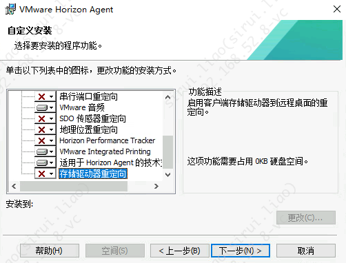

## 单向粘贴板

Active Directory 用户和计算机管理工具里面建立一个新的组织单位，把“Computers” 容器里面的计算机移动到新建的组织单位里面。然后回到组策略管理，把新的组织单位连接到新的GPO、

## 内网安全设置

关闭客户端驱动重定向

关闭存储驱动器重定向

## 参考资料

- <https://blog.csdn.net/weixin_33669839/article/details/123517746>

- <https://docs.omnissa.com/zh-CN/bundle/Horizon-Remote-Desktop-FeaturesV2312/page/AddaHorizon8ADMXTemplateFiletoaGPO.html>

关闭重定向

- <https://blog.csdn.net/ximenjianxue/article/details/112378302>