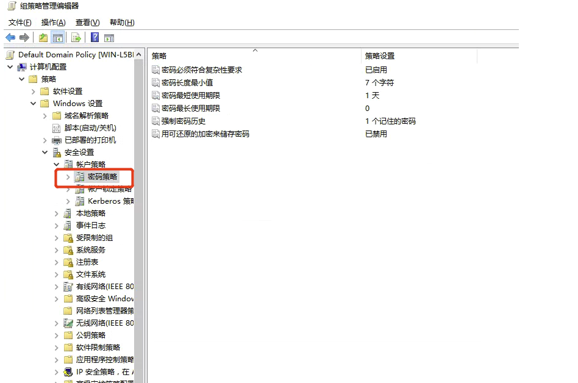

## 更改组策略设置密码策略

在域控中更改域用户密码时提示如下“密码不满足密码策略的要求”错误，可按照以下步骤进行密码策略修改：

在【服务器管理】-【工具】中打开【组策略管理】

在域名下找打【Default Domain Policy】，右击编辑


【计算机配置】-【策略】-【Windows 设置】-【安全设置】-【账户策略】中找到【密码策略】



保存策略后，打开【运行】，执行 `gpupdate /force`，更新组策略

## 使用 PowerShell 设置密码策略

加载 Active Directory 模块：

```powershell
Import-Module ActiveDirectory
```

查看当前的默认域密码策略： 

```powershell
Get-ADDefaultDomainPasswordPolicy
```

`Get-ADDefaultDomainPasswordPolicy` 命令的输出包含有关 Active Directory 默认域密码策略的详细信息。以下是一些输出及其含义：

- `ComplexityEnabled`: 这显示了密码复杂性是否启用。如果启用，那么密码必须符合一些条件，如包含大写和小写字母、数字和非字母数字字符。
- `DistinguishedName`: 这是密码策略的 Distinguished Name（DN），这是在 LDAP 目录中唯一标识条目的字符串。
- `LockoutDuration`: 这表示账户在被锁定后将保持锁定状态的时间长度。
- `LockoutObservationWindow`: 这是在锁定期满后系统继续监视无效登录尝试的时间段。
- `LockoutThreshold`: 这是在账户被锁定前允许的无效登录尝试的次数。
- `MaxPasswordAge`: 这是用户可以使用同一密码的最长时间。此值为 TimeSpan 对象。
- `MinPasswordAge`: 这是用户在更改其密码之前必须保持其当前密码的最短时间。此值为 TimeSpan 对象。
- `MinPasswordLength`: 这是密码必须的最少字符数。
- `objectClass`: 这是对象的类，对于密码策略，这应该是 "domainDNS"。
- `objectGUID`: 这是对象的全局唯一标识符（GUID）。
- `PasswordHistoryCount`: 这是用户新密码不能与其相同的历史密码的数量。
- `ReversibleEncryptionEnabled`: 这表示是否启用了可逆加密。如果启用，密码将以可逆的方式存储。

修改这些密码策略。例如，如果想要关闭密码最短使用期限（MinPasswordAge），可以通过以下命令将其设置为 0：

```powershell
Set-ADDefaultDomainPasswordPolicy -Identity <AD域名称> -MinPasswordAge 0
```

在修改密码策略时，一定要权衡安全性和实用性

修改了组策略后，通常需要刷新策略

```
gpupdate /force
```

