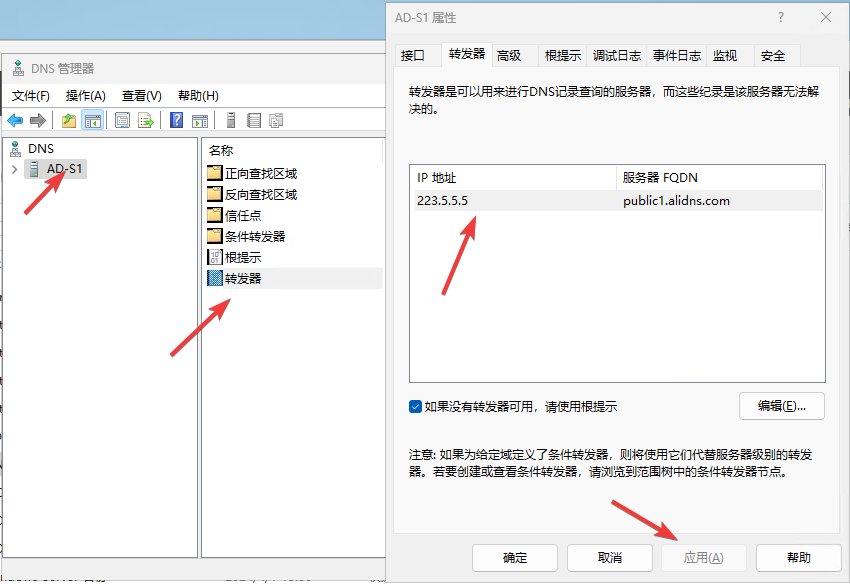
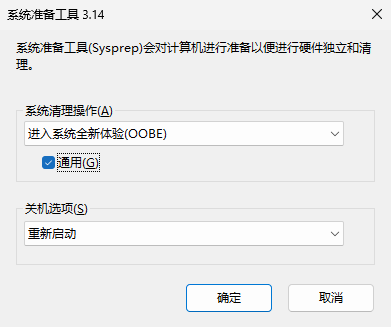

## 单域控服务器

### 安装域控

修改计算机名字，作为域控后不建议随意修改名字

```powershell
# 修改计算机名字并立即重启生效
Rename-Computer -NewName "AD-S1" -Force -Restart
```

配置静态IP地址

```bash
# 配置静态 IP 地址
New-NetIPAddress -InterfaceAlias "以太网" -IPAddress "192.168.1.101" -PrefixLength 24 -DefaultGateway 192.168.1.254
Set-DnsClientServerAddress -InterfaceAlias "以太网" -ServerAddresses "192.168.1.254"
```

删除安全服务（可选 ）

```powershell
Remove-WindowsFeature -Name Windows-Defender
```

关闭 “IE 增强安全配置”

```powershell
# 关闭 IE 增强安全设置
Set-ItemProperty -Path "HKLM:\SOFTWARE\Microsoft\Windows\CurrentVersion\Internet Settings\Zones\1" -Name "2500" -Value 0
Set-ItemProperty -Path "HKLM:\SOFTWARE\Microsoft\Windows\CurrentVersion\Internet Settings\Zones\2" -Name "2500" -Value 0
```

关闭防火墙

```bash
# 关闭防火墙
Set-NetFirewallProfile -Profile Domain,Public,Private -Enabled False
```

PowerShell 命令行安装 AD 域服务

管理员运行下面的命令

```bash
# 安装域控角色
Install-WindowsFeature -name AD-Domain-Services -IncludeManagementTools -Restart
```

将服务器配置为域控制器

```powershell
## powershell 管理员执行 或 终端 管理员执行，执行后会提示是否继续，回车继续即可。

# 提升为域控制器
Import-Module ADDSDeployment

Install-ADDSForest `
-DomainName "ad.alpha-quant.tech" `
-ForestMode Win2025 `
-DomainMode Win2025 `
-DomainNetbiosName "ALPHA-QUANT" `
-SafeModeAdministratorPassword (ConvertTo-SecureString "alphaquant" -AsPlainText -Force) `
-InstallDNS
```

- `-DomainName "ad.alpha-quant.tech"`

该参数指定新的 Active Directory 域的 DNS 名称。这里创建的域名是 `ad.alpha-quant.tech`，可以自行修改。

- `-ForestMode Win2025`
  - Windows2008, Windows2008R2
  - Windows2012, Windows2012R2
  - Windows2016（WinThreshold）
  - Windows2025

该参数用于指定新的 AD 域林的功能级别（Forest Functional Level）。功能级别定义了林中能支持的活动目录功能。

- `-DomainMode Win2025`

该参数指定域的功能级别（Domain Functional Level）。与林功能级别类似，定义了该域支持的功能和特性。

- `-DomainNetbiosName ALPHA-QUANT`

指定域的 NetBIOS 名称，NetBIOS 名称是一个 15 字符以内的短名，主要用于旧的网络浏览、兼容应用等。

一般与域名的前缀（主机部分）相同或类似，通常大写。例如 `ad.alpha-quant.tech` 域对应的 NetBIOS 名称是 `ALPHA-QUANT`。

- `-SafeModeAdministratorPassword (ConvertTo-SecureString -AsPlainText "alphaquant" -Force)`

该参数指定目录服务恢复模式（DSRM）管理员账号（内建管理员账户）的密码。

DSRM 是 AD 维护和恢复时使用的特殊模式。

命令部分 `(ConvertTo-SecureString -AsPlainText "alphaquant" -Force)` 是将明文密码 `"alphaquant"` 转换成安全的字符串格式，符合命令要求。

注意，密码应遵循复杂性策略，以保证安全。

- `-InstallDNS`

指示安装过程也安装 DNS 服务器角色，并自动配置 DNS。

对 Active Directory 域控来说，DNS 服务是必备的，因为 AD 依赖 DNS 进行名称解析和服务定位。

### 配置组策略

#### 修改密码过期时间

powershell 执行 gpmc.msc 打开组策略管理。

```bash
组策略管理
  林
    域
      Default Domain Policy
```

修改最长最短使用期限都为 0 天。

然后让 AD 执行 `gpupdate /force` 强制快速应用组策略。

```bash
计算机配置
  策略
    Windows 设置
      安全设置
        账户策略
          密码策略
```

设置 Administrator 永不过期

```bash
# 设置管理员密码永不过期
Set-ADUser -Identity "Administrator" -PasswordNeverExpires $true
```

#### 只允许本地管理员登录域控

powershell 执行 gpmc.msc 打开组策略管理。

修改策略：允许本地登录

```bash
计算机配置
  策略
    Windows 设置
      安全设置
        本地策略
          用户权限分配
            允许本地登录
```

在 “允许本地登录” 中添加 Administrators 组 和 Domain Admins 组，这样只能添加到本地管理员组的普通用户，或域控管理员用户能进行登录这台计算机。

然后让 AD 执行 `gpupdate /force` 强制快速应用组策略。

同样的方式调整远程登录。

#### 允许 LDAP 389 不加密访问

主要原因是 windows Server 2025 AD 角色增强了安全性，默认禁止在明文的连接中使用 simple bind 简单身份认证机制。只能通过 LDAPS 进行访问 (增加 CA 角色实现)。

- 找到域控制器的组策略 > 计算机配置 –> Windows 设置 –> 安全设置 –> 本地策略 –> 安全选项
- 找到配置项：域控制器: LDAP 服务器强制签名要求 将其设置为 “已禁用”
- 在所有域控强制刷新组策略 `gpupdate /force` 并重启

### DNS

#### DNS 转发器

修改 DNS 转发器，加快 DNS  查询

运行 dnsmgmt.msc，修改所有的转发器为本地网络的公共 DNS 服务器。



#### 配置正向

1. 打开 “DNS 管理器”。
2. 右键点击 “正向查找区域”，选择 “新建区域”。
3. 按照向导操作，选择 “主要区域”，输入区域名称（如`ad.alpha-quant.tech`）。

#### 创建反向查找区域

1. 打开 “DNS 管理器”。
2. 右键点击 “反向查找区域”，选择 “新建区域”。
3. 按照向导操作，选择 “主要区域”，输入 IP 地址前三位（如`192.168.1`）。
4. 创建 PTR 记录，将 IP 地址解析为域名。

 身份验证服务（如 Kerberos）、 Exchange 邮件、某些特定安全软件服务因无法校验 IP 与其域名对应而故障。

```powershell
# 配置 DNS 反向查找区域
Add-DnsServerResourceRecordPtr  `
-Name "101" -ZoneName "1.168.192.in-addr.arpa"  `
-PtrDomainName "AD-S1.ad.alpha-quant.tech"  `
-TimeToLive 01:00:00
```

DNS 反向查找区域用于将 IP 地址解析为域名，确保网络通信的完整性。

### NTP

因为默认仅仅会用 COMS 作为时间源，久了时间会偏移。

```powershell
# 仅主域控配置公网 NTP 服务器，并立即同步
w32tm /config /manualpeerlist:ntp.aliyun.com,0x8 /syncfromflags:MANUAL /update

# 强制同步 NTP 服务器，最好所有 AD 中的域控制器，都执行一次。
w32tm /resync

# 查看当前状态，NTP是否配置成功。
w32tm /query /status /verbose
Leap 指示符: 0(无警告)
层次: 3 (次引用 - 与(S)NTP 同步)
精度: -23 (每刻度 119.209ns)
根延迟: 0.2056026s
根分散: 4.0711694s
引用 ID: 0xB65C0C0B (源 IP: 182.92.12.11)
上次成功同步时间: 2025/4/29 8:52:14
源: cn.ntp.org.cn,8
轮询间隔: 6 (64s)
相位偏移: -0.2507314s
ClockRate: 0.0156261s
计算机状态: 1 (等候)
时间源标志:0 (无)
服务器角色: 64 (时间服务)
上次同步错误: 0 (成功地执行了命令。)
上次成功同步时间后的时间: 19.3403555s

```

### ADSI 配置

#### 限制普通用户添加计算技

设置普通用户不能自己将计算机加入域控

运行 adsiedit.msc，点击操作 > 连接到 > 确定（连接到默认域控）> 右键 `DC = alpha-quant,DC = tech` 属性进行编辑。

找到 “ ms-DS-MachineAccountQuota” ，将其数值由默认的 10 改成 0 。然后点击应用 （默认是 10 次，代表普通用户可以将十台计算机加入域控，但域控管理员不受限制。）

### DAS 管理用户

#### 创建额外的域控管理员用户

运行 dsa.msc 打开 Active Directory 用户和计算机

进入 Users 组织单位下，右键 Administrator，选择复制创建用户。

#### 启用并使用 Active Directory 回收站

```powershell
## powershell 管理员执行。在主域控制器执行。
# 在主域控上执行，注意修改域名。
Enable-ADOptionalFeature  `
-Identity 'CN=Recycle Bin Feature,CN=Optional Features,CN=Directory Service,CN=Windows NT,CN=Services,CN=Configuration,DC=ad,DC=alpha-quant,DC=tech'  `
-Scope ForestOrConfigurationSet  `
-Target 'ad.alpha-quant.tech'
```

已删除的对象，运行 dsac.exe 去 Active Directory 管理中心 > Deleted Objects 下查看并还原。

### 启用数据库 32k 页可选功能 – 可选

```powershell
# powershell 管理执行，输入Y继续。
# 注意修改域名。
$params = @{
Identity = 'Database 32k pages feature'
Scope = 'ForestOrConfigurationSet'
Server = 'AD-S1'
Target = 'ad.alpha-quant.tech'
}
Enable-ADOptionalFeature @params
```

## 多域控服务器

### 添加域控

同样的初始化

注意 DNS 需要设置为第一台 AD 服务器

```powershell
# 配置静态 IP 地址（假设主域控IP为192.168.1.101）
New-NetIPAddress -InterfaceAlias "以太网" -IPAddress "192.168.1.102" -PrefixLength 24 -DefaultGateway 192.168.1.254
Set-DnsClientServerAddress -InterfaceAlias "以太网" -ServerAddresses "192.168.1.101"
```

Windows 使用 SID 来表示所有的安全对象（security principals）。安全对象包括主机，域计算机账户，用户和安全组。克隆的操作系统安装需要单独执行：打开克隆完的虚拟机：`C:\Windows\System32\Sysprep\Sysprep.exe` 勾选 generalise 选项即可。



安装域控服务

```powershell
# 安装域控角色
Install-WindowsFeature -name AD-Domain-Services -IncludeManagementTools -Restart
```

提升为域控服务器

```powershell
# 创建安全字符串用于 DSRM 密码
$securePassword = ConvertTo-SecureString "alphaquant" -AsPlainText -Force

# 将服务器提升为现有域的额外域控制器
Install-ADDSDomainController `
    -DomainName "ad.alpha-quant.tech" `
    -InstallDns:$true `
    -Credential (Get-Credential) `
    -SafeModeAdministratorPassword $securePassword `
    -ReplicationSourceDC "AD-S1.ad.alpha-quan.tech" `
    -Force
```

同样的方式添加另外一台

### 验证域控

验证域控制器列表

```powershell
Get-ADDomainController -Filter * | Select-Object Name, Site, IPv4Address
```

检查复制状态

```powershell
# 查看所有域控制器间的复制状态
repadmin /replsum

# 详细查看复制延迟
Get-ADReplicationPartnerMetadata -TargetServer "AD-S1" -Scope Domain | Format-Table
```

验证客户端故障转移

```powershell
# 模拟客户端登录，验证是否能自动选择域控制器
nltest /dsgetdc:ad.alpha-quant.tech
```

模拟故障测试

```powershell
# 停止一台域控制器的AD服务进行测试
Stop-Service -Name NTDS -Force

# 验证客户端是否能自动切换到其他域控制器
nltest /dsgetdc:ad.alpha-quant.tech
```

### 优化建议

配置 DNS 负载均衡

```powershell
# 为所有域控制器配置相同的 DNS SRV 记录权重
Set-DnsServerResourceRecord -Name "_ldap._tcp" -ZoneName "ad.alpha-quant.tech" -NewTimeToLive 300 -Force
```

设置合理的复制间隔

```powershell
# 设置域内复制间隔为 15 分钟（默认为 180 分钟）
Set-ADReplicationSiteLink "DEFAULTIPSITELINK" -ReplicationFrequencyInMinutes 15 -Force
```

定期备份系统状态

```powershell
# 每日执行系统状态备份
wbadmin start systemstatebackup -backupTarget D:\Backup -quiet
```


