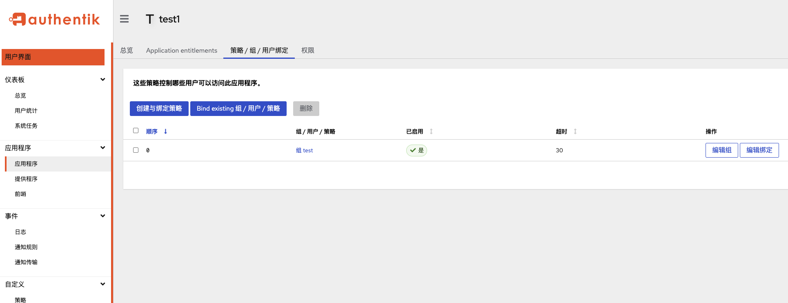

## 应用接入

Authentik 支持 5 种协议接入，分别是 SAML 2.0， OAuth 2.0/OpenID Connect (OIDC)， LDAP， SCIM，和 RADIUS

### 创建应用


authentik 中定义的应用程序用于配置和分隔授权/访问控制以及 My applications 页面中特定软件应用程序的外观

当用户登录 authentik 时，会看到 authentik 配置为为其提供身份验证和授权的应用程序（他们有权使用的应用程序）的列表

应用程序是提供商的 “另一半”。它们通常以 1 对 1 的关系存在；每个应用程序都需要一个提供程序，并且每个提供程序都可以与一个应用程序一起使用。但是，应用程序可以使用特定的其他提供程序来增强主提供程序的功能。

在以下情况下，将向用户显示应用程序：

- 用户通过策略定义了访问权限（或者应用程序没有绑定策略）
- 配置了有效的 Launch URL

可以配置以下选项：

- 名称
- 启动 URL：用户单击应用程序时打开的 URL。如果留空，authentik 会尝试根据提供程序进行推测。
  - 可以在启动 URL 中使用占位符，以便根据登录用户动态构建它们。例如，可以将 Launch URL 设置为 `https://goauthentik.io/%(username)s `，该 URL 将替换为当前登录用户的用户名。
  - 只有启动 URL 以 `http://` 或 `https://` 开头或相对 URL 的应用程序才会显示在用户的 My applications 页面上。这还可用于隐藏不应在 My applications （我的应用程序） 页面上可见但仍可供用户访问的应用程序，方法是将 Launch URL 设置为 `blank://blank`。
- 图标 （URL）：（可选）为应用程序配置图标。如果 authentik 服务器没有在 `/media` 下挂载卷，将获得文本输入。这接受绝对 URL。如果您已将单个文件挂载到容器中，则可以使用 <https://authentik.company/media/my-file.png>。如果 `/media` 下有挂载，或者配置了 S3 存储，将看到一个用于上传文件的字段。
- 发布者
- 描述

### 应用授权

要使用策略来控制哪些用户或组可以访问应用程序，请单击应用程序列表中的应用程序，然后选择 Policy/Group/User Bindings 选项卡。在那里，您可以绑定用户/组/策略以授予他们访问权限。当没有绑定任何内容时，每个人都可以访问。绑定策略会限制对特定用户或组的访问，或者通过其他自定义策略（例如限制到设定的时间或地理区域）进行访问。

默认情况下，所有用户在未绑定策略时都可以访问应用程序。

附加多个策略/组/用户时，您可以将策略引擎模式配置为：

- 要求用户传递所有绑定/成为所有组的成员 （ALL），或
- 要求用户传递任一组的 binding/be 成员 （ANY



## Providers

Provider 是一种身份验证方法，是 authentik 用来对关联应用程序的用户进行身份验证的服务。常见的提供商包括 OpenID Connect （OIDC）/OAuth2、LDAP、SAML 和通用代理提供商

提供程序是应用程序的 “另一半”。它们通常以 1 对 1 的关系存在;每个应用程序都需要一个提供程序，并且每个提供程序都可以与一个应用程序一起使用。

应用程序可以使用其他提供程序来增强主提供程序的功能。有关更多信息，请参阅 反向通道提供程序。

- LDAP：<https://docs.goauthentik.io/docs/add-secure-apps/providers/ldap/>

- Oauth2：<https://docs.goauthentik.io/docs/add-secure-apps/providers/oauth2/>

### LDAP

用户位于 `ou=users，<base DN>` 下，组位于 `ou=groups，<base DN>` 下。为了帮助兼容性，每个用户都属于自己的“虚拟”组，这是大多数类 Unix 系统的标准。此组不存在于 authentik 数据库中，并且是动态生成的。这些虚拟组位于 `ou=virtual-groups，<base DN>` DN 下。

当前向用户发送以下字段：

- `cn`： 用户的用户名
- `uid`：唯一用户标识符
- `uidNumber`：用户的唯一数字标识符
- `name`：用户名
- `displayName`：用户名
- `mail`：用户的电子邮件地址
- `objectClass`：这些字符串的列表：
  - `user`
  - `organizationalPerson`
  - `goauthentik.io/ldap/user`
- `memberOf`：用户所属的所有 DN 的列表
- `homeDirectory`：用户的默认主目录路径，默认为 `/home/$username`。可以通过将 `homeDirectory` 设置为用户或组的属性来覆盖。
- `ak-active`： 如果帐户处于活动状态，则为 “true”，否则为 “false”
- `ak-superuser`： 如果账户属于具有超级用户权限的组，则为 “true”，否则为 “false”

以下字段是当前为组设置的字段：

- `cn`：组的名称
- `uid`：唯一组标识符
- `gidNumber`：组的唯一数字标识符
- `member`：组成员的所有 DN 的列表
- `objectClass`：这些字符串的列表：
  - `group`
  - `goauthentik.io/ldap/group`

还会为每个用户创建一个虚拟组，这些用户具有与组相同的字段，但具有额外的 `objectClass： goauthentik.io/ldap/virtual-group`。虚拟组 gidNumber 等于用户的 uidNumber

#### 分配 LDAP 权限

在 Directory -> Users -> Create 下创建一个要绑定的新用户帐户，在此示例中称为 ldapservice。请注意，此用户的 DN 将为 `cn=ldapservice,ou=users,dc=alpha-quant,dc=tech`

1. 导航到 *Applications* -*> Providers* -> `Provider for LDAP` 下的 LDAP 提供程序。
2. 切换到 *Permissions* 选项卡。
3. 单击 *Assign to new user* 按钮以选择要为其分配完整目录搜索权限的用户。
4. 通过键入用户名，在模式中选择 `ldapservice` 用户。选择 *Search full LDAP directory* 权限，然后单击 *Assign*

#### 创建 LDAP 应用程序和提供程序

在应用程序 -> 应用程序 -> 使用向导创建下创建 LDAP 应用程序，并将其命名为 LDAP


#### 创建 LDAP Outpost

在 *Applications* -> *Outposts* -> *Create* 下创建（或更新）LDAP Outpost。将 Type （类型） 设置为 `LDAP` 并选择在上一步中创建的 `LDAP` 应用程序


#### ldapsearch 测试

```bash
#!/usr/bin/env bash

# no tls
ldapsearch \
    -H ldap://ldap.alpha-quant.tech:389/ \
    -x \
    -D "CN=akadmin,OU=users,DC=alpha-quant,DC=tech" \
    -b "OU=users,DC=alpha-quant,DC=tech" \
    -W
ldapsearch \
    -H ldap://ldap.alpha-quant.tech:389/ \
    -x \
    -D "CN=akadmin,OU=users,DC=alpha-quant,DC=tech" \
    -b "ou=groups,dc=alpha-quant,dc=tech" \
    -W

# tls
ldapsearch \
    -H ldap://ldap.alpha-quant.tech:389/ \
    -x \
    -ZZ \
    -D "CN=akadmin,OU=users,DC=alpha-quant,DC=tech" \
    -b "OU=users,DC=alpha-quant,DC=tech" \
    -W \
    -o TLS_CACERT="$PWD/certs/alpha-quant.tech.CA.crt"
ldapsearch \
    -H ldap://ldap.alpha-quant.tech:389/ \
    -x \
    -ZZ \
    -D "CN=akadmin,OU=users,DC=alpha-quant,DC=tech" \
    -b "ou=groups,dc=alpha-quant,dc=tech" \
    -W \
    -o TLS_CACERT="$PWD/certs/alpha-quant.tech.CA.crt"

```

### LDAP 问题

- <https://github.com/goauthentik/authentik/issues/7522>

Authentik 不支持 ldap_compare 请求 ，django-auth-ldap 无法正常工作，`AUTH_LDAP_USER_FLAGS_BY_GROUP` 需要设置为空

## 参考资料

- <https://ecwuuuuu.com/post/authentik-tutorial-1-introduction-and-install/>
