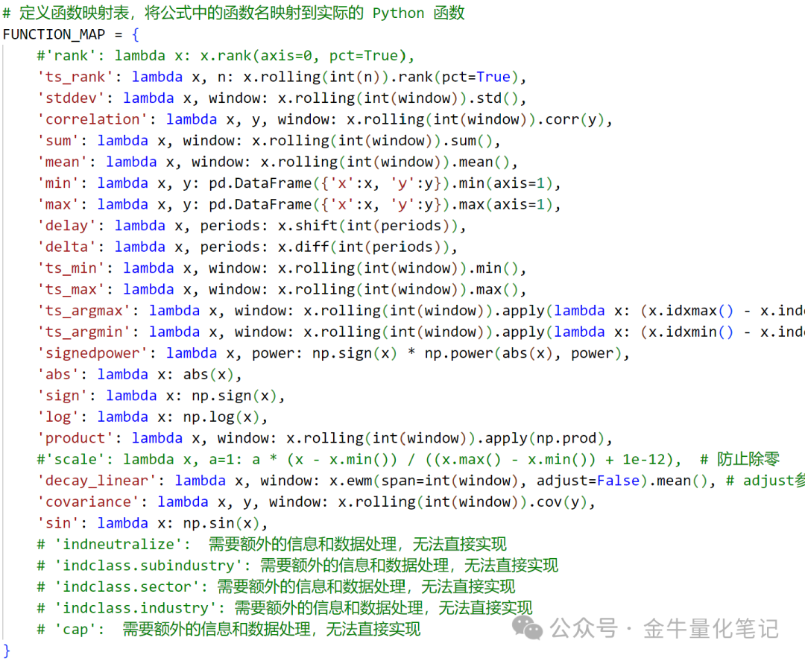
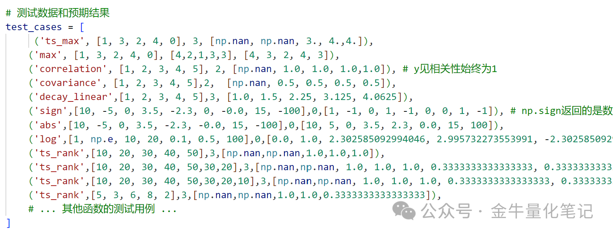
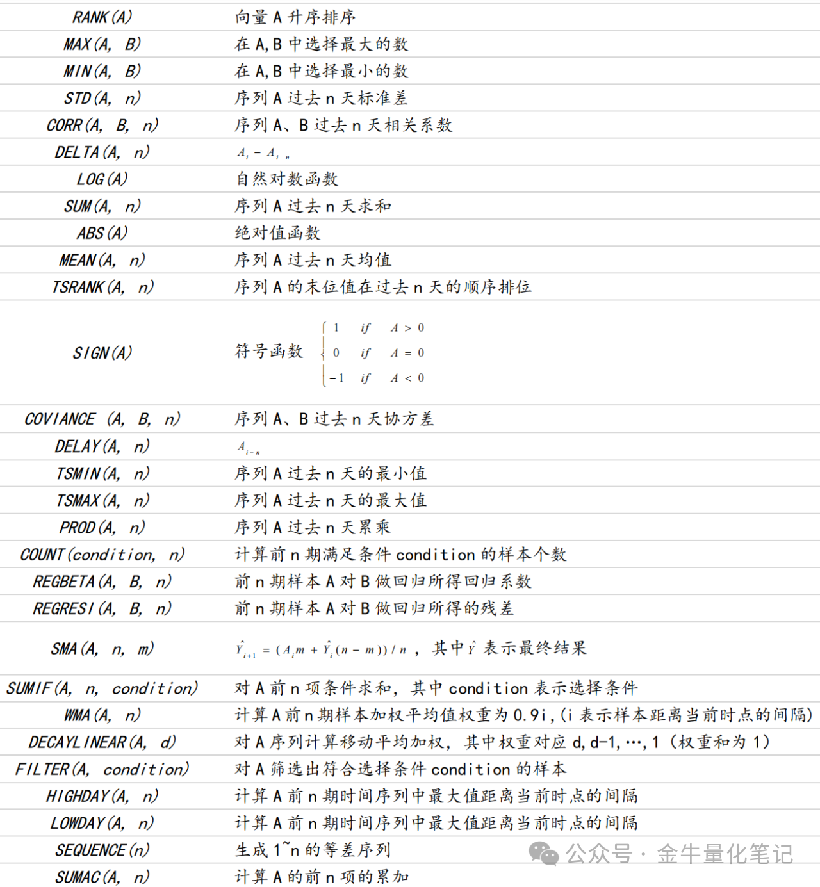
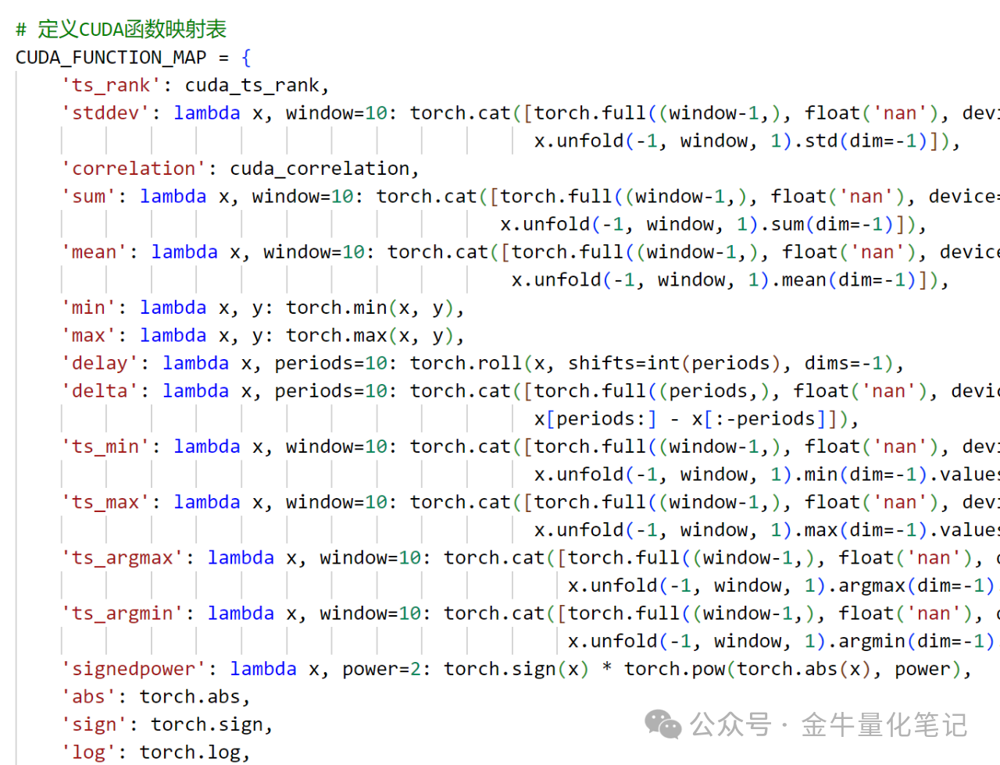

## 基本思路

- 解析公式: 可以将每个公式看作一个字符串，然后用 Python 的字符串处理功能提取其中的变量、和运算符。其中，带问号的运算符因 python 不支持，需要进行特殊处理，使用 ast 替换为自定义的 where 函数实现
- 映射函数: 将公式中的函数名，例如 rank, ts_argmax, stddev 等，映射到实现的 python 函数
- 执行计算: 根据公式的逻辑和运算符，依次调用相应的函数，并传入对应的变量或中间结果，最终得到计算结果

## 解析代码

解析公式的代码如下，parse_and_calculate_alpha 输入参数为公式字符串和 pandas 股票数据：

```python
class RewriteNode(ast.NodeTransformer):
    # 重写 AST 节点，用于转换三元表达式
    def visit_IfExp(self, node):
        # 交换 node 的 body 和 test
        node.body, node.test = node.test, node.body
        # 将 AST 节点转换为字符串
        test = ast.unparse(node.test)
        body = ast.unparse(node.body)
        orelse = ast.unparse(node.orelse)
        # 构建新的 where 函数调用节点
        newnode = ast.parse(f"where({test}, {body}, {orelse})").body[0]
        return newnode

def ternary_trans(formula):
    # 替换公式中的三元运算符为 if-else 形式
    formula = formula.replace('?', ' if ')
    formula = formula.replace(':', ' else ')
    # 解析修改后的公式为 AST 树
    tree = ast.parse(formula)
    # 遍历 AST 树，应用 RewriteNode 转换
    for node in ast.walk(tree):
        RewriteNode().visit(node)
    # 将转换后的 AST 树转换回字符串
    return ast.unparse(tree)

def where(c: pd.Series, t: pd.Series, f: pd.Series) -> pd.Series:
    return pd.Series(np.where(c, t, f))

def parse_and_calculate_alpha(formula, data):
    # 暂时不支持的函数，返回空数据
    todolist=['indneutralize','cap','filter','self','banchmarkindex']
    for todo in todolist:
        if todo in formula:
            return pd.Series(index=data.index)

    # 替换运算公式为python运算符
    formula=formula.replace("||"," | ")
    formula=formula.replace("&&"," & ")
    formula=formula.replace("^"," ** ")

    # 将 $xxx 替换为 data['xxx']
    for col in data.columns:
        formula = formula.replace(f'${col}', f"data['{col}']")

    print(f"变量替换后的公式: {formula}")

    # 使用 ast 处理三元表达式
    if '?' in formula:
        formula = ternary_trans(formula)
    print(f"三元表达式替换后的公式: {formula}")

    # 解析公式字符串为 AST 树
    tree = ast.parse(formula, mode='eval')
    print(f"ast 解析后的结果: {ast.dump(tree)}")  # 打印 ast 解析后的结果
    # 创建 ast.Expression 对象
    expression = ast.Expression(body=tree.body)

    # 将转换后的 AST 树编译为可执行的代码对象
    code = compile(expression, filename='<alpha_formula>', mode='eval') 

    # 将 FUNCTION_MAP 中的所有函数添加到全局环境
    global_env = {'__builtins__': {'True': True, 'False': False}}
    for func_name, func in FUNCTION_MAP.items():
        global_env[func_name] = func

    # 将 data 变量添加到局部环境
    local_env = {'data': data,'where':where}
    # 执行代码并返回结果
    result = eval(code, global_env, {**local_env})

    return pd.Series(result, index=data.index)
```

## 算子

- `abs(x)`: 取 x 的绝对值
- `log(x)`: 取 x 的自然对数
- `sign(x)`: 获取 x 的符号
- `rank(x)`: x 的横截面排名，跨股票计算，本次暂不复现
- `delay(x, d)`: 取 d天前x的值
- `correlation(x, y, d)`: 在过去 d 天中，x 和 y 的时间序列相关性
- `covariance(x, y, d)`: 在过去 d 天中，x 和 y 的时间序列协方差
- `scale(x, a)`: 将 x 缩放，使得 abs(x) 之和为 a（默认情况下 a = 1）
- `delta(x, d)`: 今天的 x 值减去 d 天前的 x 值
- `signedpower(x, a)`: x 的 a 次幂
- `decay_linear(x, d)`: 过去 d 天的加权移动平均，采用线性衰减的权重（d、d-1、…、1），权重之和为 1
- `indneutralize(x, g)`: x 在各组 g 中的横截面去均值化（可以是子行业、行业、部门等），即在每个组 g 内部，x 是经过去均值处理的
- `ts_min(x, d)`: 在过去 d 天的时间序列中，取 x 的最小值
- `ts_max(x, d)`: 在过去 d 天的时间序列中，取 x 的最大值
- `ts_argmax(x, d)`: 在过去 d 天的时间序列中，取 x 的最大值对应的天数
- `ts_argmin(x, d)`: 在过去 d 天的时间序列中，取 x 的最小值对应的天数
- `ts_rank(x, d)`: 在过去 d 天的时间序列中，对 x 进行排名
- `min(x, d)`: 同 ts_min(x, d)，取 x 在过去 d 天的最小值（参数类型需改为两个序列）
- `max(x, d)`: 同 ts_max(x, d)，取 x 在过去 d 天的最大值（参数类型需改为两个序列）
- `sum(x, d)`: 对过去 d 天的 x 进行求和
- `product(x, d)`: 对过去 d 天的 x 进行求积
- `stddev(x, d)`: 计算过去 d 天的 x 的移动时间序列标准差





## 国泰因子函数定义




- <https://www.joinquant.com/data/dict/alpha191>

## Qlib Alpha158

- <https://blog.csdn.net/weixin_38175458/article/details/135751721>

## GPU 因子计算

GPU，作为并行计算的利器，已经在深度学习领域大放异彩。它能够同时处理大量数据，显著提升计算速度。考虑到这一点，使用 GPU 复现因子计算



需要精心设计一个对比测试函数，将 GPU 加速计算出的因子值与传统的 pandas 版本进行对比。这一步骤将能够验证我们使用 GPU 加速因子计算方法的有效性

## 参考资料

- <https://blog.csdn.net/weixin_38175458/article/details/121308598>

- <https://bigquant.com/wiki/doc/5zug5a2q6kgo6l65byp-vBx81T1t8I>

- <https://www.youquant.com/digest-topic/9489>
- <https://qsdoc.readthedocs.io/zh-cn/latest/%E7%BB%A9%E6%95%88%E5%88%86%E6%9E%90.html>
- <https://github.com/Scorpi000/QuantStudio>