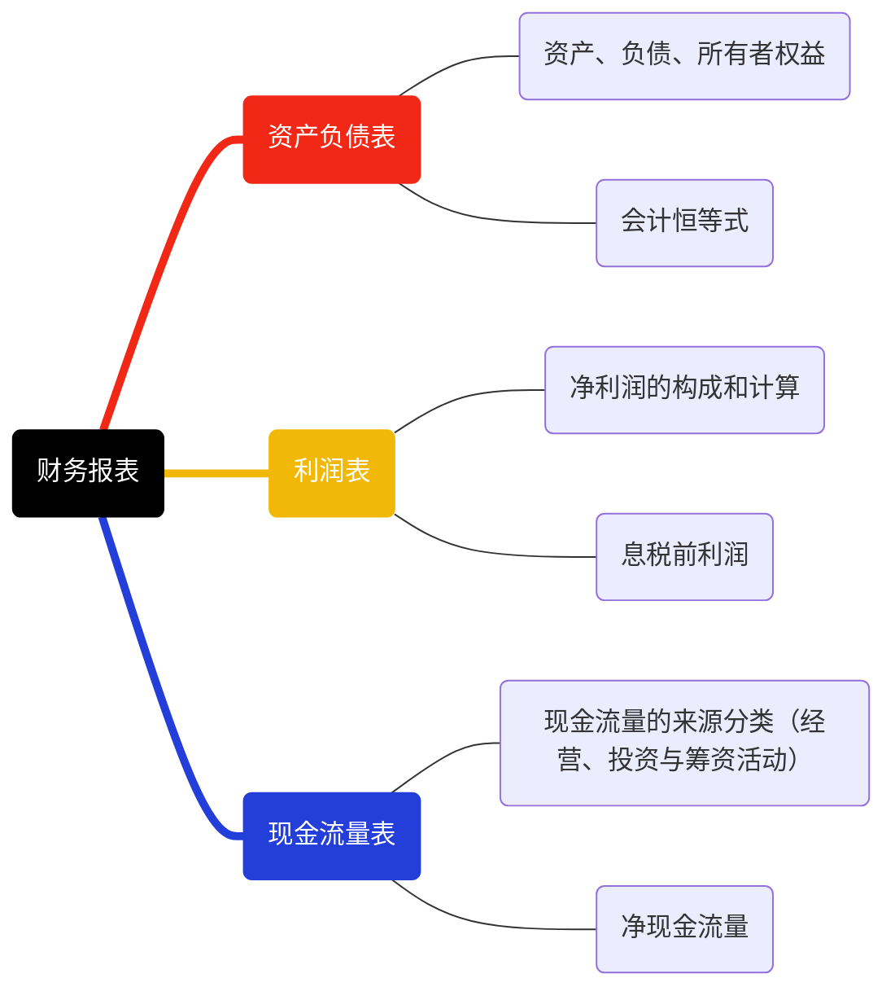

## 资产负债表

资产负债表报告了企业在某一时点的资产、负债和所有者权益的状况

信息：

- ①企业的资产要素
- ②长期/短期偿债能力
- ③资本结构的合理性
- ④企业经营风险的大小
- ⑤股东权益结构状况

作用：

- ①列出企业占有资源的梳理和性质
- ②为分析收入来源性质及其稳定性提供基础
- ③揭示企业自己的占用情况
- ④为收益把关

## 会计恒等式

会计恒等式：资产=负债+所有者权益

资产：表示企业所拥有的或掌握的，以及被其他企业所欠的各种资源或财产

负债：企业所应支付的所有债务

所有者权益：指企业总资产中扣除负债所余下的部分，表示企业的资产净值

- 股本：按面值计算的股本金
- 资金公积：股票发行溢价、法定财产重估值增值、接受捐赠资产、政府专项拨款转入
- 盈余公积：法定盈余公积、任意盈余公积
- 未分配利润：企业留待以后年度分配 / 待分配的利润

## 利润表

利润表也称损益表，反映一定时期的总体经营成果，揭示企业财务状况发生变动的直接原因

利润表由三个部分组成：营业收入、费用和利润。基本结构是收入减成本和费用等于利润（盈余）。企业盈余水平的高低是资本市场投资的基准“风向标”

注解：这里所说的企业盈余指的是营业利润，并没有考虑营业外收入（比如变卖固定资产）和营业外支出。用白话来理解就是，我们看一个企业能不能持续发展，主要看他公司业务的赚钱能力

信息：反映企业在一定时间的业务经营状况，解释企业获利能力及经营趋势

作用：

- ①通过收支结构和业务结构分析，评价各类业绩成长对企业总盈余的贡献度
- ②了解企业的盈利状况和获利能力
- ③通过收入、成本费用的分析，解析企业获利能力高低的原因，进而评价企业是否具有可持续发展能力

## 现金流量表

信息：特定会计期间内，企业的现金(包含现金等价物)的增减变动等情形（收付实现制）

现金流量表也由三个部分组成：经营活动产生的现金流量、投资活动产生的现金流量、筹资（融资）活动产生的现金流，三部分加总得到净现金流

作用：

- ①评价企业未来产生现金净流量的能力
- ②评价企业偿还债务、支付投资利润的能力，谨慎判断企业财务状况
- ③分析净收益与现金流量间的差异，并解释差异产生的原因；通过对现金投资与融资、非现金投资与融资的分析，全面了解企业财务状况

参考资料

- <https://www.233.com/jjcy/jczs/fudao/202004/16080000485.html#:~:text=%E4%B8%89%E5%A4%A7%E8%B4%A2%E5%8A%A1%E6%8A%A5%E8%A1%A8%E5%B1%9E%E4%BA%8E,%E4%B8%AD%E4%B9%9F%E5%B1%9E%E4%BA%8E%E4%B8%89%E6%98%9F%E8%80%83%E7%82%B9%E3%80%82>