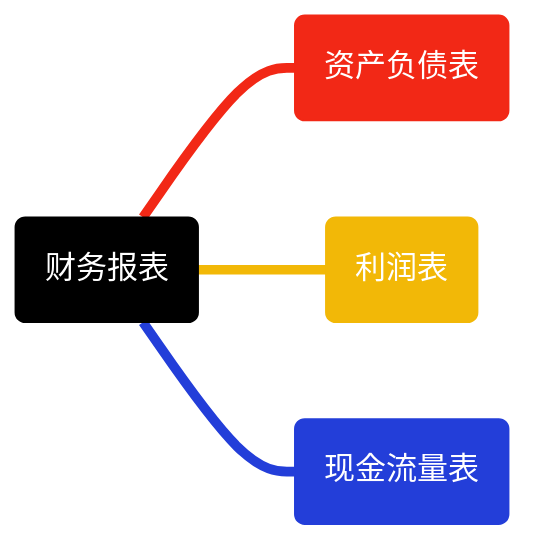

参考资料

- <https://www.233.com/jjcy/jczs/fudao/202004/16080000485.html#:~:text=%E4%B8%89%E5%A4%A7%E8%B4%A2%E5%8A%A1%E6%8A%A5%E8%A1%A8%E5%B1%9E%E4%BA%8E,%E4%B8%AD%E4%B9%9F%E5%B1%9E%E4%BA%8E%E4%B8%89%E6%98%9F%E8%80%83%E7%82%B9%E3%80%82>
- <https://blog.csdn.net/weixin_43982359/article/details/136002742>