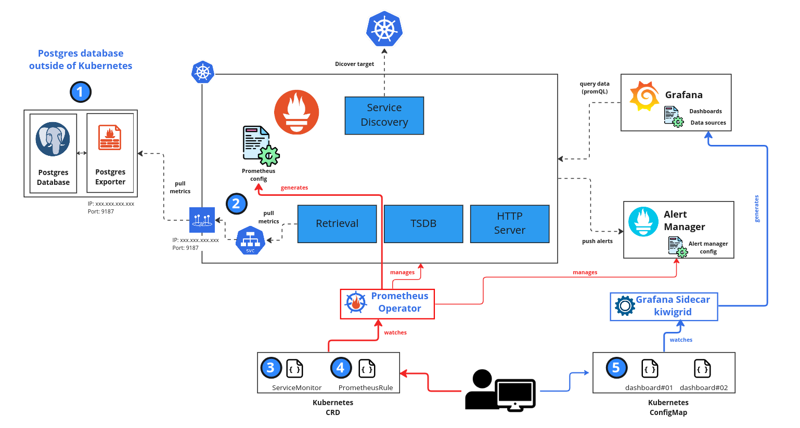

- CoreDNS

```corefile
alpha-quant.tech:53 {
    bind 0.0.0.0
    header {
        response set ra
        # set RecursionAvailable flag
    }
}
```

- APIServer 指标参考：<https://help.aliyun.com/zh/ack/ack-managed-and-ack-dedicated/user-guide/monitor-kube-apiserver>

- CPU 亲和性：<https://kubernetes.io/zh-cn/docs/tasks/administer-cluster/cpu-management-policies/>

- 自签证书：<https://cloud.tencent.com/developer/article/2310741>

生成 PKCS 格式的证书可以直接点击安装到系统证书簇中，方便一些应用（浏览器等）的使用

- Kube QoS：<https://help.aliyun.com/zh/ack/ack-managed-and-ack-dedicated/user-guide/cpu-burst?spm=a2c4g.11186623.0.0.5e4679961BzGeH>

- Kube 异常排查：<https://help.aliyun.com/zh/ack/ack-managed-and-ack-dedicated/support/dns-troubleshooting>

- Authentic：<https://ecwuuuuu.com/post/authentik-tutorial-4-setup-forwardauth/>
  - 接入 FreeIPA：<https://docs.goauthentik.io/users-sources/sources/directory-sync/freeipa/>

- Harbor 高可用：<https://goharbor.cn/docs/2.13.0/install-config/harbor-ha-helm/>

- veleror 备份：<https://docs.alauda.cn/alauda-build-of-harbor/2.14/howto/04_backup_and_restore_using_velero.html>

- PG Exporter：<https://erhwenkuo.github.io/prometheus/postgres-exporter/postgres-exporter-integration/#02-postgresql>



- Prefect PG 生产调优建议：<https://docs.prefect.io/v3/advanced/database-maintenance>

- PG 性能问题分析：<https://zhuanlan.zhihu.com/p/299613755>

- Derper：<https://github.com/kaaanata/derper-docker/pkgs/container/derper>

- max pid

  ```
  kernel.pid_max = 4194304
  ```

  

- PG 分布式集群：<https://mp.weixin.qq.com/s/ukMRVSlirrugRYihmAc44Q>

- SNMP 深入：<https://blog.csdn.net/wsyzxss/article/details/120666622>
  - <https://www.bboy.app/2023/03/09/%E4%BD%BF%E7%94%A8snmp-exporter%E7%9B%91%E6%8E%A7h3c%E8%B7%AF%E7%94%B1%E5%99%A8/>
  - <https://zahui.fan/posts/smz2c9/>
