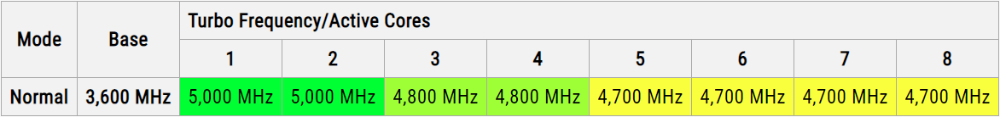
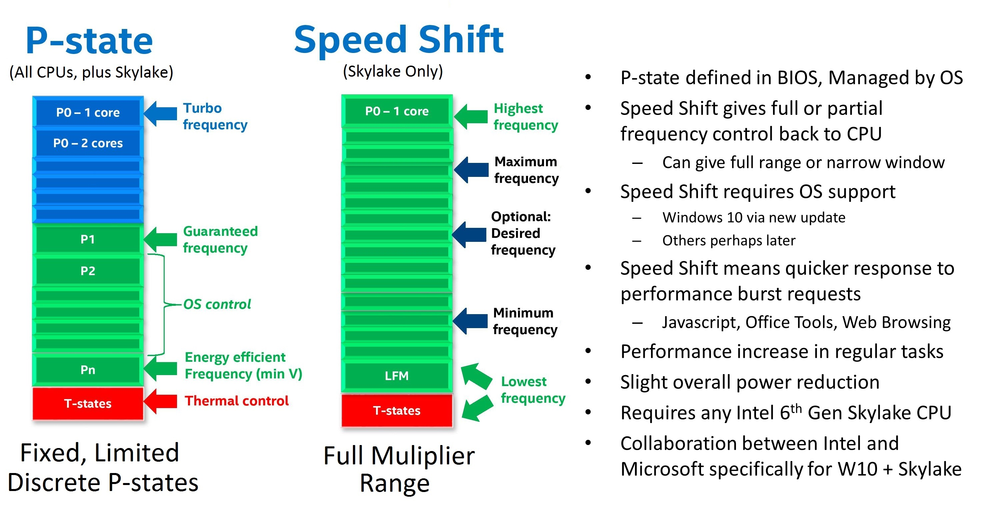

## CPU 频率

关闭调节

```bash
intel_pstate=disable intel_idle.max_cstate=0 processor.max_cstate=0

amd_pstate=passive
```

（1）P-State (processor performance state)

P-State (processor performance state)：处理器支持的 voltage-freq 列表

处理器可以工作在不同的频率，对应不同的电压（最终体现为功耗）。这些 voltage-frequency 组合就称为 P-State（处理器性能状态）。 比如下面这个 P-State Table（这个 table 会保存在一个名为 MSR (model specific register) 的 read-only 寄存器中）

| Voltage | Frequency     |
| ------- | ------------- |
| 1.21 V  | 2.8 GHz (HFM) |
| 1.18 V  | 2.4 GHz       |
| 1.05 V  | 2.0 GHz       |
| 0.96 V  | 1.6 GHz       |
| 0.93 V  | 1.3 GHz       |
| 0.86 V  | 600 MHz (LFM) |

P-State 是 CPU 电压和频率的操作点的集合，电压和频率都会随着 P state 状态的改变而同时发生变化。P state 目的根据负载是动态的增加和减少 cpu 电压和频率，以达到用户在节能和性能方面的需求

LFM/HFM (low/high freq mode)：p-state 中的最低和最高频率；在 p-state table 中

- 最低频率模式称为 Low Frequency Mode (LFM)，工作频率和电压不能比这个更低
- 最高频率模式称为 High Frequency mode (HFM)，工作频率和电压不能比这个更高

`amd_pstate` CPPC 有 3 种操作模式：自主（active）模式、非自主（passive）模式和引导自主（guided）模式。通过不同的内核参数可以选择 active/passive/guided 模式

- 在自主模式下，平台会忽略所需的性能级别请求，并仅考虑设置为最小、最大和能量性能首选项寄存器的值
- 在非自主模式下，平台直接通过所需性能寄存器从操作系统获取所需的性能水平
- 在引导自主模式下，平台根据当前工作负载并在操作系统通过最小和最大性能寄存器设置的限制内自主设置操作性能级别

（2）基频（base frequency）与超频（overclocking）

根据 p-state 的定义，处理器的最低（LF）和最高（HF）频率

但在市场宣传中，厂商将 HF —— p-state 中的上限频率 —— 称为基础频率或基频（Base Frequency）

将 HF 称为基频，那处理器（至少在某些场景下）肯定能工作在更高的频率

- 处理器厂商出于功耗、散热、稳定性等方面的原因，会给出一个官方认证的最高稳定频率 （clock rate certified by the manufacturer）但这个频率可能不是处理器的物理极限（最高）频率。 厂商承诺在这个最高稳定频率及以下可以长时间稳定运行，但超出这个频率， 有的厂商提供有限保证，有的厂商完全不保证
- 工作在比处理器厂商认证的频率更高的频率上，就称为超频（overclocking）

“官方认证的最高稳定频率”就是基频（HF）， 工作在基频以上的场景，就称为超频。比如基频是 2.8GHz，超频到 3.0GHz

（3）Intel Turbo（睿频） 或 AMD PowerTune：动态超频

Turbo 是 Intel 的技术方案，其他家也都有类似方案，基本原理都一样：根据负载动态调整频率 —— 但这句话其实只说对了一半 —— 这项技术的场景也非常明确，但宣传中经常被有意或无意忽略： 在部分处理器空闲的情况下，另外那部分处理器才可能动态超频

所在官方文档说，我们会看到它一般都是写“能支持的最大单核频率”（maximum single-core frequency） 叫 Max Turbo Frequency，因为它们在设计上就不支持所有核同时运行在这个最大频率。

原因其实也很简单： 频率越高，功耗越高，散热越大。整个系统软硬件主要是围绕基频（HF）设计和调优的， 出厂给出的也是和基频对应的功耗（TDP，后面会介绍）。 另外，TDP 也是数据中心设计时的主要参考指标之一，所以大规模长时间持续运行在 TDP 之上， 考验的不止是处理器、主板、散热片这些局部的东西，数据中心全局基础设施都得跟上

下面是一个 Intel 处理器官方参数



- 基频是 3.6GHz
- 超频到 5GHz 时，最多只有 2 个核能工作在这个频率
- 超频到 4.8GHz 时，最多只有 4 个核能工作在这个频率
- 超频到 4.7GHz 时，最多只有 8 个核能工作在这个频率

Turbo 高低跟 workload 使用的指令集（SSE/AVX/...）也有关系；能超到多少，跟跑的业务类型（或者说使用的指令集）也有关系，使用的指令集不同，能达到的最高频率也不同，比如：

| Mode          | Example Workload                                             | Absolute Guaranteed Lowest Frequency | Absolute Highest Frequency |
| ------------- | ------------------------------------------------------------ | ------------------------------------ | -------------------------- |
| Non-AVX       | SSE, light AVX2 Integer Vector (non-MUL), All regular instruction | Base Frequency                       | Turbo Frequency            |
| AVX2 Heavy    | All AVX2 operations, light AVX-512 (non-FP, Int Vect non-MUL) | AVX2 Base                            | AVX2 Turbo                 |
| AVX-512 Heavy | All heavy AVX-512 operations                                 | AVX-512 Base                         | AVX-512 Turbo              |

另外，在一些 CPU data sheet 中，还有一个所谓的 all-core turbo： 这是所有 core 同时超到同一个频率时，所能达到的最高频率。这个频率可能比 base 高一些， 但肯定比 max turbo frequency 低。例如，Xeon Gold 6150

- base 2.7 GHz
- all-core turbo 3.4 GHz
- turbo max 3.7GHz

（4）p-state vs. freq 直观展示



（5）Linux node `lscpu/procinfo` 实际查看各种频率

``` bash
[root@k8s-prod250-wk003 ~]# lscpu |grep MHz
CPU(s) scaling MHz:                 100%
CPU max MHz:                        2250.0000
CPU min MHz:                        1500.0000
```

还可以通过 cpuinfo 查看，每个 Core 都可能工作在不同频率

```
cat /proc/cpuinfo | egrep '(processor|cpu MHz)'

processor	: 0
cpu MHz		: 3022.175
processor	: 1
cpu MHz		: 2250.000
processor	: 2
cpu MHz		: 2823.914
...
cpu MHz		: 2819.743
processor	: 128
```

这里的 CPU 本质上都是硬件线程（超线程），并不是独立 CORE；同属一个 CORE 的两个硬件线程（CPU 0 & CPU 128）可以工作在不同频率

## CPU 功耗

TDP (Thermal Design Power)：Base Freq 下的额定功耗

TDP 表示的处理器运行在基频时的平均功耗（average power）

这就是说，超频或 turbo 之后，处理器的功耗会比 TDP 更大。 具体到实际，需要关注功耗、电压、电流、出风口温度等等指标

以 AMD 的 turbo 技术为例：

